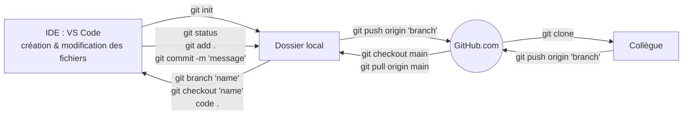

# 08 - Git & Versioning

Jour Git/GitHub du Wagon. Session confortable, tous les challenges bouclés avant le live code — clairement portée par les réflexes déjà pris sur ce cookbook.

## Le workflow complet, en un schéma

Quatre pôles : **IDE (VS Code)** pour créer/modifier les fichiers, **Dossier local** (working directory + staging), **GitHub.com** (dépôt distant + Pull Request), **Collègue** (autre contributeur sur le même repo).



La Pull Request se joue entièrement côté GitHub.com : elle propose de merger une branche dans `main`, avec revue de code possible avant validation — le point de passage standard en équipe plutôt qu'un merge direct en local.

## 1. Setup (une seule fois par poste)

```bash
git config --global user.name "prénom nom"
git config --global user.email "email valide"
git config --global color.ui auto
```

## 2. Initialiser ou récupérer un repo

```bash
git init                # nouveau repo dans le dossier courant
git clone git@<projet>  # récupérer un repo existant depuis son URL
```

## 3. Branches

```bash
git branch                    # liste les branches, * = branche active
git branch nom-branche        # créer une branche
git checkout nom-branche      # basculer dessus
git merge nom-branche         # fusionner dans la branche courante
git branch -d nom-branche     # supprimer une branche locale
git switch nom-branche        # selectionne une branche où aller
```

## 4. Staging & commit

```bash
git status                    # fichiers modifiés / stagés
git add fichier1 fichier2     # stage sélectif
git add .                     # stage tout d'un coup
git diff                      # diff non stagé
git diff --staged             # diff de ce qui est stagé
git commit -m "message"       # snapshot des fichiers stagés
git commit -am "message"      # add + commit en un coup (fichiers déjà suivis uniquement)
git reset fichier             # désindexer sans perdre les modifs
```

**Piège fréquent** : pusher/puller avec des modifications non commitées → toujours `git status` en premier réflexe avant `pull` ou `push`.

## 5. Synchronisation avec le remote

```bash
git remote -v                 # liste les dépôts distants liés
git remote add origin <url>   # associer une URL distante
git push origin nom-branche   # envoyer la branche vers GitHub
git fetch origin              # récupérer les branches distantes sans merger
git pull origin main          # = fetch + merge en un coup
```

## 6. Historique & inspection

```bash
git log                       # historique de la branche active
git log --oneline             # historique condensé, une ligne par commit
git log --graph --oneline --all  # historique visuel avec les branches
git log --stat -M             # + fichiers déplacés/renommés
git log branchB..branchA      # commits sur A absents de B
git diff branchB...branchA    # diff entre deux branches
git show <SHA>                # détail d'un commit précis
```

## 7. Mise de côté temporaire (stash)

Pratique pour changer de branche en urgence sans commit les modifs en cours.

```bash
git stash        # met de côté les modifs en cours
git stash list    # empile les stash successifs
git stash pop     # réapplique le dernier stash et le retire de la pile
git stash drop    # supprime le dernier stash sans le réappliquer
```

## 8. Annuler / corriger (sans réécrire l'historique)

Les commandes safe, à utiliser en priorité avant de sortir l'artillerie lourde de la section suivante.

```bash
git restore fichier               # annule les modifs non commitées d'un fichier
git restore --staged fichier      # retire un fichier de l'index, sans perdre les modifs
git reset --soft HEAD~1           # annule le dernier commit, garde les modifs en staging
git revert commit_id              # crée un nouveau commit qui annule un commit précédent
```

`revert` est la méthode safe en équipe : elle n'efface rien de l'historique, contrairement à `reset --hard`.

## 9. Réécrire l'historique ⚠️

```bash
git rebase nom-branche        # rejoue les commits de la branche courante après nom-branche
git reset --hard <commit>     # vide le staging + réécrit le working tree sur ce commit
```

`reset --hard` perd définitivement les modifications non commitées — à ne jamais utiliser sans être sûr.

## 10. Renommer / supprimer des fichiers trackés

```bash
git rm fichier                    # supprime + stage la suppression
git mv ancien-chemin nouveau-chemin  # déplace/renomme + stage
```

## 11. Ignorer des fichiers (.gitignore)

```
logs/
*.notes
pattern*/
```

Config globale valable sur tous les repos locaux :
```bash
git config --global core.excludesfile <fichier>
```

## Commandes annexes

```bash
git help -a       # liste toutes les commandes git disponibles
```
