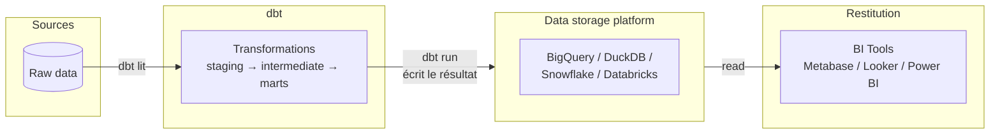
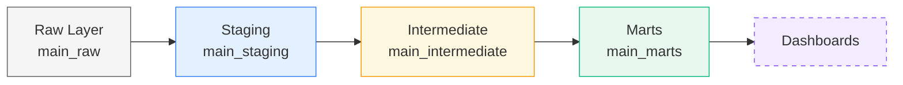
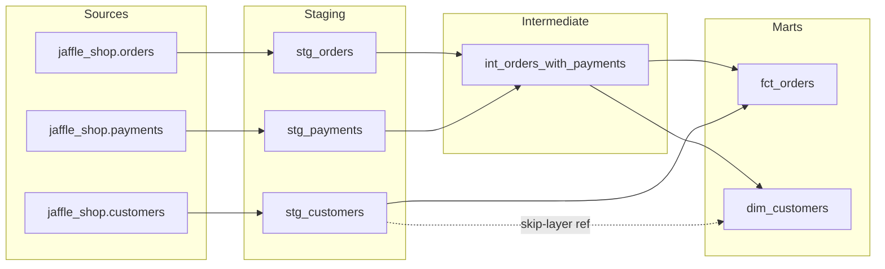

# 09 · Introduction à DBT (Data Build Tool)

> Le **T** du pipeline ELT. DBT ne stocke, n'extrait et ne charge aucune donnée — il se connecte à une base déjà existante (BigQuery, DuckDB, Snowflake, Redshift, Databricks...) et **transforme** cette donnée avec du SQL versionné, testé et documenté.

**Session du 22/07/2026 · Prérequis : Git/versionning (vu la veille)**

---

## 🎯 TL;DR — les 3 superpouvoirs

| Superpower | Ce que ça résout concrètement |
|---|---|
| **Version control** | Le SQL vit dans Git : historique, retour en arrière, travail à plusieurs sans écraser le boulot des autres |
| **Testing** | Tests automatisés (clés primaires, nulls, règles métier) lancés en une commande, **bloquants** si échec |
| **Documentation** | Doc + lineage graph auto-générés à partir du code — n'importe qui arrive sur le projet et comprend la structure |

Ce que DBT **n'est pas** : un outil d'extraction, de chargement, d'orchestration ou de stockage. Il lit une base, il écrit dans cette même base. Point.

---

## 🧠 DBT Core vs DBT Platform

DBT Labs propose deux produits qui font *exactement les mêmes transformations* — seule l'interface change.

| | **DBT Core** | **DBT Platform** *(ex-Cloud)* |
|---|---|---|
| Prix | Gratuit, open source | Payant |
| Interface | Terminal + VS Code | SaaS IDE (web) |
| Compétences requises | Code + terminal | SQL seulement |
| Git | À setup soi-même | Intégré |
| Orchestration | À gérer soi-même | Intégrée (dbt Jobs) |
| Profil type | Équipes ingénieur, petites boîtes | Profils moins techniques |

**On bosse en DBT Core** cette semaine (c'est aussi la version la plus répandue dans les petites structures et les équipes IT-finance — cohérent avec les ESN/banques que tu vises à Genève).

---

## 🔁 Le pipeline complet



Points clés :
- DBT **lit** les sources et **écrit** le résultat transformé dans la même base — il ne fait que passer entre les deux.
- Plusieurs devs travaillent en local chacun de leur côté, puis poussent leur code sur le projet commun via Git.
- Deux environnements distincts : **dev** (sandbox, on peut casser des trucs) et **prod** (propre, toujours fonctionnelle — protégée par les tests).

---

## 🏗️ L'architecture en couches

Chaque couche a **un seul job**. C'est une convention quasi universelle : dans n'importe quelle boîte qui utilise DBT, tu retrouveras ces mêmes noms.



| Couche | Rôle | Contenu | Matérialisation | Préfixe |
|---|---|---|---|---|
| **Raw** | Donnée source telle quelle | APIs, DB, fichiers — 0 transformation | *(dbt ne crée pas cette couche, il la lit)* | `raw_` |
| **Staging** | Nettoyage minimal | Renommage, typage, dédoublonnage | Vue | `stg_` |
| **Intermediate** | Logique métier | Joins, agrégations, colonnes calculées | Vue | `int_` |
| **Marts** | Couche servie | Fact tables, dimensions, tables larges | Table | `dim_` / `fct_` |
| **Dashboards** | Consommation | *(hors DBT)* Metabase, Looker, Power BI | — | — |

### Zoom par couche

**Sources (Raw)**
- Chargées par un outil ELT (Fivetran, import CSV...) — DBT ne les crée pas, il les **lit**.
- Déclarées dans `sources.yml` pour que DBT puisse tracker le lineage et la fraîcheur des données *(détail plus bas)*.
- Convention : `raw_customers`, `raw_orders`, `raw_payments`.

**Staging**
- **1 modèle staging = 1 table source** (correspondance 1:1).
- Règle d'or : **jamais de join ni d'agrégation ici.** Uniquement renommer, caster les types, coalescer les nulls, filtrer basique.
- Matérialisé en **vue** — pas cher à construire, toujours à jour.

**Intermediate**
- C'est ici que vit la **logique métier** : joins, agrégations, colonnes dérivées.
- Ne référence que des modèles staging (ou d'autres modèles intermediate) via `{{ ref() }}` — jamais directement une source.
- Matérialisé en **vue**.

**Marts**
- La couche finale, celle que les dashboards interrogent.
- Deux types de tables : dimensions (`dim_`) et faits (`fct_`) — détail juste en dessous.
- Matérialisé en **table** (la performance compte enfin, donc on paie le coût de construction).
- Rangé par domaine métier : finance, marketing, opérations...

---

## ⭐ Dimensions, faits, et le Star Schema

| | **Dimension** (`dim_`) | **Fact** (`fct_`) |
|---|---|---|
| Question | *Qui / quoi ?* | *Qu'est-ce qui s'est passé ?* |
| Grain | 1 ligne = 1 entité | 1 ligne = 1 événement |
| Exemple | `dim_customers` : customer_id, name, lifetime_value | `fct_orders` : order_id, customer_id, order_date, total_amount |
| Contient | Attributs descriptifs | Clés étrangères + mesures numériques |

**Astuce mémo :** si tu comptes ou sommes une colonne → c'est un fait. Si tu filtres ou groupes dessus → c'est une dimension.

Le **star schema** connecte une table de faits centrale à plusieurs tables de dimensions via leurs clés (customer_id, product_id, date...). C'est le pattern OLAP standard — le nom vient de la forme du schéma, pas du code.

**OLTP vs OLAP** :
- **OLTP** (les sources) : donnée jamais dupliquée, une entrée = une ligne, optimisée pour l'écriture transactionnelle.
- **OLAP** (marts) : donnée volontairement dupliquée via les joins, optimisée pour l'analyse croisée.

---

## 🧱 Matérialisation : view vs table

| | **View** | **Table** |
|---|---|---|
| Mécanisme | Requête SQL stockée comme objet, calculée à chaque accès | Résultat calculé et stocké au *build time* |
| Coût | Rapide à déployer, pas de stockage | Lent à construire, rapide à interroger |
| Usage DBT | Staging, Intermediate | Marts |

*(Le mode `incremental` sera vu dans une prochaine session — pas besoin d'y penser maintenant.)*

---

## 📦 Qu'est-ce qu'un "modèle" DBT ?

Avec DBT on ne parle plus de *table* ou de *vue* en écrivant le code — on parle de **modèle**. Mécaniquement, un modèle c'est très simple :

> Un modèle DBT = **un `SELECT`** écrit dans **un fichier `.sql`**.

Quand tu lances `dbt run`, DBT exécute ce `SELECT` et écrit le résultat dans la base, sous forme de **vue par défaut**, avec **le même nom que le fichier**. Exemple : `sales_products.sql` contenant `SELECT * FROM lewagon.raw_data_circle.raw_cc_sales` devient, après `dbt run`, une vue `sales_products` dans le dataset de dev (ex. `dbt_circle_laure.sales_products`).

Si tu écris plusieurs modèles (`sales_products.sql`, `stock.sql`...), chacun devient sa propre vue au même endroit. Rien de magique — un fichier `.sql` = un objet dans la base.

⚠️ **Point capital de la session : un modèle non exécuté n'existe pas vraiment.** Tant que tu n'as pas fait tourner un modèle (`dbt run`), il reste un brouillon — le résultat n'a jamais été écrit dans la base. Si un modèle B dépend d'un modèle A, A doit avoir été exécuté au moins une fois pour que B puisse s'appuyer dessus.

### Chaîner les modèles (la version "à la main", avant `ref()`)

Le prof montre d'abord la mécanique brute — **volontairement pas la bonne pratique** — pour bien faire comprendre ce qui se passe : un modèle peut interroger le résultat d'un autre modèle en écrivant son chemin en dur.

```sql
-- stock_sales.sql (version "à la main", à éviter en vrai)
SELECT *
FROM `dbt_circle_laure`.`stock`
JOIN `dbt_circle_laure`.`sales_products`
USING (product_id)
```

Ça marche, mais c'est fragile : le chemin `dbt_circle_laure` change selon l'environnement (dev vs prod), et DBT ne sait pas que `stock_sales` dépend de `stock` et `sales_products` — donc rien ne garantit qu'ils soient construits dans le bon ordre. C'est exactement le problème que `{{ ref() }}` résout *(section dédiée plus bas)*.

### Convention de schéma en dev : `dbt_<prénom>`

Dans l'exemple BigQuery du cours, chaque développeur voit ses modèles écrits dans un dataset à son nom (`dbt_circle_laure`). C'est une convention courante : en environnement de dev, chaque dev a son propre schéma isolé pour ne pas écraser le travail des autres — tout le monde peut lancer `dbt run` sans collision. En prod, tout part dans un schéma commun et propre.

---

## 🗂️ Anatomie d'un projet DBT

```
jaffle_shop_dbt/
├── dbt_project.yml     ← config du projet + matérialisation par défaut
├── models/              ← fichiers .sql + fichiers schema.yml
├── analyses/            ← requêtes exploratoires ponctuelles
├── macros/               ← fonctions Jinja custom
└── tests/                ← tests SQL custom

~/.dbt/
└── profiles.yml         ← config de connexion à la base
```

⚠️ **Point important pour le repo Git : `profiles.yml` vit dans `~/.dbt/`, en dehors du projet.** C'est volontaire — ce fichier contient les identifiants de connexion à la base (credentials). Il ne doit **jamais** être commité dans Git, contrairement à tout le reste du projet (`dbt_project.yml`, `models/`, `macros/`...) qui lui est versionné normalement.

### `dbt_project.yml` en détail

```yaml
models:
  jaffle_shop_dbt:
    staging:
      +materialized: view
      +schema: staging
    marts:
      +materialized: table
      +schema: marts
```

- `name` : nom du projet, doit correspondre au nom du dossier.
- `models:` : config de matérialisation et de schéma, **au niveau du dossier**.
- Le préfixe `+` veut dire *"applique ça à tous les modèles de ce dossier"* — c'est ce qui permet de dire en une fois "tout ce qui est dans `staging/` est une vue" plutôt que de le répéter modèle par modèle.

### Nommage des schémas dans DuckDB

Quand tu lances `dbt run`, DBT ne crée pas un schéma qui porte exactement le nom donné dans `+schema:` — il le **combine** avec le schéma par défaut de la base :

| Config dans `dbt_project.yml` | Schéma créé dans DuckDB | Ce que tu vois dans DBeaver |
|---|---|---|
| `+schema: staging` | `main_staging` | `main_staging` |
| `+schema: intermediate` | `main_intermediate` | `main_intermediate` |
| `+schema: marts` | `main_marts` | `main_marts` |

**Formule : `main` (schéma par défaut de DuckDB) + `_` + le nom de ton schéma custom.** C'est pour ça que les diagrammes du cours affichent `main_staging`, `main_intermediate`, `main_marts` plutôt que juste `staging`/`intermediate`/`marts` — et c'est entièrement piloté par `dbt_project.yml`.

---

## ⌨️ Commandes essentielles

| Commande | Ce qu'elle fait |
|---|---|
| `dbt debug` | Vérifie que la connexion à la base fonctionne — premier réflexe en cas de bug de setup |
| `dbt compile` | Résout le Jinja (`ref()`, `source()`...) sans exécuter le SQL — pratique pour débugger |
| `dbt run` | Construit tous les modèles |
| `dbt test` | Lance tous les tests |
| `dbt build` | Run + test dans l'ordre du DAG *(la commande à privilégier)* |
| `dbt docs generate && dbt docs serve` | Génère et ouvre le site de documentation |

---

## 🦆 DuckDB — la base du jour

Remplace BigQuery pour la formation, avec le même intérêt pédagogique que Git en local hier : zéro friction pour démarrer.

- Tourne en local, aucun compte cloud nécessaire, gratuit.
- SQL quasi identique à BigQuery (quelques noms de fonctions diffèrent).
- ⚠️ **Gotcha à retenir :** DuckDB a un verrou mono-écrivain (*single-writer lock*). Si DBeaver est connecté à la base, **il faut le déconnecter** avant de lancer une commande DBT comme `dbt run` — sinon ça bloque.
- Rappel financier : si DBT est branché sur BigQuery en vrai projet, chaque exécution de modèle génère un coût côté BigQuery — pas le cas avec DuckDB.

**Dataset d'exercice : `jaffle_shop`** — 3 tables sources : `customers`, `orders`, `payments`. C'est le dataset tutoriel officiel et canonique de DBT Labs (tu le recroiseras probablement dans la doc officielle ou en entretien) — volontairement simple pour se concentrer sur la mécanique DBT plutôt que sur la complexité métier.

---

## 📡 Déclarer ses sources : `source()` plutôt que le chemin en dur

Deux façons de référencer la donnée brute dans un modèle staging :

| Option | SQL | DBT sait que la table existe ? |
|---|---|---|
| A) Chemin en dur | `SELECT * FROM raw.raw_customers` | ❌ Non |
| B) Macro `source()` | `SELECT * FROM {{ source('jaffle_shop', 'customers') }}` | ✅ Oui |

L'option B est **toujours** la bonne pratique : c'est ce qui permet à DBT de savoir que ta table brute existe, de tracker le lineage, et de vérifier sa fraîcheur.

### Anatomie du YAML de sources (`models/schema.yml`)

```yaml
sources:
  - name: jaffle_shop        # groupe logique — utilisé dans {{ source() }}
    schema: raw               # schéma réel dans DuckDB
    tables:
      - name: customers        # nom utilisé en SQL : {{ source('jaffle_shop', 'customers') }}
        identifier: raw_customers   # nom réel de la table dans DuckDB
      - name: orders
        identifier: raw_orders
      - name: payments
        identifier: raw_payments
```

**`name` ≠ `identifier`** — point à bien retenir : l'`identifier` est le nom moche/technique de la table telle qu'elle existe réellement dans la base ; le `name` est le nom propre que tu utilises dans ton code SQL via `source()`. Ça permet de découpler le nommage "sale" du monde réel du nommage propre de ton projet DBT.

---

## 🧩 Le pattern CTE standard (à copier-coller)

C'est le template que tu retrouveras dans **quasiment tous les modèles staging**, partout où DBT est utilisé :

```sql
WITH source AS (
    -- Step 1: pull raw data, no changes
    SELECT * FROM {{ source('jaffle_shop', 'customers') }}
),

renamed AS (
    -- Step 2: rename, cast, clean
    SELECT
        id           AS customer_id,
        first_name,
        last_name
    FROM source
)

-- Step 3: expose the clean layer
SELECT * FROM renamed
```

- **CTE `source`** : le pull brut, non touché.
- **CTE `renamed`** : toutes les transformations (renommage, cast, nettoyage).
- **`SELECT * FROM renamed`** : c'est cette dernière requête qui est matérialisée.

### Pourquoi renommer les colonnes compte

La source brute utilise souvent des noms peu clairs ou incohérents d'une table à l'autre (`user_id` dans `orders`, alors que partout ailleurs on parle de `customer_id`). Le rôle du staging, c'est justement d'**uniformiser le vocabulaire une bonne fois pour toutes**, pour que tout le reste du projet (intermediate, marts) utilise des noms cohérents sans jamais revoir un nom brut.

```sql
renamed AS (
    SELECT
        id           AS order_id,
        user_id      AS customer_id,   -- raw uses user_id; on standardise ici
        order_date,
        status
    FROM source
)
```

### Les 3 modèles staging du jour

| Modèle | Table source | Transformations clés |
|---|---|---|
| `stg_customers.sql` | `raw_customers` | `id` → `customer_id` |
| `stg_orders.sql` | `raw_orders` | `id` → `order_id`, `user_id` → `customer_id` |
| `stg_payments.sql` | `raw_payments` | `id` → `payment_id`, `amount / 100.0` (centimes → unité) |

- Matérialisés en **vue**.
- Référencés via `{{ source() }}`.
- **Aucun** join, **aucune** agrégation — on l'a déjà dit, mais ça vaut le rappel.

---

## 🔗 Le macro `{{ ref() }}`

Une fois qu'un modèle existe dans DBT (staging, intermediate...), on ne le référence **plus jamais** avec un chemin en dur — on utilise `{{ ref() }}` :

```sql
-- Dans int_orders_with_payments.sql
WITH orders   AS (SELECT * FROM {{ ref('stg_orders') }}),
     payments AS (SELECT * FROM {{ ref('stg_payments') }})
```

`{{ ref() }}` fait trois choses en une seule fonction :

1. **Construit le DAG** — DBT sait que `int_orders_with_payments` dépend de `stg_orders` et `stg_payments`.
2. **Résout le chemin** — pointe toujours vers le bon schéma, peu importe l'environnement cible (dev vs prod), sans que tu aies à le gérer toi-même.
3. **Rend l'ordre automatique** — DBT construit staging avant intermediate, intermediate avant marts, tout seul.

**Règle simple à retenir : `{{ source() }}` uniquement en staging → `{{ ref() }}` partout ailleurs.**

---

## 🧪 La règle de la couche Intermediate

Les modèles intermediate sont le **bac à sable de la logique métier**.

**Autorisé en intermediate :**
- Joins entre modèles staging
- Agrégations et colonnes dérivées
- Règles métier (ex. `amount / 100.0`, logique de statut)

**Interdit :**
- Être référencé directement par un dashboard
- Contenir des noms de colonnes bruts que le staging aurait dû nettoyer
- Faire un travail qui appartient au staging (cast de type, renommage)

### Exemple complet : `int_orders_with_payments.sql`

**Objectif :** attacher le montant total payé à chaque commande.

```sql
WITH orders   AS (SELECT * FROM {{ ref('stg_orders') }}),
     payments AS (SELECT * FROM {{ ref('stg_payments') }}),

payment_totals AS (
    SELECT
        order_id,
        SUM(amount) AS total_amount
    FROM payments
    GROUP BY order_id
),

orders_with_payments AS (
    SELECT
        orders.*,
        COALESCE(payment_totals.total_amount, 0) AS total_amount
    FROM orders
    LEFT JOIN payment_totals USING (order_id)
)

SELECT * FROM orders_with_payments
```

**Pourquoi un `LEFT JOIN` et pas un `JOIN` classique ?** Certaines commandes n'ont pas encore de paiement associé (statut `placed` ou `returned`, par exemple) — un `JOIN` normal les ferait disparaître du résultat. Le `LEFT JOIN` + `COALESCE(..., 0)` garantit qu'on garde **toutes** les commandes, avec `0` comme montant si aucun paiement n'existe encore.

### 🔍 Le réflexe du grain check

Après **n'importe quel** join, un one-liner à prendre en habitude systématique :

```sql
SELECT COUNT(*), COUNT(DISTINCT order_id) FROM int_orders_with_payments
```

**Les deux nombres doivent être égaux.** C'est le test le plus rapide pour attraper le bug le plus fréquent en intermediate : un join qui **duplique silencieusement des lignes** (typiquement une relation 1-to-many mal anticipée). Si `COUNT(*) > COUNT(DISTINCT order_id)`, le join est cassé — quelque part, une commande a été dupliquée.

---

## 🎯 Construire la couche Marts

### `dim_customers.sql` — "qui est ce client ?"

**Objectif :** une ligne par client, enrichie de métriques de cycle de vie (lifetime metrics).

```sql
WITH customers AS (SELECT * FROM {{ ref('stg_customers') }}),
     orders    AS (SELECT * FROM {{ ref('int_orders_with_payments') }}),

customer_metrics AS (
    SELECT
        customer_id,
        MIN(order_date)      AS first_order_date,
        MAX(order_date)      AS most_recent_order_date,
        COUNT(order_id)      AS number_of_orders,
        SUM(total_amount)    AS lifetime_value
    FROM orders
    GROUP BY customer_id
)

SELECT
    customers.*,
    customer_metrics.*
FROM customers
LEFT JOIN customer_metrics USING (customer_id)
```

**Pourquoi un `LEFT JOIN` ici aussi ?** Les clients qui n'ont encore passé aucune commande doivent quand même apparaître dans `dim_customers` — avec des métriques à `NULL` plutôt que de disparaître de la table.

`dim_customers` est **la** table "qui est ce client ?". Toute question métier sur un client (ancienneté, valeur, fréquence...) doit être répondue ici — pas dans la table de faits.

### `fct_orders.sql` — l'enregistrement d'événement

**Objectif :** une ligne par **commande**. L'enregistrement de l'événement.

```sql
WITH orders    AS (SELECT * FROM {{ ref('int_orders_with_payments') }}),
     customers AS (SELECT * FROM {{ ref('stg_customers') }})

SELECT
    orders.order_id,
    orders.customer_id,
    orders.order_date,
    orders.status,
    orders.total_amount,
    customers.first_name,
    customers.last_name
FROM orders
LEFT JOIN customers USING (customer_id)
```

- Matérialisé en **table** : les analystes l'interrogent en boucle dans des dashboards, donc la vitesse de lecture prime.
- **Ce que `fct_orders` ne contient volontairement pas :** toutes les métriques lifetime du client (nombre total de commandes, valeur totale...). Ça vit dans `dim_customers`, pas ici.
- `fct_orders` ne joint que `first_name`/`last_name` depuis `stg_customers` — uniquement pour l'affichage, rien d'analytique. C'est la séparation de responsabilité entre fact et dimension appliquée concrètement : la table de faits reste centrée sur l'événement, pas sur les attributs de l'entité.

---

## 📝 Documenter ses modèles (`schema.yml`)

`schema.yml` vit à côté des fichiers `.sql` et a deux rôles : **descriptions** et **tests**.

```yaml
models:
  - name: stg_customers
    description: "One row per customer. Cleaned from raw_customers."
    columns:
      - name: customer_id
        description: "Primary key. Renamed from id in the source."
        tests: [unique, not_null]
```

Tests et documentation seront vus en détail dans une prochaine unité — mais bon à savoir dès maintenant que c'est **le même fichier YAML** qui sert à déclarer les sources (`sources:`) et à documenter/tester les modèles (`models:`).

---

## 🗺️ Ce qu'on construit aujourd'hui



Note sur la ligne en pointillés : `dim_customers` référence `stg_customers` **directement**, sans passer par l'intermediate. C'est autorisé — la couche intermediate n'est pas obligatoire pour chaque chemin : si aucune logique métier n'est nécessaire entre le staging et un mart, on peut "sauter" la couche (*skip-layer ref*). La règle des couches organise le projet, elle n'impose pas un détour systématique par toutes les étapes.

### 📋 Récap — le pipeline complet Jaffle Shop

| Modèle | Couche | Matérialisation | Job clé |
|---|---|---|---|
| `stg_customers` | Staging | View | Renomme `id` → `customer_id` |
| `stg_orders` | Staging | View | Renomme `user_id` → `customer_id` |
| `stg_payments` | Staging | View | Convertit centimes → unité |
| `int_orders_with_payments` | Intermediate | View | Agrège les paiements, joint aux commandes |
| `dim_customers` | Marts | Table | Une ligne par client + métriques lifetime |
| `fct_orders` | Marts | Table | Une ligne par commande + nom du client |

Ce tableau résume tout le chapitre en une seule vue — c'est la référence à garder sous les yeux la prochaine fois que tu écris un pipeline DBT de zéro.

---

## 🏷️ Naming conventions — cheat sheet

```
models/
├── staging/
│   ├── stg_customers.sql
│   ├── stg_orders.sql
│   ├── stg_payments.sql
│   └── schema.yml
├── intermediate/
│   ├── int_orders_with_payments.sql
│   └── schema.yml
└── marts/
    ├── dim_customers.sql
    ├── fct_orders.sql
    └── schema.yml
```

| Préfixe | Couche | Signifie |
|---|---|---|
| `raw_` | Raw | Donnée source brute |
| `stg_` | Staging | 1:1 avec une source, nettoyée |
| `int_` | Intermediate | Logique métier appliquée |
| `dim_` | Marts | Table de dimension |
| `fct_` | Marts | Table de faits |

---

## 🔗 Pont avec l'architecture Médaillon

Équivalence conceptuelle déjà notée, confirmée par le vocabulaire DBT officiel :

| Médaillon | DBT |
|---|---|
| Bronze | Raw / Staging |
| Silver | Intermediate |
| Gold | Marts |

Bon point à mentionner en entretien : le concept de layering est universel, DBT lui donne juste un nom et un tooling standardisés.

---

## ⚠️ Points de vigilance

- `profiles.yml` (credentials) vit hors du projet, dans `~/.dbt/` — **jamais** dans Git.
- `dbt_project.yml` est un YAML **très sensible à l'indentation** ; le préfixe `+` applique une config à tout un dossier.
- Le nom de schéma réel dans DuckDB = `main_` + le nom donné dans `+schema:` (ex. `+schema: marts` → `main_marts`).
- `{{ source() }}` uniquement en staging, `{{ ref() }}` partout ailleurs — jamais de chemin en dur une fois qu'un modèle existe.
- Un test qui échoue **bloque** la mise à jour des tables en aval — c'est voulu, c'est le garde-fou qui garde la prod propre.
- Ne jamais joindre ou agréger en staging — si tu sens le besoin de faire un join, ça appartient à l'intermediate.
- `LEFT JOIN` + `COALESCE(..., 0)` est le réflexe standard quand une relation est optionnelle (ex. commande sans paiement, client sans commande).
- Après un join : `COUNT(*)` vs `COUNT(DISTINCT clé)` — s'ils diffèrent, le join duplique des lignes.
- Un modèle intermediate ne doit jamais être branché directement à un dashboard.
- `fct_orders` ne doit pas réabsorber les métriques lifetime déjà calculées dans `dim_customers` — chaque table garde sa responsabilité.

---

## 🔮 Prochaine étape

- **Demain avec Flo :** macros en détail, approfondissement de `dbt_project.yml`, dataset GreenWis (plus complexe).
- **Prochaine unité :** tests et documentation en détail (aujourd'hui juste effleurés via `schema.yml`).
