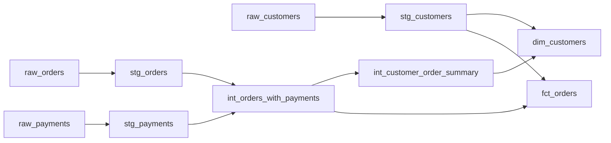

# 📝 13 — dbt · Introduction, modèles & pipeline Jaffle Shop

> [!info] Repères Brocode
> **Modèle IA — rédaction :** [[modeles-ia/ChatGPT Sol|ChatGPT Sol]]
> **Version :** référence · [[navigation/Cours|Index des cours]]
> **Variante conservée :** [[wagon2321/cours/12_dbt_intro|Claude Sonnet]]


> [!info] Navigation Brocode
> **← Précédent :** [[wagon2321/cours_sol/12_git_versioning_github_collaboration_sol|12 — Git, versioning & collaboration GitHub]]
> **Prérequis SQL :** [[wagon2321/cours_sol/07_joins_and_testing_sol|07 — JOINs & Testing]] · [[wagon2321/cours_sol/08_subqueries_ctes_union_sol|08 — CTEs & Subqueries]] · [[wagon2321/cours_sol/10_data_pipelines_views_tables_sol|10 — Data Pipelines, Views & Tables]]
> **Suite pédagogique → :** [[wagon2321/cours_sol/14_dbt_advanced_sol|14 — dbt : tests, documentation, environnements, macros & packages]]

> [!abstract] Objectif du chapitre
> Savoir reprendre un projet dbt plusieurs mois après le cours : comprendre où vivent le code et les données, identifier les fichiers de configuration, reconstruire les dépendances, écrire les modèles, choisir `view` ou `table`, tester la granularité et livrer deux tables métier à partir de trois sources.

> [!tip] Fiches pour approfondir
> [[codex/sheet/Granularité d'une table|Granularité d'une table]] · [[codex/sheet/Clé de jointure et cardinalité|Clé de jointure et cardinalité]] · [[wagon2321/cours/12a_dbt-config-sources-fiche|🧠 Fiche de synthèse — Config initiale dbt & gestion des sources]]


## 🧭 0. Périmètre, sources et mode de lecture

Ce chapitre reprend le cours **#13 — Intro DBT du 22 juillet 2026**, à partir de l’export Markdown fourni — résumé et transcription des deux séquences — et de ses **40 captures intégrées**, de `09.12.44` à `10.38.11`. Les deux séquences sont la théorie puis la démonstration du **même premier cours** ; elles ne sont pas les deux journées dbt du bootcamp.

Le chapitre SQL #09 fourni sert de référence éditoriale : propriétés YAML, H1 unique, sections progressives, exemples expliqués, pièges, préparation aux entretiens, synthèse et liens transversaux. Les wikilinks externes de cette note ciblent des fichiers effectivement présents dans `wagon2321/cours_sol/`.

### Trois niveaux de contenu

| Marqueur | Signification |
| --- | --- |
| **Cours source** | Reformulation des idées et exemples visibles dans la transcription ou les slides. Ce n’est pas une transcription verbatim. |
| **Complément Brocode** | Explication, exemple, méthode de contrôle ou code ajouté pour rendre la notion réutilisable. |
| **Correction Brocode** | Rectification d’une erreur, d’une formulation trop générale ou d’une incohérence des supports. |

Les sections conceptuelles suivent le **cours source**, avec les compléments et corrections nommés au point concerné. Le pipeline détaillé est une **reconstruction pédagogique exécutable** des exemples, et non un export du corrigé officiel des challenges.

> [!note] Version de dbt visée
> Les exemples pratiques ciblent **dbt Core v1.x avec l’adaptateur `dbt-duckdb`**, conformément au cours. Le YAML des tests avec `arguments:` vise **dbt Core 1.10.5 ou ultérieur**. Toujours commencer par `dbt --version` dans un ancien projet.
>
> La documentation actuelle distingue aussi une génération v2/Fusion et plusieurs modes d’utilisation. Cela ne justifie pas de migrer le projet du cours : les moteurs, adaptateurs et outils doivent rester compatibles. **Brocode v2 désigne ici la version du vault, pas la version du moteur dbt.** Voir la [présentation actuelle de dbt](https://docs.getdbt.com/docs/introduction).

### Ce que l’on approfondit ici

Les modèles SQL, Jinja élémentaire, `source()` et `ref()`, les dépendances, les trois couches de transformation, les fichiers YAML, les matérialisations `view`/`table`, les environnements, la qualité des données et Jaffle Shop de bout en bout.

### Ce que l’on réserve à la suite

Le [[wagon2321/cours_sol/14_dbt_advanced_sol|deuxième cours dbt]] approfondit les tests de données et leur diagnostic, la documentation, les targets dev/prod, les macros et les packages, puis reprend la démonstration BigQuery et les enjeux de grain de Greenweez.

Les modèles incrémentaux, snapshots, tests unitaires, configurations complexes, CI/CD complète et orchestration détaillée restent hors du périmètre développé de ces deux cours. Ils peuvent être situés en une phrase sans devenir artificiellement de nouveaux cours.

### Parcours de lecture

- **Comprendre le système :** sections 1 à 8.
- **Reproduire Jaffle Shop :** sections 9 à 15.
- **Reprendre un projet et diagnostiquer :** sections 16 à 19.
- **Réviser :** sections 20 à 24.

---

## 🧠 1. Pourquoi ajouter dbt à du SQL ?

### 1.1 Le problème de départ

**Cours source.** Avec SQL seul, on sait déjà filtrer, agréger, joindre et créer des tables. Mais un projet grandit rapidement : une table de nettoyage alimente deux jointures, puis plusieurs agrégations et un dashboard. On finit par se demander :

- Quelle requête a produit cette table ?
- Quelle version du calcul de chiffre d’affaires est utilisée ?
- Dans quel ordre relancer les transformations ?
- Quelles tables seront affectées si je renomme une colonne ?
- Comment savoir qu’un `JOIN` n’a pas multiplié les montants ?
- Comment expliquer le pipeline à quelqu’un qui rejoint l’équipe ?

Le problème devient celui de **l’organisation et de la fiabilité du code analytique**.

### 1.2 La définition à retenir

**dbt, historiquement “data build tool”, permet de définir des transformations sous forme de modèles, puis de les construire dans une plateforme de données en tenant compte de leurs dépendances.**

Dans ce cours, on écrit essentiellement des requêtes `SELECT`. dbt se charge de les compiler et de piloter la création des vues ou tables dans DuckDB.

```text
SQL métier + configuration + dépendances
                    ↓
                   dbt
                    ↓
      SQL exécuté par la base de données
                    ↓
        vues / tables prêtes à analyser
```

**Complément Brocode.** C’est une porte d’entrée vers l’**Analytics Engineering** : appliquer au SQL analytique des pratiques de développement logiciel — modularité, contrôle de version, tests, documentation et revue du code.

### 1.3 Les cinq apports du cours

| Apport | Ce que cela change concrètement | Ce qu’il faut encore faire soi-même |
| --- | --- | --- |
| Transformation modulaire | Une transformation nommée devient réutilisable | Concevoir le bon SQL et le bon grain |
| Versioning | Les fichiers SQL/YAML sont suivis dans Git | Committer, relire et gérer les branches |
| Tests | Les assertions sont rejouables en une commande | Choisir des assertions pertinentes |
| Documentation | dbt assemble les métadonnées et descriptions | Écrire les définitions métier |
| Lineage | On retrouve les relations entre sources et modèles | Déclarer les dépendances avec `source()` et `ref()` |

> [!warning] Correction Brocode — Git versionne le code
> dbt ne fait pas automatiquement un commit après chaque exécution. Git conserve l’historique des fichiers suivis, **pas l’historique complet des données du warehouse**. Revenir à un ancien commit puis reconstruire une table utilise les données disponibles au moment de cette nouvelle exécution.
>
> Un rollback du code ne remonte donc pas automatiquement les données dans le temps.

Lien : [[wagon2321/cours_sol/12_git_versioning_github_collaboration_sol|Git, commits et collaboration]].

---

## 🏗 2. Ce qu’est dbt, et ce qu’il n’est pas

### 2.1 Sa place dans un pipeline ELT

**Cours source.** Le scénario du cours est de type **ELT** : on extrait, on charge, puis on transforme là où les données sont accessibles.

```text
Application / API / fichiers
             │
             │ extraction et chargement
             ▼
       tables RAW dans DuckDB
             │
             │ transformations pilotées par dbt
             ▼
 staging → intermediate → marts
             │
             ▼
    analyse / dashboard / reporting
```

Dans ce schéma, les données brutes et transformées peuvent se trouver dans **la même base**, dans des schémas différents. Les flèches des slides représentent le processus ; elles ne signifient pas que toutes les données sont d’abord téléchargées dans dbt, puis réexpédiées au warehouse.

### 2.2 Répartition des responsabilités

| Élément | Son rôle dans le cours |
| --- | --- |
| dbt Core | Lit le projet, compile le SQL/Jinja, détermine les dépendances et pilote les exécutions |
| `dbt-duckdb` | Adaptateur qui permet à dbt de communiquer avec DuckDB |
| DuckDB | Exécute le SQL, conserve les tables et définitions de vues dans le fichier de base |
| VS Code | Éditeur des fichiers du projet et accès pratique au terminal |
| DBeaver | Client graphique pour explorer la base et exécuter des requêtes |
| Git / GitHub | Historique du code et collaboration |
| Outil BI | Lit les résultats destinés à l’analyse |

**DBeaver n’est pas la base de données. VS Code non plus.** On peut fermer ces interfaces et conserver les objets dans le fichier DuckDB.

### 2.3 Les frontières à connaître

- **dbt n’est pas un data warehouse.** Les relations analytiques sont persistées dans la plateforme cible.
- **dbt n’est pas un outil BI.** Il prépare les données ; il ne remplace pas la conception du dashboard.
- **dbt n’est pas un connecteur universel d’ingestion.** Déclarer une source ne télécharge pas sa table depuis une API.
- **dbt Core seul n’est pas un service de planification.** Une commande ne se répète pas chaque matin sans mécanisme externe.
- **dbt ne corrige pas automatiquement une mauvaise logique métier.** Une requête valide peut calculer le mauvais indicateur.

> [!warning] Correction Brocode — “dbt ne stocke rien” et “dbt ne charge rien”
> L’idée utile est que dbt **ne fournit pas le stockage des tables analytiques**. Il produit tout de même des fichiers locaux : SQL compilé, logs, manifeste et résultats d’exécution.
>
> Il existe aussi des mécanismes comme les seeds pour charger de petits CSV de référence. Cela ne transforme pas dbt en outil généraliste d’ingestion. Pour ce cours, les trois tables raw sont chargées **avant** les modèles.

### 2.4 Et par rapport à BigQuery ?

**Cours source.** On pourrait connecter dbt à BigQuery plutôt qu’à DuckDB. Le projet SQL reste organisé de la même manière, mais la connexion, l’adaptateur et certaines syntaxes changent.

**Complément Brocode.** dbt Core gratuit ne rend pas les traitements cloud gratuits : les opérations exécutées dans BigQuery restent soumises à son fonctionnement et à sa facturation. Le coût exact dépend des opérations, des volumes et du mode de tarification ; créer une vue n’équivaut pas à recalculer et stocker tous ses résultats.

> [!warning] Correction Brocode — BigQuery peut aussi remplacer une table
> La transcription oppose dbt à une suppression/recréation manuelle inévitable dans BigQuery. C’est trop fort : BigQuery propose notamment `CREATE OR REPLACE TABLE ... AS SELECT ...`.
>
> L’apport de dbt est de **gérer la construction dans un projet cohérent**, avec configuration, dépendances, tests et historique du code, plutôt que d’inventer une opération impossible en SQL. Référence : [DDL BigQuery](https://docs.cloud.google.com/bigquery/docs/reference/standard-sql/data-definition-language).

---

## 🧰 3. dbt Core vs dbt Platform

### 3.1 Comparaison dans le cadre du cours

| Question | dbt Core v1.x | dbt Platform, anciennement dbt Cloud |
| --- | --- | --- |
| Comment développer ? | Fichiers locaux, terminal, éditeur | Environnement et services intégrés, avec différentes interfaces selon l’offre |
| Faut-il connaître SQL ? | Oui | Oui pour les modèles SQL du cours |
| Git | À intégrer à son workflow | Intégration facilitée par la plateforme |
| Planification des runs | À organiser séparément | Fonctionnalités de jobs et de planification |
| Hébergement du service dbt | À prendre en charge | Service géré |
| Stockage et calcul des données | Base cible | Base cible également |
| Compte dbt pour l’exercice local | Pas nécessaire | Compte plateforme requis pour son utilisation |

**Cours source.** Le bootcamp passe à Core pour apprendre les mécanismes avec VS Code et le terminal, sans imposer un compte cloud dbt.

> [!warning] Correction Brocode — même principe, pas équivalence totale des produits
> Les mêmes transformations SQL simples peuvent être implémentées dans les deux environnements. Cela ne signifie pas que tous les services, moteurs, adaptateurs et fonctions sont identiques.
>
> La plateforme intègre notamment des fonctions d’exploitation. La présenter comme “Core avec une interface” est un raccourci. De même, les remarques orales sur la taille des entreprises ou leurs profils techniques sont un retour d’expérience, pas une statistique à généraliser. Voir [dbt : modes d’utilisation](https://docs.getdbt.com/docs/introduction).

### 3.2 Ce qu’il faut savoir expliquer en entretien

> « J’ai utilisé dbt Core avec DuckDB pour construire des modèles SQL versionnés, reliés par `ref()` et `source()`. La plateforme dbt ajoute un environnement et des services gérés autour de ces workflows. Dans les deux cas, il faut comprendre les données et la logique des transformations. »

---

## 🌱 4. Développement, production et collaboration

### 4.1 Dev et prod sont des cibles de données

**Cours source.** Le développement sert à construire et tester ; la production sert les consommateurs métier.

**Complément Brocode.** Il faut distinguer deux séparations :

```text
Branche Git                  Cible de données
feature/customer-summary     schéma dbt_brice / fichier de dev
main                         schéma analytics / fichier de prod
```

Une branche isole du **code**. Un schéma ou un fichier distinct isole les **objets de données créés**. Une branche différente avec la même cible peut toujours écraser les modèles d’un collègue.

### 4.2 Local ne signifie pas forcément données locales

Avec Core, le code et la commande peuvent tourner sur le laptop tandis que les transformations sont exécutées dans BigQuery. Dans l’exercice DuckDB, le moteur et son fichier sont locaux aussi.

Inversement, un schéma nommé `dev` n’est pas automatiquement protégé : les autorisations et la configuration déterminent réellement où dbt peut écrire.

### 4.3 Workflow de collaboration

1. Partir d’une version connue du projet et créer une branche de travail.
2. Vérifier la cible et la connexion de développement.
3. Modifier modèles, descriptions et tests ensemble.
4. Construire les modèles concernés et contrôler le résultat métier.
5. Committer puis faire relire le changement.
6. Intégrer le code validé.
7. Faire exécuter ce code sur la cible de production via le workflow de l’équipe.

**Un `git push` ne reconstruit pas une base par lui-même.** Il faut une exécution dbt, déclenchée manuellement ou par l’automatisation configurée.

> [!warning] Correction Brocode — les tests ne rendent pas la production infaillible
> Dev/prod, tests et revue réduisent le risque. Ils ne garantissent pas que la production est “toujours fonctionnelle”. Un test absent ne détecte rien ; des sources peuvent changer ; un run peut échouer après avoir reconstruit une partie du pipeline.

---

## 🗂 5. Raw → Staging → Intermediate → Marts

### 5.1 Chaque couche répond à une question

| Couche | Question | Transformations typiques | Sortie du cours |
| --- | --- | --- | --- |
| Raw | Qu’a fourni le système source ? | Chargement réalisé en amont | Tables sources |
| Staging | Comment rendre chaque source propre et cohérente ? | Renommer, typer, normaliser les unités | Vues `stg_` |
| Intermediate | Comment combiner ces données au bon grain ? | JOIN, GROUP BY, logique métier réutilisable | Vues `int_` |
| Marts | Quelles données doit utiliser le métier ? | Exposer des entités et événements documentés | Tables `dim_` et `fct_` |

### 5.2 Raw : préserver le point de départ

**Cours source.** On retrouve `raw_customers`, `raw_orders`, `raw_payments`. dbt les lit au moyen de sources déclarées en YAML.

**Complément Brocode.** Une table raw n’est pas “bonne par définition”. On doit examiner son grain, ses identifiants, ses types, sa fraîcheur et ses valeurs manquantes. Préserver la source facilite l’audit : on peut comparer l’entrée et la sortie du nettoyage.

### 5.3 Staging : un contrat lisible avec chaque source

**Cours source.** La règle du projet est **un modèle de staging par table source**, sans jointure entre sources et sans agrégation métier.

Exemples :

```text
customers.id         → customer_id
orders.id            → order_id
orders.user_id       → customer_id
payments.id          → payment_id
payments.amount      → montant en dollars, après conversion des centimes
```

On normalise dès l’entrée pour ne pas refaire ces opérations dans chaque modèle aval.

**Complément Brocode.** La correspondance 1:1 concerne d’abord **les modèles et les tables sources**. Une déduplication ou un filtre peut changer le nombre de lignes. Ces opérations doivent être explicites et testées : `DISTINCT` ne doit pas masquer sans explication un problème de clé.

Remplacer tous les `NULL` par `0` n’est pas non plus un nettoyage universel. Un montant inconnu et un montant nul ont des sens différents.

### 5.4 Intermediate : décomposer le raisonnement

**Cours source.** On prépare des briques réutilisables : paiements agrégés par commande, commandes enrichies, résumé des commandes par client.

Le nom doit raconter l’opération ou le résultat :

```text
int_orders_with_payments
int_customer_order_summary
```

L’intérêt n’est pas de multiplier les fichiers artificiellement. On isole une étape lorsqu’elle clarifie la logique, change le grain, est réutilisée ou mérite ses propres tests.

### 5.5 Marts : une interface métier stable

**Cours source.** Les marts exposent ici les clients et commandes. Dans un projet plus grand, on peut les ranger par domaine : finance, marketing, opérations.

**Complément Brocode.** Une table métier doit préciser ce que représente une ligne, la signification des montants, l’unité, le périmètre temporel et les exclusions. Le dashboard devrait pouvoir consommer cette interface sans réinventer les règles de paiement ou les conversions.

> [!warning] Correction Brocode — conventions, pas lois du moteur
> Les dossiers `staging`, `intermediate`, `marts` et les préfixes associés sont des conventions répandues, pas des noms imposés dans toutes les entreprises.
>
> Le moteur ne déduit ni le grain ni la matérialisation du préfixe. Un `int_` peut être une table si le projet le configure ainsi. Un mart peut prendre une autre forme qu’une étoile stricte. Voir [le guide de structuration dbt](https://docs.getdbt.com/best-practices/how-we-structure/1-guide-overview).

### 5.6 Peut-on sauter une couche ?

Oui. Dans le pipeline du cours, `dim_customers` lit directement `stg_customers` pour les noms. Il n’est pas nécessaire de créer un intermediate qui ne ferait que recopier ces trois colonnes.

En revanche, faire pointer chaque mart directement vers les tables raw contournerait les règles de nettoyage centralisées. On cherche une architecture compréhensible, pas un nombre identique d’étapes sur chaque branche.

---

## 🧱 6. Modèles, vues, tables et compilation

### 6.1 Un fichier de modèle n’est pas la relation en base

**Cours source.** Un modèle SQL du projet est un fichier `.sql`, placé dans `models/`, qui contient une requête produisant un résultat.

```sql
-- Exemple de modèle : models/staging/stg_customers.sql
select
    id as customer_id,
    first_name,
    last_name
from {{ source('jaffle_shop', 'customers') }}
```

Trois objets distincts :

| Objet | Exemple | Rôle |
| --- | --- | --- |
| Fichier source | `models/staging/stg_customers.sql` | Code à éditer et versionner |
| SQL compilé | Fichier correspondant dans `target/compiled/` | SQL après résolution de Jinja |
| Relation en base | `main_staging.stg_customers` | Vue ou table interrogée avec SQL |

Le nom logique du modèle est ici `stg_customers`, sans `.sql`. Le nom de la relation est par défaut dérivé du nom du modèle ; une configuration d’alias peut le modifier.

### 6.2 Ce que fait une exécution

```text
1. Lire projet, configuration et dépendances
2. Résoudre les expressions Jinja
3. Choisir la stratégie de matérialisation
4. Envoyer les instructions SQL à DuckDB
5. Conserver les résultats d’exécution et les logs
```

Dans le cas simple d’une vue, on peut imaginer une instruction du type :

```sql
-- Illustration du résultat attendu, pas un modèle dbt à enregistrer.
create or replace view main_staging.stg_customers as
select
    id as customer_id,
    first_name,
    last_name
from raw.raw_customers;
```

L’adaptateur gère les instructions effectives ; elles peuvent inclure des objets temporaires et des opérations de remplacement. Le modèle contient le **SELECT métier**, pas ce DDL d’illustration.

### 6.3 `view` ou `table` ?

| Critère | `view` | `table` |
| --- | --- | --- |
| Ce qui est persisté | Définition de requête | Résultat calculé |
| Consultation | Évalue la logique sur les objets sous-jacents | Lit le résultat stocké |
| Nouvelles données amont | Visibles à la lecture selon l’état de l’amont | Nécessitent une reconstruction pour apparaître |
| Exécution dbt | Crée ou remplace la vue | Reconstruit la table pour cette matérialisation |
| Usage du cours | Staging et intermediate | Marts |

**Cours source.** La matérialisation SQL par défaut est `view`. Ici, on configure explicitement les marts en `table`. La [documentation des matérialisations](https://docs.getdbt.com/docs/build/materializations) confirme ces comportements.

> [!tip] Complément Brocode — raisonner sur toute la chaîne
> Une vue sur une table reconstruite hier voit la version de cette table, pas magiquement les données de ce matin présentes plus haut dans le pipeline. Et empiler des vues ne supprime pas le coût des calculs : il peut se reporter au moment de la lecture.

Une table n’est pas systématiquement plus rapide pour chaque requête, et une vue n’est pas toujours coûteuse. On choisit selon les transformations, volumes, usages et besoins de fraîcheur.

Lien : [[wagon2321/cours_sol/10_data_pipelines_views_tables_sol|Vues, tables et pipelines SQL]].

### 6.4 Changer le code ne suffit pas

Après avoir ajouté une colonne dans le fichier, sauvegarder puis exécuter le modèle met à jour la relation. Si les descendants sont des tables, il faut aussi les reconstruire pour propager le changement.

> [!warning] Correction Brocode — pas besoin de lancer manuellement les parents un par un
> Le fichier de modèle existe bien avant son exécution. C’est sa **relation matérialisée** qui peut ne pas encore exister.
>
> Un run complet construit les modèles sélectionnés dans l’ordre du DAG. On peut aussi sélectionner un modèle **avec ses ancêtres**. Si on ne sélectionne qu’un enfant dont la table parent manque, l’exécution peut échouer ; `ref()` n’inclut pas à lui seul tous les parents dans la sélection.

### 6.5 Compiler n’est pas exécuter le modèle

**Cours source.** `dbt compile` permet d’inspecter le SQL obtenu après Jinja.

> [!warning] Correction Brocode — portée de `compile`
> Pour Core v1.x, une compilation réussie n’est pas une garantie que le SQL s’exécutera correctement ni que le résultat sera juste. `compile` ne matérialise pas les modèles. Il peut néanmoins accéder à la base pour des métadonnées ou certaines expressions de compilation ; “aucun SQL n’est jamais exécuté” serait trop absolu.
>
> Pour vérifier une construction réelle, utiliser `run` ou `build`, puis examiner les tests et résultats. Référence : [commande compile](https://docs.getdbt.com/reference/commands/compile).

---

## 🔗 7. Jinja, `source()`, `ref()` et DAG

### 7.1 Le minimum utile de Jinja

**Cours source.** Jinja est un langage de templates. Dans dbt, il permet de générer le SQL à partir d’expressions et du contexte du projet.

```sql
select *
from {{ ref('stg_orders') }}
```

Dans l’exemple DuckDB du chapitre, cela pourra devenir :

```sql
select *
from "jaffle_shop"."main_staging"."stg_orders"
```

La base reçoit une référence de relation SQL, pas le texte `{{ ref(...) }}`. Le nom du catalogue dépend du fichier DuckDB configuré.

| Syntaxe | Utilité | Exemple |
| --- | --- | --- |
| `{{ ... }}` | Insérer le résultat d’une expression | `{{ ref('stg_orders') }}` |
| `` | Instruction du template | `` |
| `{# ... #}` | Commentaire Jinja absent du rendu | `{# remarque de développement #}` |

**Complément Brocode.** `{{ config(materialized='table') }}` configure le modèle ; son appel ne produit pas une colonne SQL. Les délimiteurs sont les mêmes, mais le rôle de la fonction compte.

Ne pas entourer tout `{{ ref(...) }}` de quotes SQL : on attend un nom de relation, pas une chaîne de caractères. À l’intérieur de l’appel, `'stg_orders'` est une chaîne Jinja passée à la fonction.

Une macro Jinja génère du code ; elle n’est pas automatiquement une UDF persistante créée dans le warehouse. La création de macros attendra le cours suivant. Voir [Jinja dans dbt](https://docs.getdbt.com/docs/build/jinja-macros) et [[wagon2321/cours_sol/09_udf_window_functions_sol|UDFs et Window Functions]].

### 7.2 `source()` : lire une entrée déclarée

```sql
{{ source('jaffle_shop', 'customers') }}
```

- `jaffle_shop` est le **nom logique du groupe de sources**.
- `customers` est le **nom logique de la table dans ce groupe**.
- La déclaration YAML donne l’emplacement physique à utiliser.
- L’appel inscrit cette dépendance dans le graphe.

Cela ne crée pas `raw_customers`, ne l’importe pas et ne teste pas automatiquement toutes ses colonnes.

### 7.3 `ref()` : dépendre d’un modèle du projet

```sql
{{ ref('stg_orders') }}
```

L’appel résout l’emplacement de `stg_orders` selon la configuration et déclare une dépendance vers ce modèle. Pour cet exercice, il n’y a ni nom de dossier ni extension à ajouter.

```text
Correct : ref('stg_orders')
Incorrect : ref('stg_orders.sql')
Incorrect : ref('models/staging/stg_orders.sql')
```

**Complément Brocode.** `ref()` peut aussi référencer d’autres ressources dbt appropriées, comme des seeds ou snapshots ; le cours reste limité aux modèles SQL. Référence : [fonction ref](https://docs.getdbt.com/reference/dbt-jinja-functions/ref).

### 7.4 Pourquoi ne pas écrire le nom physique directement ?

```sql
-- SQL physique : peut fonctionner, mais cache cette dépendance à dbt.
select * from main_staging.stg_orders;
```

Ce code est lié à un environnement particulier. Si la cible change ou si le parent est renommé physiquement, il faut le reprendre. `ref()` conserve une référence logique et rend la dépendance visible au projet.

| Besoin | Expression à utiliser |
| --- | --- |
| Lire la table raw `raw.raw_customers` déclarée comme source | `source('jaffle_shop', 'customers')` |
| Lire le résultat du modèle `stg_customers.sql` | `ref('stg_customers')` |
| Vérifier un résultat dans DBeaver | Nom SQL physique de la relation, car DBeaver ne compile pas Jinja |

> [!warning] Correction Brocode — c’est la ressource qui détermine la fonction
> “`source()` dans staging, `ref()` partout ailleurs” est la convention de ce pipeline, pas une restriction syntaxique de dbt. Techniquement, un staging peut référencer un autre modèle et un mart peut lire une source. L’architecture choisie vise à centraliser le nettoyage.

### 7.5 DAG : Directed Acyclic Graph

- **Directed** : les dépendances ont un sens, du parent vers l’enfant.
- **Acyclic** : pas de boucle où A dépend de B qui dépend de A.
- **Graph** : un réseau de nœuds reliés.

```text
stg_orders ────┐
              ├── int_orders_with_payments ── fct_orders
stg_payments ──┘
```

`int_orders_with_payments` doit pouvoir lire ses deux parents. dbt utilise ce graphe pour déterminer l’ordre **des ressources sélectionnées**. Deux branches sans dépendance entre elles peuvent être construites en parallèle selon la configuration.

L’ordre n’est pas celui de l’alphabet, de l’affichage dans VS Code ou du nom des dossiers.

### 7.6 Lineage technique et sens métier

**Cours source.** Le lineage montre d’où vient un modèle et ce qu’il alimente.

**Complément Brocode.** Le graphe n’explique pas à lui seul si `total_amount` signifie montant facturé, encaissé ou net de remboursements. Il faut compléter les liens techniques par des descriptions métier. Les dépendances écrites hors du projet ne sont pas automatiquement couvertes par ce seul graphe.

---

## ⚙️ 8. Les trois niveaux de configuration

### 8.1 Le tableau à mémoriser

| Fichier | Question à laquelle il répond | Contenu typique |
| --- | --- | --- |
| `profiles.yml` | **Où et avec quelle connexion exécuter ?** | Adaptateur, fichier/base, cible, schéma par défaut, authentification si nécessaire |
| `dbt_project.yml` | **Comment organiser et construire le projet ?** | Nom, profil, chemins, configurations par dossier |
| `schema.yml` ou autre fichier de propriétés | **Que sont les sources et modèles, et quelles assertions leur appliquer ?** | Déclarations des sources, descriptions, colonnes, tests, configurations ciblées |

> [!warning] Correction Brocode — `schema.yml` n’est pas un nom magique
> On peut avoir plusieurs fichiers de propriétés, par exemple `sources.yml`, `staging.yml` ou `marts.yml`. Leur contenu et leur emplacement dans les chemins du projet comptent. Un seul fichier central n’est pas obligatoire.
>
> Dans les blocs suivants, on sépare les sources et les propriétés de chaque couche. Ne pas redéclarer une même source ou un même modèle dans plusieurs fichiers copiés au hasard.

### 8.2 Lire du YAML sans se perdre

```yaml
models:
  - name: stg_customers
    description: "Une ligne par client."
    columns:
      - name: customer_id
        description: "Identifiant du client."
        data_tests:
          - unique
          - not_null
```

`models` contient une liste. Le premier élément a un `name`, une `description` et une liste `columns`. La colonne contient elle-même une liste de tests.

> [!warning] Correction Brocode — indentation YAML en espaces
> Le cours recommande la touche Tab. Elle convient **si l’éditeur l’a configurée pour insérer des espaces**. Les caractères de tabulation ne doivent pas servir à l’indentation YAML.
>
> Utiliser une indentation régulière, ici deux espaces par niveau, et vérifier la configuration de VS Code. Voir la [spécification YAML, indentation](https://yaml.org/spec/1.2.2/#61-indentation-spaces).

Un mauvais alignement peut provoquer une erreur de parsing **ou un YAML valide ayant le mauvais sens**. La coloration syntaxique ne suffit donc pas à valider la structure.

### 8.3 Les trois `version` n’ont pas le même sens

- `version: "1.0.0"` dans `dbt_project.yml` : version déclarée du projet.
- `config-version: 2` : format de configuration du projet.
- `version: 2` dans les fichiers de propriétés : format de ces fichiers.

Aucun de ces champs ne prouve que l’on utilise le moteur dbt v2. Pour celui-ci : `dbt --version`.

---

## ☕ 9. Jaffle Shop : contrat et architecture retenue

### 9.1 Les trois sources

**Cours source.** Jaffle Shop est un jeu de données de boutique fictive, volontairement petit pour se concentrer sur dbt.

| Table physique | Grain attendu | Colonnes utilisées dans la reconstruction |
| --- | --- | --- |
| `raw.raw_customers` | Une ligne par client | `id`, `first_name`, `last_name` |
| `raw.raw_orders` | Une ligne par commande | `id`, `user_id`, `order_date`, `status` |
| `raw.raw_payments` | Une ligne par paiement | `id`, `order_id`, `payment_method`, `amount` |

**Complément Brocode — contrat d’exécution.** Ces colonnes forment le contrat explicite des exemples ci-dessous. Les slides détaillent les renommages et la conversion monétaire, mais le ZIP ne contient pas les CSV ni la base du challenge. `payment_method` est conservée pour illustrer les paiements multiples ; si un export utilise un autre nom, l’adaptation se fait dans staging.

Pour cette reconstruction :

- les identifiants doivent être renseignés et uniques au grain de leur table ;
- les montants raw sont des centimes entiers, dans une seule devise, ici USD ;
- une commande peut avoir plusieurs paiements, ou aucun paiement enregistré ;
- un client peut n’avoir aucune commande ;
- le statut de commande est conservé, sans calcul de remboursement inventé ;
- les agrégats portent sur tout l’historique **présent dans les sources**.

### 9.2 Deux variantes dans les supports

> [!warning] Correction Brocode — harmonisation du pipeline
> La slide de `10.12.22` et la transcription annoncent deux modèles intermédiaires, dont `int_customer_order_summary`. La slide de `10.32.07` calcule les mêmes métriques dans une CTE de `dim_customers`, et la synthèse de `10.38.11` n’affiche plus ce second intermediate.
>
> Cette version SOL retient **sept modèles : trois staging, deux intermediate et deux marts**. On extrait le calcul client dans `int_customer_order_summary`, sans le refaire dans `dim_customers`. Le résultat métier reste celui expliqué dans le cours.

### 9.3 Le DAG complet retenu



Lecture sans Mermaid : commandes + paiements alimentent les commandes enrichies ; celles-ci alimentent le résumé client et les faits commandes ; les noms des clients proviennent du staging clients.

### 9.4 Les sept modèles et leur grain

| Modèle | Grain de sortie | Matérialisation | Fonction |
| --- | --- | --- | --- |
| `stg_customers` | Client | View | Standardiser les identifiants clients |
| `stg_orders` | Commande | View | Renommer et typer les commandes |
| `stg_payments` | Paiement | View | Renommer et convertir les centimes |
| `int_orders_with_payments` | Commande | View | Agréger les paiements puis enrichir les commandes |
| `int_customer_order_summary` | Client ayant au moins une commande | View | Calculer dates, nombre de commandes et montant cumulé |
| `dim_customers` | Tous les clients de la source | Table | Ajouter le résumé d’activité à l’entité client |
| `fct_orders` | Commande | Table | Exposer l’événement et le montant associé |

### 9.5 Arborescence de la reconstruction

```text
jaffle_shop_dbt/
├── dbt_project.yml
├── .gitignore
├── data/
│   └── jaffle_shop.duckdb          # fichier local, non versionné
├── models/
│   ├── sources.yml
│   ├── staging/
│   │   ├── stg_customers.sql
│   │   ├── stg_orders.sql
│   │   ├── stg_payments.sql
│   │   └── schema.yml
│   ├── intermediate/
│   │   ├── int_orders_with_payments.sql
│   │   ├── int_customer_order_summary.sql
│   │   └── schema.yml
│   └── marts/
│       ├── dim_customers.sql
│       ├── fct_orders.sql
│       └── schema.yml
├── tests/
│   ├── assert_orders_preserved.sql
│   └── assert_payment_totals_preserved.sql
├── analyses/                      # requêtes d’exploration, pas des modèles construits
├── macros/                        # réservé à la suite
├── target/                        # généré par dbt
└── logs/                          # généré par dbt

~/.dbt/
└── profiles.yml                   # connexion locale
```

Les fichiers ci-dessous constituent un ensemble cohérent à recopier dans **un projet dbt d’exercice**. Ce chapitre Markdown, lui, se dépose dans `wagon2321/cours_sol/` ; le vault de notes n’a pas à devenir le projet dbt exécutable.

---

## 🔌 10. Préparer la connexion, le projet et les sources

### 10.1 Vérifier l’installation existante

Dans le terminal de l’environnement Python du cours :

```bash
dbt --version
pwd
ls
```

Vérifier la présence de l’adaptateur DuckDB dans la sortie de version. Ne pas remplacer aveuglément l’installation d’un ancien projet. Pour une nouvelle installation, suivre le setup du challenge ou la [documentation de l’adaptateur DuckDB](https://docs.getdbt.com/docs/local/connect-data-platform/duckdb-setup), en conservant des versions compatibles.

### 10.2 `profiles.yml` : connexion

**Complément Brocode — exemple minimal.** Adapter le chemin absolu à son propre dossier et le recopier à l’identique dans la connexion DBeaver.

**Fichier : `~/.dbt/profiles.yml`**

```yaml
jaffle_shop_dbt:
  target: dev
  outputs:
    dev:
      type: duckdb
      path: /chemin/absolu/jaffle_shop_dbt/data/jaffle_shop.duckdb
      schema: main
      threads: 4
```

- `jaffle_shop_dbt` : nom du profil, à relier au projet.
- `target: dev` : sortie utilisée par défaut.
- `type: duckdb` : adaptateur.
- `path` : fichier DuckDB persistant ; éviter `:memory:` pour retrouver les données dans DBeaver et entre les commandes.
- `schema: main` : schéma cible par défaut.
- `threads` : concurrence des tâches dbt ; ce n’est pas un nombre d’utilisateurs autorisés à ouvrir le fichier.

Le chemin absolu évite les ambiguïtés de résolution des chemins relatifs entre outils et versions. Une connexion à un mauvais chemin peut créer une base vide : une connexion réussie ne prouve donc pas que les bonnes sources sont présentes.

Pour un exercice réellement séparé en dev/prod, on pourrait déclarer une deuxième sortie avec un autre fichier ou schéma, puis utiliser `--target prod`. Il faudrait y rendre les sources accessibles aussi. Ce chapitre ne crée pas une production réelle.

### 10.3 `dbt_project.yml` : règles de construction

**Fichier : `dbt_project.yml`**

```yaml
name: jaffle_shop_dbt
version: "1.0.0"
config-version: 2
profile: jaffle_shop_dbt

model-paths: ["models"]
analysis-paths: ["analyses"]
test-paths: ["tests"]
macro-paths: ["macros"]

models:
  jaffle_shop_dbt:
    staging:
      +materialized: view
      +schema: staging
    intermediate:
      +materialized: view
      +schema: intermediate
    marts:
      +materialized: table
      +schema: marts
```

**Cours source.** Les dossiers guident l’application des configurations. La clé sous `models:` correspond au `name` du projet ; les clés suivantes correspondent aux dossiers.

> [!warning] Correction Brocode — nom du projet et préfixe `+`
> Le `name` du projet n’est pas obligé d’être identique au nom de son dossier sur disque, contrairement au raccourci de la slide. En revanche, le bloc `models: jaffle_shop_dbt:` doit viser le bon nom de projet.
>
> Le `+` distingue une **configuration** d’un chemin de ressource dans cette structure. Sa position dans l’arbre détermine la portée ; il ne signifie pas à lui seul “tous les modèles”.

Une configuration spécifique peut remplacer le défaut hérité, par exemple au début d’un modèle :

```sql
{{ config(materialized='table') }}
```

Pour ce cours, préférer les règles par dossier et réserver les exceptions aux besoins réels.

### 10.4 D’où vient `main_staging` ?

Avec la génération de schémas standard :

```text
schéma cible + "_" + schéma personnalisé
main         + "_" + staging
                         ↓
                   main_staging
```

On obtient donc `main_staging`, `main_intermediate`, `main_marts`. Si le schéma cible devient `dbt_brice`, le premier devient `dbt_brice_staging`.

> [!warning] Correction Brocode — ce préfixe est produit par dbt
> DuckDB ne préfixe pas spontanément tout dossier avec `main_`. C’est la règle de génération de nom de schéma de dbt, combinée au profil et à `+schema`. Elle peut être personnalisée dans un projet ; ici on garde le comportement standard. Référence : [schémas personnalisés dbt](https://docs.getdbt.com/docs/build/custom-schemas).

Ne pas confondre cette configuration des **sorties** avec `schema: raw` dans une déclaration de **source**.

### 10.5 Vérifier les sources déjà chargées

Dans DBeaver, connecté au bon fichier :

```sql
select table_catalog, table_schema, table_name, table_type
from information_schema.tables
where table_schema = 'raw'
order by table_name;
```

Puis :

```sql
describe raw.raw_customers;
describe raw.raw_orders;
describe raw.raw_payments;
```

Le chargement vient avant `dbt build`. Les noms physiques et les colonnes doivent correspondre au contrat de la section 9.

**Complément Brocode — import CSV si nécessaire.** Si l’on dispose des fichiers du challenge, on peut les charger avec DuckDB. Exemple pour une seule source, à adapter après inspection des types :

```sql
create schema if not exists raw;

create table raw.raw_customers as
select *
from read_csv_auto('/chemin/absolu/raw_customers.csv', header = true);
```

Cet exemple suppose une table encore absente. Les options d’inférence ne dispensent pas de vérifier les identifiants et dates. La section 15 fournit aussi un petit jeu synthétique autonome.

### 10.6 Déclarer les trois sources

**Fichier : `models/sources.yml`**

```yaml
version: 2

sources:
  - name: jaffle_shop
    description: "Sources du Jaffle Shop pédagogique : clients, commandes et paiements."
    schema: raw
    tables:
      - name: customers
        identifier: raw_customers
        description: "Une ligne par client du système source."
        columns:
          - name: id
            data_tests: [unique, not_null]
      - name: orders
        identifier: raw_orders
        description: "Une ligne par commande du système source."
        columns:
          - name: id
            data_tests: [unique, not_null]
      - name: payments
        identifier: raw_payments
        description: "Une ligne par paiement ; amount est exprimé en centimes USD."
        columns:
          - name: id
            data_tests: [unique, not_null]
          - name: amount
            data_tests: [not_null]
```

Les descriptions et tests enrichissent ici la déclaration minimale des slides.

### 10.7 `name`, `schema`, `identifier` : lire dans le bon sens

| Élément YAML | Dans l’exemple | Signification |
| --- | --- | --- |
| `sources[].name` | `jaffle_shop` | Groupe logique utilisé dans `source()` |
| `schema` | `raw` | Schéma physique où la source existe |
| `tables[].name` | `customers` | Nom logique de la table utilisé dans `source()` |
| `identifier` | `raw_customers` | Nom physique de la table |

```text
source('jaffle_shop', 'customers')
                  ↓ déclaration YAML
          raw.raw_customers
```

> [!warning] Correction Brocode — aucune table n’est renommée physiquement
> `schema` et `identifier` indiquent où trouver l’objet existant. Les champs `name` définissent les noms logiques utilisés dans le projet. Déclarer `identifier: raw_customers` ne lance aucun `ALTER TABLE`.
>
> Si le nom logique de table et le nom physique sont identiques, `identifier` peut être omis. Le groupe logique `jaffle_shop` n’a pas besoin d’être un schéma physique. Référence : [sources dbt](https://docs.getdbt.com/docs/build/sources).

---

## 🧼 11. Construire les trois modèles staging

### 11.1 Le pattern CTE du cours

```text
source   → lire une entrée déclarée
renamed  → nommer et typer explicitement les colonnes exposées
SELECT   → exposer le résultat du modèle
```

**Cours source.** Cette structure rend visible la frontière entre lecture et nettoyage.

**Complément Brocode.** C’est une convention de lisibilité, pas une obligation dbt. Elle fonctionne aussi dans les modèles intermediate et marts. Une CTE n’est pas un modèle séparé : elle appartient à la requête du fichier et ne possède pas automatiquement sa propre relation en base.

Le `SELECT *` de la première CTE est contrôlé par une projection explicite dans la seconde. Une nouvelle colonne raw ne se propage donc pas automatiquement dans le contrat du modèle.

### 11.2 Clients

**Fichier : `models/staging/stg_customers.sql`**

```sql
with source as (
    select * from {{ source('jaffle_shop', 'customers') }}
),

renamed as (
    select
        cast(id as bigint) as customer_id,
        first_name,
        last_name
    from source
)

select * from renamed
```

Le renommage vient du cours ; le `CAST` explicite formalise ici le contrat des identifiants. Il échoue si les valeurs ne sont pas convertibles, ce qui évite de poursuivre silencieusement avec une clé invalide.

### 11.3 Commandes

**Fichier : `models/staging/stg_orders.sql`**

```sql
with source as (
    select * from {{ source('jaffle_shop', 'orders') }}
),

renamed as (
    select
        cast(id as bigint) as order_id,
        cast(user_id as bigint) as customer_id,
        cast(order_date as date) as order_date,
        status
    from source
)

select * from renamed
```

Deux colonnes raw différentes, `customers.id` et `orders.user_id`, deviennent des colonnes portant le même sens métier : `customer_id`. Les prochaines jointures deviennent plus faciles à lire.

### 11.4 Paiements

**Fichier : `models/staging/stg_payments.sql`**

```sql
with source as (
    select * from {{ source('jaffle_shop', 'payments') }}
),

renamed as (
    select
        cast(id as bigint) as payment_id,
        cast(order_id as bigint) as order_id,
        payment_method,
        cast(amount / 100.0 as decimal(18, 2)) as amount
    from source
)

select * from renamed
```

**Cours source.** Le montant est divisé par 100 pour passer des centimes aux dollars.

**Complément Brocode.** Le `DECIMAL(18, 2)` explicite le type monétaire de sortie pour cet exercice. La division DuckDB `/` passe par un calcul flottant : ce cast n’est pas une preuve d’exactitude pour des montants arbitrairement grands. Pour une chaîne financière stricte, conserver les centimes entiers pour les agrégations et contrôler les conversions. Ici, le contrat porte sur de petits montants entiers en centimes.

> [!warning] Correction Brocode — `/ 100` ne tronque pas les décimales dans DuckDB actuel
> La transcription affirme qu’il faut `/ 100.0` pour éviter une division entière. Avec les opérateurs actuels, `105 / 100` vaut **1.05**, tout comme `105 / 100.0`. La division entière de deux entiers s’écrit `105 // 100`, qui vaut **1**.
>
> `/ 100.0` reste lisible pour exprimer la conversion d’unité, mais l’explication orale est corrigée. Vérifié avec DuckDB 1.5.4 et la [documentation des opérateurs numériques](https://duckdb.org/docs/current/sql/functions/numeric).

```sql
select
    105 / 100 as division,
    105 / 100.0 as explicit_conversion,
    105 // 100 as integer_division;
```

> [!warning] Correction Brocode — convertir une seule fois
> La slide intermediate donne aussi `amount / 100.0` comme exemple de règle. Dans notre pipeline, la conversion a déjà eu lieu dans `stg_payments`. La refaire ensuite diviserait les montants par 10 000 depuis la source.

### 11.5 Première construction et inspection

Fermer la connexion active DBeaver à ce fichier, puis lancer dans le projet :

```bash
dbt debug
dbt run --select stg_customers stg_orders stg_payments
```

Après la fin de la commande, reconnecter DBeaver et vérifier :

```sql
select * from main_staging.stg_customers limit 10;
select * from main_staging.stg_orders limit 10;
select * from main_staging.stg_payments limit 10;
```

À ce stade, le SQL doit refléter les nouveaux noms, types et unités. Le succès de `run` ne signifie pas que les tests ont été lancés.

---

## 🧮 12. Intermediate : agréger avant de joindre

### 12.1 Le risque fondamental : changer de grain sans le voir

**Cours source.** Une commande peut être payée avec plusieurs moyens de paiement. La table commandes et la table paiements ne partagent donc pas le même grain.

```text
Orders                         Payments
order_id                       payment_id   order_id   amount
101                            1001         101        7.00
                               1002         101        3.50
```

Un `JOIN` direct produit deux lignes pour la commande 101. C’est correct pour une sortie **au grain paiement**, mais incorrect pour un modèle annoncé **au grain commande**.

**Complément Brocode.** Imaginons un montant de livraison de 2 € sur la commande. Si on le répète après la jointure puis qu’on le somme, il devient 4 €. La requête n’échoue pas : c’est le sens du résultat qui est faux.

### 12.2 La solution du cours

```text
paiements : une ligne par paiement
                  ↓ GROUP BY order_id
total des paiements : une ligne par commande payée
                  ↓ LEFT JOIN avec orders
commandes enrichies : une ligne par commande
```

### 12.3 Commandes avec total des paiements

**Fichier : `models/intermediate/int_orders_with_payments.sql`**

```sql
with orders as (
    select * from {{ ref('stg_orders') }}
),

payments as (
    select * from {{ ref('stg_payments') }}
),

payment_totals as (
    select
        order_id,
        sum(amount) as total_amount
    from payments
    group by order_id
),

orders_with_payments as (
    select
        orders.order_id,
        orders.customer_id,
        orders.order_date,
        orders.status,
        coalesce(payment_totals.total_amount, 0) as total_amount
    from orders
    left join payment_totals
        on orders.order_id = payment_totals.order_id
)

select * from orders_with_payments
```

### 12.4 Pourquoi un `LEFT JOIN` ?

**Cours source.** On conserve toutes les commandes, même si aucun paiement n’a encore été enregistré. Un `INNER JOIN` retirerait ces commandes et ferait baisser le nombre de commandes du mart.

> [!warning] Correction Brocode — pas de paiement ne signifie pas nécessairement erreur
> L’oral suggère qu’il faudrait forcément un montant pour chaque commande ; la slide précise que certaines commandes peuvent ne pas encore avoir de paiement. On retient cette possibilité.
>
> La présence d’un paiement dépend du cycle métier. Un statut `returned` ne prouve pas à lui seul que le paiement est absent, ni qu’un remboursement a déjà été traité.

### 12.5 Que signifie `COALESCE(..., 0)` ?

Dans le cours, une commande sans paiement reçoit un total de **0**.

**Complément Brocode.** On adopte donc la définition : **somme des paiements enregistrés disponibles pour la commande**, avec zéro si aucun paiement n’est trouvé. Ce n’est pas le prix théorique de la commande ni nécessairement le chiffre d’affaires reconnu.

Ce zéro ne doit pas cacher un paiement dont le montant est inconnu. Le test `not_null` sur `amount` et les contrôles de relations protègent ce contrat. Les remboursements, paiements échoués et multi-devises demanderaient d’autres colonnes et règles absentes du support.

### 12.6 Le résumé par client

**Fichier : `models/intermediate/int_customer_order_summary.sql`**

```sql
with orders as (
    select * from {{ ref('int_orders_with_payments') }}
)

select
    customer_id,
    min(order_date) as first_order_date,
    max(order_date) as most_recent_order_date,
    count(*) as number_of_orders,
    sum(total_amount) as lifetime_value
from orders
group by customer_id
```

**Cours source, réorganisé.** On extrait ici les calculs présents dans la CTE `customer_metrics` de la slide clients.

Le grain change : on passe de la commande au client ayant commandé. `COUNT(*)` est correct parce que le modèle d’entrée a déjà une ligne par commande. Il ne compterait pas les commandes correctement après une jointure qui les aurait dupliquées.

### 12.7 Le sens des métriques

| Colonne | Définition retenue |
| --- | --- |
| `first_order_date` | Première date de commande dans les sources disponibles |
| `most_recent_order_date` | Dernière date de commande dans les sources disponibles |
| `number_of_orders` | Toutes les commandes présentes, sans filtre de statut |
| `lifetime_value` | Somme des paiements enregistrés rattachés aux commandes du client |

> [!warning] Correction Brocode — `lifetime_value` n’est pas une CLV prédictive
> Le nom est repris du cours, mais le calcul est une somme historique sur les données disponibles. Il n’est ni une prévision de valeur future, ni une marge, ni nécessairement une mesure comptable du revenu. Un nom plus explicite dans un projet métier pourrait être `total_recorded_payments`.

---

## ⭐ 13. Marts, faits, dimensions et schéma en étoile

### 13.1 Fait vs dimension

**Cours source.** Une dimension décrit une entité ; une table de faits décrit un événement ou un phénomène mesuré.

| Question | Dimension clients | Faits commandes |
| --- | --- | --- |
| Que représente une ligne ? | Un client | Une commande |
| Clé du modèle | `customer_id` | `order_id` |
| À quoi sert-elle ? | Décrire, regrouper, filtrer les clients | Compter les commandes et analyser les montants |
| Exemples | Prénom, nom, première commande | Date, client, statut, total payé |

> [!warning] Correction Brocode — une table de faits n’est pas “toute la donnée”
> Elle porte un **grain explicite** et les mesures et clés utiles à ce grain. Elle ne doit pas contenir tous les IDs de l’entreprise ni forcément le grain le plus fin imaginable.
>
> Ici le grain est la commande, même si les paiements sont plus détaillés. Dans un autre projet, une table de faits pourrait être au grain ligne de commande ou transaction. Les dimensions ne sont pas non plus définies par l’absence de nombres : une entité client peut contenir des agrégats, comme dans le cours.

### 13.2 Une étoile est un schéma de relations

```text
                  dim_dates
                      │
                      │
dim_customers ──── fct_orders ──── dim_products
```

**Cours source.** La table de faits relie les axes d’analyse via des clés étrangères.

**Complément Brocode.** Ce dessin général n’est pas la liste des modèles à créer aujourd’hui. Les trois sources Jaffle Shop de ce cours ne contiennent pas de lignes produits : on ne fabrique donc pas `dim_products` ni un `product_id` dans `fct_orders`.

Au niveau actuel, la relation utile est :

```text
dim_customers.customer_id  1 ───────── N  fct_orders.customer_id
```

Une commande a un client selon le contrat ; un client peut avoir zéro, une ou plusieurs commandes. Cette cardinalité suppose une clé client unique dans la dimension.

### 13.3 OLTP et OLAP : distinguer l’objectif

**Cours source.** Le système transactionnel organise les opérations ; le système analytique rend les données faciles à analyser.

**Correction Brocode.** OLTP ne signifie pas “zéro duplication garantie” et OLAP ne signifie pas “toutes les duplications sont sans risque”. La normalisation peut limiter la redondance du système transactionnel. En analytique, une dénormalisation contrôlée peut faciliter les lectures, mais les duplications de mesures après JOIN restent dangereuses.

### 13.4 Dimension clients

**Fichier : `models/marts/dim_customers.sql`**

```sql
with customers as (
    select * from {{ ref('stg_customers') }}
),

customer_metrics as (
    select * from {{ ref('int_customer_order_summary') }}
)

select
    customers.customer_id,
    customers.first_name,
    customers.last_name,
    customer_metrics.first_order_date,
    customer_metrics.most_recent_order_date,
    coalesce(customer_metrics.number_of_orders, 0) as number_of_orders,
    coalesce(customer_metrics.lifetime_value, 0) as lifetime_value
from customers
left join customer_metrics
    on customers.customer_id = customer_metrics.customer_id
```

**Cours source.** Le `LEFT JOIN` permet de conserver les clients sans commande.

**Complément Brocode — choix explicite.** La slide laisse leurs métriques à `NULL`. Ici, `number_of_orders` et `lifetime_value` deviennent `0`, puisque l’absence de commande signifie zéro activité enregistrée selon le contrat. Les dates restent `NULL` : il n’existe pas de première commande à dater.

**Correction Brocode.** La projection explicite évite de sélectionner à la fois `customers.*` et `customer_metrics.*`, ce qui exposerait deux fois la clé client dans l’exemple de la slide.

### 13.5 Table de faits commandes

**Fichier : `models/marts/fct_orders.sql`**

```sql
with orders as (
    select * from {{ ref('int_orders_with_payments') }}
),

customers as (
    select * from {{ ref('stg_customers') }}
)

select
    orders.order_id,
    orders.customer_id,
    orders.order_date,
    orders.status,
    orders.total_amount,
    customers.first_name,
    customers.last_name
from orders
left join customers
    on orders.customer_id = customers.customer_id
```

**Cours source.** La slide enrichit les faits avec le prénom et le nom pour l’affichage. La jointure reste au grain commande si `stg_customers.customer_id` est unique.

**Complément Brocode.** Une étoile plus stricte laisserait les noms dans `dim_customers`. Le modèle du cours est légèrement dénormalisé ; cela ne le rend pas incorrect. Il faut seulement documenter ce choix et ne pas confondre les deux variantes.

Les noms proviennent de l’état courant des clients dans la source. Sans mécanisme d’historisation, on ne sait pas garantir le nom tel qu’il était au jour de chaque commande.

### 13.6 Ne pas sommer deux fois les agrégats clients

Si Alice a deux commandes et `lifetime_value = 13`, une jointure de la dimension sur les faits répète `13` deux fois. Sommer cette colonne après le JOIN produit `26`.

```sql
-- Analyse au grain client : lire le mart clients.
select sum(lifetime_value) as total_recorded_payments
from main_marts.dim_customers;

-- Analyse au grain commande : lire le mart commandes.
select sum(total_amount) as total_recorded_payments
from main_marts.fct_orders;
```

**Complément Brocode.** Les deux totaux doivent se rejoindre si tous les clients et commandes sont valides et si les périmètres concordent. On ne répète pas une métrique déjà agrégée pour ensuite la sommer à un grain plus fin.

Liens : [[wagon2321/cours_sol/07_joins_and_testing_sol|Cardinalité et conservation après JOIN]] · [[wagon2321/cours_sol/09_udf_window_functions_sol|Granularité et agrégats répétés]].

---
## 🧪 14. Tester ce pipeline sans anticiper tout le deuxième cours

### 14.1 Trois niveaux de validation

**Cours source.** Les tests sont des assertions sur les données, lancées de manière reproductible.

**Complément Brocode.** On distingue :

1. **Le projet est lisible** : YAML/Jinja et ressources correctement déclarés.
2. **Le SQL s’exécute** : les relations et colonnes existent, les opérations sont compatibles.
3. **Le résultat respecte le contrat** : grain, clés, relations, unités et montants corrects.

Un `run` réussi couvre une partie du deuxième niveau. Il ne remplace pas le troisième.

### 14.2 Les quatre tests génériques à reconnaître

| Test | Assertion | Limite à garder en tête |
| --- | --- | --- |
| `unique` | Pas de doublons sur les valeurs testées | À combiner avec `not_null` pour une clé |
| `not_null` | Pas de valeur NULL | Une valeur renseignée peut être incorrecte |
| `relationships` | Chaque clé non NULL existe dans le parent | Ne prouve pas que la clé parent est unique |
| `accepted_values` | Les valeurs non NULL appartiennent à la liste | Ajouter `not_null` si l’absence est interdite |

**Correction Brocode.** Un test dbt ne crée pas automatiquement une contrainte `PRIMARY KEY` ou `FOREIGN KEY` dans le moteur. Il exécute une vérification ; il ne bloque pas chaque écriture future en base.

Les [tests génériques documentés par dbt](https://docs.getdbt.com/reference/resource-properties/data-tests) couvrent ces assertions. Le support utilise `tests:` ; `data_tests:` est le nom explicite actuel, `tests:` restant un alias. Les exemples avec arguments ci-dessous supposent une version compatible avec `arguments:`.

### 14.3 Propriétés et tests du staging

**Complément Brocode — configuration minimale exploitable.** Les tests d’unicité et non-nullité sont introduits dans le cours. Les relations et valeurs autorisées prolongent les réflexes du chapitre JOINs & Testing.

**Fichier : `models/staging/schema.yml`**

```yaml
version: 2

models:
  - name: stg_customers
    description: "Une ligne par client ; identifiant standardisé depuis raw_customers.id."
    columns:
      - name: customer_id
        description: "Identifiant unique et obligatoire du client."
        data_tests: [unique, not_null]
      - name: first_name
        description: "Prénom issu du système source."
      - name: last_name
        description: "Nom issu du système source."

  - name: stg_orders
    description: "Une ligne par commande, tous statuts conservés."
    columns:
      - name: order_id
        data_tests: [unique, not_null]
      - name: customer_id
        data_tests:
          - not_null
          - relationships:
              arguments:
                to: ref('stg_customers')
                field: customer_id
      - name: order_date
        data_tests: [not_null]
      - name: status
        description: "Statut source ; liste à confirmer pour chaque nouveau dataset."
        data_tests:
          - not_null
          - accepted_values:
              arguments:
                values: ['placed', 'shipped', 'completed', 'return_pending', 'returned']

  - name: stg_payments
    description: "Une ligne par paiement ; montant converti des centimes en USD."
    columns:
      - name: payment_id
        data_tests: [unique, not_null]
      - name: order_id
        data_tests:
          - not_null
          - relationships:
              arguments:
                to: ref('stg_orders')
                field: order_id
      - name: payment_method
        description: "Moyen de paiement fourni par la source."
      - name: amount
        description: "Montant enregistré en USD, DECIMAL(18,2), sans règle de remboursement ajoutée."
        data_tests: [not_null]
```

La liste de statuts est une **hypothèse explicite de la reconstruction**. Si les fichiers réels ont d’autres valeurs légitimes, il faut les examiner et adapter le contrat, pas les supprimer pour rendre le test vert.

On ne teste **pas** `unique` sur `stg_payments.order_id` : plusieurs paiements par commande sont autorisés. L’unicité porte sur `payment_id`.

### 14.4 Propriétés et tests des intermediate

**Fichier : `models/intermediate/schema.yml`**

```yaml
version: 2

models:
  - name: int_orders_with_payments
    description: "Une ligne par commande ; somme des paiements enregistrés, zéro si aucun paiement."
    columns:
      - name: order_id
        data_tests: [unique, not_null]
      - name: customer_id
        data_tests: [not_null]
      - name: order_date
        data_tests: [not_null]
      - name: total_amount
        description: "Somme en USD des paiements enregistrés de la commande."
        data_tests: [not_null]

  - name: int_customer_order_summary
    description: "Une ligne par client ayant au moins une commande dans les sources disponibles."
    columns:
      - name: customer_id
        data_tests: [unique, not_null]
      - name: first_order_date
        description: "Première date de commande connue dans les données disponibles."
      - name: most_recent_order_date
        description: "Dernière date de commande connue dans les données disponibles."
      - name: number_of_orders
        description: "Nombre de commandes, tous statuts conservés."
        data_tests: [not_null]
      - name: lifetime_value
        description: "Cumul des paiements enregistrés des commandes du client ; pas une CLV prédictive."
        data_tests: [not_null]
```

### 14.5 Propriétés et tests des marts

**Fichier : `models/marts/schema.yml`**

```yaml
version: 2

models:
  - name: dim_customers
    description: "Une ligne par client source, y compris les clients sans commande."
    columns:
      - name: customer_id
        data_tests: [unique, not_null]
      - name: first_name
        description: "Prénom courant dans la source."
      - name: last_name
        description: "Nom courant dans la source."
      - name: first_order_date
        description: "NULL si aucune commande n'est connue."
      - name: most_recent_order_date
        description: "NULL si aucune commande n'est connue."
      - name: number_of_orders
        description: "Zéro si aucune commande n'est connue."
        data_tests: [not_null]
      - name: lifetime_value
        description: "Cumul historique des paiements enregistrés en USD ; zéro sans commande."
        data_tests: [not_null]

  - name: fct_orders
    description: "Une ligne par commande ; montant payé enregistré et noms clients pour affichage."
    columns:
      - name: order_id
        data_tests: [unique, not_null]
      - name: customer_id
        data_tests:
          - not_null
          - relationships:
              arguments:
                to: ref('dim_customers')
                field: customer_id
      - name: order_date
        data_tests: [not_null]
      - name: status
        description: "Statut source sans filtre métier supplémentaire."
      - name: total_amount
        description: "Somme des paiements enregistrés de la commande, en USD."
        data_tests: [not_null]
      - name: first_name
        description: "Prénom courant ajouté depuis stg_customers."
      - name: last_name
        description: "Nom courant ajouté depuis stg_customers."
```

Ne pas mettre `not_null` sur les dates de commande de `dim_customers` : le client sans commande est un cas valide.

### 14.6 Contrôler le grain après JOIN

**Cours source.** Dans DBeaver :

```sql
select
    count(*) as rows_count,
    count(distinct order_id) as distinct_orders,
    count(*) - count(order_id) as null_order_ids
from main_intermediate.int_orders_with_payments;
```

Pour ce contrat, `rows_count = distinct_orders` et `null_order_ids = 0`.

> [!warning] Correction Brocode — ce contrôle est nécessaire mais insuffisant
> `COUNT(*) > COUNT(DISTINCT order_id)` peut révéler des doublons **ou des NULL**, puisque `COUNT(DISTINCT ...)` ignore les NULL. Ce n’est pas forcément une erreur de jointure : la source peut déjà être invalide.
>
> À l’inverse, l’égalité peut rester vraie après la perte de commandes ou sur une table vide. Il faut aussi vérifier le périmètre conservé et les montants. Pour un autre grain, plusieurs lignes par `order_id` peuvent être normales.

Pour trouver les clés problématiques :

```sql
select order_id, count(*) as row_count
from main_intermediate.int_orders_with_payments
group by order_id
having count(*) > 1 or order_id is null;
```

### 14.7 Conserver les mêmes commandes

**Complément Brocode.** Un test singulier est un fichier SQL dans `tests/` qui retourne les **lignes en anomalie**. Avec la configuration par défaut, zéro ligne signifie succès. On en ajoute deux, sans créer de macro ni installer de package.

**Fichier : `tests/assert_orders_preserved.sql`**

```sql
with before_join as (
    select order_id from {{ ref('stg_orders') }}
),

after_join as (
    select order_id from {{ ref('fct_orders') }}
)

select
    before_join.order_id as source_order_id,
    after_join.order_id as mart_order_id
from before_join
full outer join after_join
    on before_join.order_id = after_join.order_id
where before_join.order_id is null
   or after_join.order_id is null
```

On vérifie la conservation **des identifiants**, pas seulement l’égalité de deux nombres de lignes. Les tests `unique`/`not_null` complètent ce contrôle : ce test de présence ne suffit pas à détecter tous les doublons.

### 14.8 Conserver les paiements à l’échelle de chaque commande

**Fichier : `tests/assert_payment_totals_preserved.sql`**

```sql
with expected as (
    select
        order_id,
        sum(amount) as expected_amount
    from {{ ref('stg_payments') }}
    group by order_id
),

actual as (
    select order_id, total_amount
    from {{ ref('fct_orders') }}
)

select
    expected.order_id as payment_order_id,
    actual.order_id as mart_order_id,
    expected.expected_amount,
    actual.total_amount
from expected
full outer join actual
    on expected.order_id = actual.order_id
where actual.order_id is null
   or actual.total_amount is null
   or actual.total_amount <> coalesce(expected.expected_amount, 0)
```

Ce test accepte une commande sans paiement avec total égal à zéro. Il signale un paiement sans commande correspondante et une différence de montant par commande. La non-nullité des clés et paiements est vérifiée séparément.

**Complément Brocode.** Comparer uniquement le total global peut laisser passer deux erreurs qui se compensent : +10 sur une commande et −10 sur une autre. C’est pourquoi le contrôle ci-dessus travaille par `order_id`.

Ce test compare les montants **après staging**. Il ne détecterait pas une conversion erronée identique dans tout l’aval. Il faut contrôler aussi la frontière raw/staging, par exemple avec les centimes et les résultats connus du petit jeu de données.

### 14.9 Ce qui n’est pas encore couvert

Ces tests vérifient un socle, pas toutes les règles possibles : fraîcheur des sources, validité exhaustive des dates, variations anormales de volumes, remboursement réel et exhaustivité historique demanderaient des contrats supplémentaires.

**Cours source.** La fraîcheur est évoquée. **Complément Brocode.** Déclarer une source ne met pas en place automatiquement un contrôle de fraîcheur : il faut une configuration adaptée et exécuter `dbt source freshness`. Ce n’est pas implicitement inclus dans le `dbt build` de ce chapitre.

---

## 🔬 15. Petit jeu de données pour vérifier le pipeline à la main

### 15.1 Pourquoi un exemple supplémentaire ?

**Complément Brocode — données synthétiques, pas données originales du challenge.** Ce jeu minuscule permet de refaire le pipeline sans retrouver les CSV du cours. Il couvre :

- deux paiements pour une commande ;
- deux commandes pour un client ;
- une commande sans paiement ;
- un client sans commande ;
- un montant non entier en dollars.

Utiliser un **fichier DuckDB d’exercice neuf**. Les instructions ci-dessous créent les tables ; elles ne suppriment ni ne remplacent de tables existantes.

### 15.2 Charger les données dans DuckDB

Dans DBeaver connecté à ce fichier, exécuter le SQL suivant une seule fois.

**Bloc de validation : `fixture.sql` — uniquement pour l’exercice isolé.**

```sql
create schema if not exists raw;

create table raw.raw_customers (
    id bigint,
    first_name varchar,
    last_name varchar
);

insert into raw.raw_customers values
    (1, 'Alice', 'Martin'),
    (2, 'Bob', 'Durand'),
    (3, 'Chloe', 'Petit');

create table raw.raw_orders (
    id bigint,
    user_id bigint,
    order_date date,
    status varchar
);

insert into raw.raw_orders values
    (101, 1, date '2026-07-01', 'completed'),
    (102, 1, date '2026-07-03', 'completed'),
    (103, 2, date '2026-07-04', 'placed');

create table raw.raw_payments (
    id bigint,
    order_id bigint,
    payment_method varchar,
    amount bigint
);

insert into raw.raw_payments values
    (1001, 101, 'credit_card', 700),
    (1002, 101, 'gift_card', 350),
    (1003, 102, 'credit_card', 250);
```

Enregistrer les sept modèles, les fichiers YAML et les deux tests du chapitre dans le projet dbt. Fermer la connexion DBeaver, puis :

```bash
dbt debug
dbt build
dbt docs generate
```

### 15.3 Résultats attendus

Dans `stg_payments`, les montants sont **7.00, 3.50, 2.50**.

Dans `fct_orders` :

| order_id | customer_id | total_amount | first_name |
| --- | --- | --- | --- |
| 101 | 1 | 10.50 | Alice |
| 102 | 1 | 2.50 | Alice |
| 103 | 2 | 0.00 | Bob |

Dans `dim_customers` :

| customer_id | number_of_orders | lifetime_value | first_order_date | most_recent_order_date |
| --- | --- | --- | --- | --- |
| 1 | 2 | 13.00 | 2026-07-01 | 2026-07-03 |
| 2 | 1 | 0.00 | 2026-07-04 | 2026-07-04 |
| 3 | 0 | 0.00 | NULL | NULL |

Dans `int_customer_order_summary`, seuls les clients **1 et 2** sont présents. C’est la jointure depuis `stg_customers` qui réintroduit le client 3 dans la dimension finale.

### 15.4 Contrôles croisés

```sql
select order_id, customer_id, total_amount, first_name
from main_marts.fct_orders
order by order_id;

select customer_id, number_of_orders, lifetime_value,
       first_order_date, most_recent_order_date
from main_marts.dim_customers
order by customer_id;
```

Attendus :

```text
3 clients raw           → 3 clients dans dim_customers
3 commandes raw         → 3 commandes dans fct_orders
3 paiements raw         → 3 paiements dans stg_payments
1 300 centimes raw      → 13.00 USD dans fct_orders
SUM(number_of_orders)   → 3
SUM(lifetime_value)     → 13.00
```

Ces nombres appartiennent **uniquement au jeu synthétique ci-dessus**. Ils ne constituent pas les résultats attendus du challenge original.

### 15.5 Exercices de diagnostic

Sur une copie d’exercice :

| Modification volontaire | Ce que l’on doit observer |
| --- | --- |
| Dupliquer un `customer_id` | Échec d’unicité ; risque de multiplication des commandes après JOIN |
| Ajouter un paiement vers une commande inexistante | Échec de relation ; risque de paiement perdu dans un LEFT JOIN depuis les commandes |
| Remplacer un montant de paiement par NULL | Échec `not_null`, même si une somme aval masque ensuite le problème |
| Diviser encore `total_amount` par 100 dans le mart | Échec de conservation par commande |
| Passer le JOIN paiements en INNER JOIN | Disparition de la commande 103 ; test de conservation des commandes en échec |
| Oublier le LEFT JOIN dans la dimension | Disparition du client 3, révélée par les résultats attendus et le contrôle de population |

Le but est de comprendre **quel contrôle révèle quelle erreur**. Les deux derniers cas montrent aussi que les tests doivent être adaptés à chaque contrat de sortie, et pas recopiés mécaniquement.

---

## ⌨️ 16. Les commandes dbt essentielles

### 16.1 Tableau de référence

| Commande | Action | Ce qu’elle ne garantit pas |
| --- | --- | --- |
| `dbt --version` | Affiche version du moteur et adaptateurs | Que le bon projet ou profil est utilisé |
| `dbt debug` | Vérifie la configuration et la connexion | Que le SQL métier et les données sont corrects |
| `dbt compile` | Produit le SQL compilé des ressources sélectionnées | Que les modèles ont été matérialisés |
| `dbt run` | Construit les modèles sélectionnés | Que les tests de données ont été exécutés |
| `dbt test` | Exécute les tests sélectionnés | Que les modèles SQL viennent d’être reconstruits |
| `dbt build` | Construit et teste les ressources sélectionnées dans le graphe | Un rollback global ou une validation métier exhaustive |
| `dbt docs generate` | Génère les artefacts documentaires | Que le site est servi ou les descriptions écrites à notre place |
| `dbt docs serve` | Sert le site documentaire localement | Un hébergement partagé permanent |

**Compléments Brocode utiles :** `dbt ls` pour inspecter la sélection ; `dbt parse` pour vérifier le projet sans connexion au warehouse. Références : [debug](https://docs.getdbt.com/reference/commands/debug), [parse](https://docs.getdbt.com/reference/commands/parse).

### 16.2 `run`, `test`, `build` : ne pas les confondre

```text
run   : construire les modèles
        ↓
        résultats modifiés, même si les tests n’ont pas été lancés

test  : vérifier les relations déjà présentes
        ↓
        résultats des tests, sans reconstruire les modèles SQL

build : construire / tester en tenant compte des dépendances
```

> [!warning] Correction Brocode — `build` n’est pas exactement `run` puis `test`
> La formule du cours est un mémo, pas l’ordre réel des opérations. `build` entrelace les constructions et tests selon les dépendances et peut aussi traiter d’autres types de ressources sélectionnées, comme seeds et snapshots.
>
> Un test de données en échec avec sévérité bloquante peut faire passer les ressources aval concernées en `SKIP`. Le modèle testé peut **déjà avoir été construit**, et les autres branches peuvent avoir avancé. Il n’y a pas de transaction globale restaurant tout le projet à son état antérieur. Voir [dbt build](https://docs.getdbt.com/reference/commands/build).

Pour des tests à plusieurs parents, le blocage dépend des dépendances concernées ; ne pas déduire que toute la base s’arrête au premier échec. Un avertissement n’a pas nécessairement le même effet qu’une erreur : voir [sévérité des tests](https://docs.getdbt.com/reference/resource-configs/severity).

### 16.3 Sélectionner un modèle et ses dépendances

```bash
# Un modèle seulement : ses parents doivent déjà être disponibles.
dbt run --select int_orders_with_payments

# Le modèle ET ses ancêtres.
dbt build --select +fct_orders

# Un modèle modifié ET ses descendants.
dbt build --select stg_payments+

# Ancêtres et descendants autour du modèle.
dbt build --select +int_orders_with_payments+
```

**Complément Brocode.** Le `+` placé avant ou après un sélecteur est un **opérateur de graphe**. Il n’a pas le même rôle que le `+` des configurations YAML.

```text
+modèle  → remonter vers les parents
modèle+  → descendre vers les consommateurs
```

Référence : [opérateurs de sélection](https://docs.getdbt.com/reference/node-selection/graph-operators).

### 16.4 Vérifier ce que la commande va sélectionner

```bash
dbt ls --select +fct_orders
dbt ls --resource-type model --select stg_payments+
```

Les tests peuvent être sélectionnés indirectement via les modèles. La sélection et les parents multiples peuvent modifier ce qui est réellement testé. Pour le premier run de ce petit projet, le plus clair est `dbt build` sans sélection étroite.

### 16.5 Lire le résultat d’un run

- **SUCCESS / OK** : la ressource a été exécutée avec succès.
- **PASS** : le test a passé ses critères.
- **FAIL** : le test a trouvé des données contraires à l’assertion.
- **ERROR** : une erreur a empêché l’exécution normale.
- **SKIP** : une ressource n’a pas été exécutée, souvent à cause d’un problème amont.
- **WARN** : avertissement à examiner ; ne signifie pas forcément interruption.

**Complément Brocode.** Chercher la première cause utile, puis suivre ses descendants. Vingt modèles en `SKIP` ne représentent pas forcément vingt erreurs indépendantes.

---

## 📚 17. Documentation : produire une référence utile

### 17.1 Ce qui est généré, ce qui doit être rédigé

**Cours source.** dbt rassemble les modèles, sources, colonnes, tests et dépendances dans une documentation navigable.

Les descriptions utiles doivent être écrites par l’équipe. Exemple de description faible :

```text
lifetime_value : lifetime value du client
```

Description exploitable :

```text
Somme en USD des paiements enregistrés rattachés aux commandes du client,
sur l’ensemble des sources disponibles. Aucun filtre de statut ni calcul
spécifique de remboursement. Zéro pour un client sans commande.
```

### 17.2 Générer puis servir

```bash
dbt docs generate
dbt docs serve
```

Dans Core v1.x, on retrouve notamment des artefacts dans `target/`, dont le manifeste du projet, le catalogue et le site documentaire. La génération peut interroger les métadonnées de la base ; elle ne reconstruit pas les modèles à la place d’un `build`.

La commande `serve` laisse un serveur local actif ; suivre l’adresse affichée et utiliser `Ctrl+C` pour l’arrêter. Voir [commandes dbt docs](https://docs.getdbt.com/reference/commands/cmd-docs).

### 17.3 Ce qu’il faut vérifier dans le lineage

- `stg_customers` a bien `customers` comme source.
- Les paiements et commandes alimentent `int_orders_with_payments`.
- Le résumé client dépend des commandes enrichies.
- La dimension conserve une dépendance directe aux clients staging.
- Les faits commandes dépendent des commandes enrichies et des noms clients.

Les tests `relationships` peuvent aussi faire apparaître des relations entre ressources. Ne pas confondre une dépendance de **construction d’un modèle SQL** avec une relation nécessaire à **l’exécution d’un test**.

### 17.4 Une description de modèle en quatre phrases

**Complément Brocode.** Pour chaque mart :

1. Une ligne représente quoi ?
2. Quel périmètre est inclus ?
3. Quelle règle donne son sens à la mesure principale ?
4. Quel cas limite doit connaître le lecteur ?

Cette documentation sert autant aux autres qu’à soi-même six mois plus tard.

---

## 🛠 18. DuckDB, DBeaver, VS Code : travailler et diagnostiquer

### 18.1 La boucle de travail locale

```text
VS Code : modifier SQL / YAML
                 ↓
Sauvegarder les fichiers
                 ↓
DBeaver : déconnecter la base DuckDB
                 ↓
Terminal : dbt build
                 ↓
DBeaver : reconnecter et actualiser les schémas
                 ↓
Comparer le résultat au contrat métier
```

> [!warning] Correction Brocode — portée du verrou DuckDB
> Pour le fichier DuckDB local utilisé ici, DBeaver et dbt sont deux processus distincts. Une connexion active peut empêcher l’autre processus d’ouvrir le fichier pour écrire. Déconnecter DBeaver avant le run est donc le bon réflexe du cours.
>
> “Single writer” ne signifie pas une seule requête ou un seul thread dans le processus dbt. Le moteur prend en charge de la concurrence interne. Cette remarque vise le mode local du cours ; elle ne décrit pas tous les déploiements DuckDB possibles. Voir [concurrence DuckDB](https://duckdb.org/docs/current/connect/concurrency).

### 18.2 Le terminal doit être dans le bon environnement

| Commande | À quoi elle sert |
| --- | --- |
| `pwd` | Afficher le dossier courant |
| `ls` | Lister le contenu du dossier courant |
| `ls -la` | Voir les détails et fichiers cachés |
| `cd dossier` | Entrer dans un dossier |
| `cd ..` | Remonter au dossier parent |
| `cd -` | Revenir au dossier précédent |
| `mkdir -p chemin/du/dossier` | Créer les dossiers manquants du chemin |
| `code .` | Ouvrir le dossier courant dans VS Code, si la commande est installée |

**Correction Brocode.** `mkdir` signifie *make directory*, `cd` signifie *change directory*. `~` représente le dossier personnel de l’utilisateur, pas nécessairement Documents.

**Cours source.** Sur les postes Windows configurés par Le Wagon, utiliser le terminal Ubuntu/WSL prévu par le setup. **Complément Brocode.** Sur Mac, utiliser le shell et l’environnement Python où dbt a été installé. Ce n’est pas une obligation universelle d’utiliser Ubuntu pour dbt.

### 18.3 Diagnostic par symptôme

| Symptôme | Cause plausible | Première vérification |
| --- | --- | --- |
| `dbt: command not found` | Mauvais environnement ou dbt absent | Environnement actif, sortie de version |
| Projet introuvable | Terminal dans le mauvais dossier | `pwd`, présence de `dbt_project.yml` |
| Profil introuvable | Nom ou emplacement incorrect | `profile:` et nom racine de `profiles.yml` |
| Connexion réussie mais sources absentes | Mauvais fichier DuckDB ou chargement non fait | Chemin absolu, `information_schema.tables` |
| Verrou du fichier DuckDB | Autre processus connecté | Déconnecter DBeaver et les autres sessions de ce fichier |
| Erreur YAML | Indentation, deux-points ou structure incorrecte | Espaces et niveau de la propriété |
| Source introuvable dans le projet | Noms logiques incohérents | Deux arguments de `source()` et déclaration YAML |
| Relation SQL absente | Mauvais `schema`/`identifier` ou parent non construit | Sources physiques, sélection avec ancêtres |
| Colonne introuvable | Utilisation d’un ancien nom raw en aval | Sortie du staging et SQL compilé |
| Erreur sur `{{` dans DBeaver | SQL dbt collé sans compilation | Utiliser le SQL compilé ou la relation physique |
| Montants ×100 ou ÷100 | Conversion absente ou répétée | Unité du raw, staging, intermediate, mart |
| Plus de lignes après JOIN | Mauvaise cardinalité | Unicité des clés des deux côtés et grain attendu |
| Moins de lignes après JOIN | INNER JOIN ou filtre qui élimine des lignes | Anti-jointure et populations avant/après |
| Table mart inchangée après édition | Modèle non exécuté ou mauvaise cible | Sauvegarde, sélection, chemin de base |
| `SKIP` en cascade | Échec amont | Premier FAIL/ERROR, pas seulement le dernier modèle |

### 18.4 Méthode de debug en six étapes

1. **Nommer le résultat attendu** : une ligne par commande, total payé en USD.
2. **Localiser le premier écart** : raw, staging, intermediate ou mart.
3. **Inspecter les entrées** : quelques IDs précis, types et valeurs.
4. **Lire le SQL compilé** : les références pointent-elles au bon endroit ?
5. **Isoler l’opération** : agrégation seule, puis JOIN, puis métrique.
6. **Ajouter ou ajuster le contrôle** qui aurait révélé cette erreur plus tôt.

La compilation aide à comprendre le SQL exécuté ; elle ne remplace pas la comparaison des données.

### 18.5 DuckDB n’est pas le dialecte BigQuery

**Complément Brocode.** Les concepts `SELECT`, `JOIN`, `GROUP BY`, CTE et fenêtres se transfèrent bien. Les types, fonctions de dates, quotes d’identifiants et divisions peuvent différer.

Par exemple, dans ce chapitre on utilise `BIGINT`, `VARCHAR`, `DECIMAL` et `CAST(... AS DATE)`. Ne pas copier automatiquement tous les types GoogleSQL ou supposer que `SAFE_DIVIDE` existe partout. Pour une division avec dénominateur potentiellement nul ou zéro dans DuckDB, on peut écrire :

```sql
select numerator / nullif(denominator, 0) as ratio
from my_table;
```

Le résultat est alors NULL si le dénominateur vaut zéro. Cette règle est un choix de traitement ; il faut encore expliquer au métier ce que ce NULL signifie.

---

## 🔄 19. Du challenge au workflow réutilisable

### 19.1 Ordre des challenges du cours

**Cours source.** La progression annoncée est :

```text
Warmup → Setup DBT → Load Data → First Model → Data Analytics Mart
```

Le warmup familiarise avec le terminal. Le setup relie les outils. Le chargement prépare les tables sources. Les derniers exercices construisent les modèles et marts.

### 19.2 `make` n’est pas une commande dbt

**Correction Brocode.** `make` exécute des règles définies dans un `Makefile`. Dans les challenges, ces règles lancent des vérifications propres aux exercices et participent au suivi prévu par la plateforme.

Dans un autre projet, `make` peut faire tout autre chose, ou ne pas être disponible. `make`, `dbt test` et `dbt build` ne sont donc pas interchangeables. Ne pas inventer une commande de réparation générale : examiner le `Makefile`, l’erreur et les instructions du challenge.

### 19.3 Le workflow complet à réutiliser

1. Lire le README et vérifier versions, projet et cible.
2. Ouvrir la base source correcte et vérifier les colonnes.
3. Écrire le grain attendu des sorties.
4. Déclarer les sources.
5. Créer les staging et contrôler noms, types, unités.
6. Construire les intermediate en contrôlant les JOINs.
7. Exposer les marts avec des colonnes explicites.
8. Ajouter descriptions, clés, relations et contrôles de conservation.
9. Lancer `dbt build`, puis analyser les résultats métier.
10. Générer la documentation et relire le lineage.
11. Vérifier les changements Git et committer le code utile.

### 19.4 Ce que l’on versionne

**Complément Brocode.** Suivre les modèles SQL, fichiers YAML non secrets, tests, documentation, configurations reproductibles et fichiers de dépendances du projet. Éviter de versionner les sorties régénérables, les bases locales et les identifiants personnels.

Exemple de `.gitignore` pour ce petit projet dbt :

```gitignore
target/
logs/
dbt_packages/
.venv/
.env
profiles.yml
*.duckdb
*.duckdb.wal
.DS_Store
```

Le profil réel situé hors du repo dans `~/.dbt/` n’entre pas dans Git. Un exemple anonymisé `profiles.example.yml` peut aider à reproduire la connexion. Pour ce projet pédagogique public, ne pas ajouter les données professionnelles ou secrets à un commit.

```bash
git status
git diff
git add models tests dbt_project.yml .gitignore
git commit -m "Build and test Jaffle Shop models"
```

Un push se fait ensuite selon les règles du dépôt utilisé. Les instructions du challenge peuvent demander d’autres fichiers ; cette liste correspond à la reconstruction de ce chapitre.

---

## 🎤 20. Questions d’entretien et réponses solides

### « À quoi sert dbt ? »

> À organiser et exécuter les transformations analytiques sous forme de modèles réutilisables, avec dépendances, tests, documentation et code versionné. Les traitements SQL s’exécutent dans la plateforme de données cible.

### « Est-ce une base de données ? »

> Non. Dans mon exercice, DuckDB stocke les données et exécute le SQL. dbt pilote les transformations, VS Code sert à écrire le code et DBeaver à explorer la base.

### « Quelle différence entre un modèle et une table ? »

> Le modèle décrit une transformation. Sa matérialisation détermine comment son résultat est exposé : ici une vue ou une table. Un fichier SQL sauvegardé ne signifie pas que la relation a été construite.

### « `source()` ou `ref()` ? »

> `source()` désigne une entrée déclarée en YAML ; `ref()` désigne ici un autre modèle dbt. Les deux résolvent des noms de relations et renseignent les dépendances.

### « Comment dbt connaît-il l’ordre d’exécution ? »

> Il construit un DAG à partir des dépendances déclarées. Il ordonne les ressources sélectionnées ; si je ne sélectionne qu’un enfant, je dois m’assurer que ses parents existent ou inclure ses ancêtres avec `+`.

### « Pourquoi trois couches de transformation ? »

> Le staging standardise les sources, l’intermediate assemble la logique et les grains, les marts exposent des données métier stables. Cette séparation évite de répéter le nettoyage et facilite le diagnostic.

### « Pourquoi agréger les paiements avant le JOIN ? »

> Une commande peut avoir plusieurs paiements. J’agrège donc les paiements par commande avant de les rattacher aux commandes pour conserver une ligne par commande.

### « Comment vérifier ce JOIN ? »

> Je contrôle l’unicité et la non-nullité des clés, les commandes conservées, les relations entre tables et les montants par commande. Un simple nombre de lignes ou un total global ne suffit pas toujours.

### « `dbt build` protège-t-il totalement la production ? »

> Non. Il peut bloquer des descendants après un test en erreur, mais certaines relations peuvent déjà avoir été reconstruites. Il faut aussi des cibles isolées, une revue du code et un workflow de déploiement adapté.

### « Que faut-il mettre dans chaque fichier YAML ? »

> `profiles.yml` décrit la connexion ; `dbt_project.yml` organise le projet et ses configurations ; les fichiers de propriétés décrivent sources, modèles, colonnes et tests. Le nom `schema.yml` est une convention.

### « Qu’est-ce qu’une table de faits ? »

> Une table à un grain défini pour analyser des événements ou mesures, avec les clés utiles vers les dimensions. Ici, `fct_orders` contient une ligne par commande et son total de paiements enregistrés.

### « Un SQL compilé est-il forcément correct ? »

> Non. Il faut distinguer la résolution du template, l’exécution SQL et la validité métier du résultat. Je vérifie les trois niveaux.

---

## 🧾 21. Cheat sheet

### Les trois références à ne pas mélanger

```text
source('jaffle_shop', 'customers') → source déclarée
ref('stg_customers')              → modèle du projet
main_staging.stg_customers        → relation SQL physique, pour DBeaver
```

### Les fichiers

```text
profiles.yml      → connexion / cible
dbt_project.yml  → organisation / configuration
schema.yml        → propriétés / descriptions / tests
models/*.sql      → transformations
tests/*.sql       → anomalies à retourner
target/           → sorties générées, pas fichiers à éditer
```

### Les grains

```text
stg_payments                  → paiement
stg_orders                    → commande
int_orders_with_payments      → commande
int_customer_order_summary    → client ayant commandé
dim_customers                 → client source, avec ou sans commande
fct_orders                    → commande
```

### Les commandes de reprise

```bash
dbt --version
dbt debug
dbt ls --select +fct_orders
dbt compile --select fct_orders
dbt build
dbt docs generate
dbt docs serve
```

### Le réflexe JOIN

```text
grain gauche ?
grain droite ?
clé unique de quel côté ?
agrégation avant JOIN nécessaire ?
quelles lignes doivent survivre ?
quels montants doivent être conservés ?
```

### Le réflexe source

```text
nom logique ≠ nom physique
name        → ce que j’utilise dans source()
schema      → où se trouve la table
identifier  → comment elle s’appelle réellement
```

---

## 💡 22. Ce que je dois avoir retenu

- dbt structure la transformation ; DuckDB ou le warehouse exécute le SQL et conserve les relations.
- Core v1.x et Platform partagent des principes de modèles, mais pas tous leurs services et modes d’exploitation.
- Git suit le code ; il ne constitue pas une sauvegarde historique des données.
- Dev/prod nécessite une isolation des cibles, pas seulement des branches.
- Raw, staging, intermediate et marts ont des responsabilités différentes.
- Les noms `stg_`, `int_`, `dim_`, `fct_` documentent une intention ; ils ne configurent pas dbt automatiquement.
- Une vue conserve une définition ; une table conserve un résultat calculé.
- `source()` lit une entrée déclarée ; `ref()` relie un modèle à une autre ressource dbt.
- Le DAG ordonne les dépendances sélectionnées, pas les dossiers.
- Les trois fichiers de configuration répondent à trois questions différentes.
- Un test réussi prouve seulement que son assertion a passé sur les données testées.
- Une jointure correcte s’évalue au grain attendu, avec contrôles de clés, de population et de conservation.
- Le pipeline Jaffle Shop transforme trois sources en une dimension clients et des faits commandes via sept modèles dans cette version SOL.
- Les résultats monétaires ont un sens précis : ici les paiements enregistrés disponibles, pas une définition universelle du revenu.

> [!tip] La question réflexe
> **Quelle est la ligne que je construis, de quelles données dépend-elle, dans quelle cible sera-t-elle créée et quel test me dira si son sens a changé ?**

---

## ✅ 23. Actions post-session

- [ ] Expliquer sans support le rôle de DuckDB, DBeaver, VS Code, dbt et Git.
- [ ] Retrouver le profil et le fichier DuckDB réellement utilisés par un projet.
- [ ] Lire une déclaration de source en distinguant les deux `name`, `schema` et `identifier`.
- [ ] Refaire les trois staging et vérifier types, noms et unités.
- [ ] Construire une commande payée en deux fois sans multiplier les lignes du modèle commande.
- [ ] Conserver une commande sans paiement et un client sans commande.
- [ ] Comparer les sept modèles au DAG de la section 9.
- [ ] Ajouter les propriétés et tests, puis expliquer chaque assertion.
- [ ] Retrouver un modèle dans le SQL compilé et dans la base.
- [ ] Provoquer une erreur sur une copie du jeu synthétique et vérifier qu’un contrôle la détecte.
- [ ] Générer et parcourir la documentation locale.
- [ ] Vérifier les fichiers à committer et le périmètre de la cible de données.

### Connexions avec le reste du Brocode

| Note liée | Connexion avec dbt |
| --- | --- |
| [[wagon2321/cours_sol/05_intro_sql_relational_databases_bigquery_sol\|05 — SQL et bases relationnelles]] | Tables, clés et plateforme de données |
| [[wagon2321/cours_sol/06_sql_aggregation_string_date_time_functions_sol\|06 — Agrégations, strings et dates]] | Typage, GROUP BY, MIN/MAX et métriques |
| [[wagon2321/cours_sol/07_joins_and_testing_sol\|07 — JOINs & Testing]] | Cardinalité, nullité et conservation |
| [[wagon2321/cours_sol/08_subqueries_ctes_union_sol\|08 — CTEs, Subqueries & UNION]] | Décomposition d’un modèle en étapes lisibles |
| [[wagon2321/cours_sol/09_udf_window_functions_sol\|09 — UDFs & Window Functions]] | Grain conservé ou modifié, agrégats répétés, différence macro/UDF |
| [[wagon2321/cours_sol/10_data_pipelines_views_tables_sol\|10 — Pipelines, vues et tables]] | Matérialisation et fraîcheur |
| [[wagon2321/cours_sol/12_git_versioning_github_collaboration_sol\|12 — Git et collaboration]] | Historique, branches et revue du code SQL |

---

## 🔎 24. Traçabilité des sources et corrections Brocode

### 24.1 Repères dans les captures originales

Les horaires permettent de retrouver les images dans le ZIP sans ajouter de dépendances vers des fichiers temporaires à ce Markdown autonome.

| Captures du 22 juillet 2026 | Contenu repris |
| --- | --- |
| 09.12.44, 09.13.17, 09.14.54 | Définition, workflow, tests, versioning et documentation |
| 09.20.03, 09.21.24 | Core/Platform et utilité pour le Data Analyst |
| 09.22.42, 09.25.11, 09.25.49, 09.26.14, 09.28.33 | Couches raw, staging, intermediate et marts |
| 09.31.51, 09.34.44, 09.36.17 | Faits, dimensions, étoile et conventions de nommage |
| 09.40.04, 09.40.24, 09.41.03 | Matérialisations, DuckDB, plateformes de données et verrou |
| 09.43.02, 09.43.41, 09.44.29, 09.47.29, 09.47.58 | Modèles SQL, construction en base et dépendances |
| 09.49.39, 09.53.55, 09.54.41 | Anatomie du projet, commandes et configuration |
| 10.12.22, 10.13.45, 10.15.44 | DAG Jaffle Shop et déclarations de sources |
| 10.22.19, 10.24.31, 10.26.10 | Pattern CTE, renommages et staging |
| 10.28.03, 10.28.46, 10.29.57 | `ref()` et paiements agrégés par commande |
| 10.31.14, 10.31.45 | Rôle intermediate et vérification du grain après JOIN |
| 10.32.07, 10.33.55 | Dimension clients et faits commandes |
| 10.35.06, 10.36.56, 10.38.11 | Schémas DuckDB, documentation/tests et pipeline final |

La transcription apporte les explications orales sur dev/prod, Git, les outils locaux et le déroulé des challenges. Ses erreurs de reconnaissance vocale sur les noms des outils ont été normalisées en `dbt`, `DuckDB`, `DBeaver`, `BigQuery`, `Jinja` et `schema.yml`.

### 24.2 Registre des corrections principales

| Formulation ou ambiguïté du support | Précision retenue dans cette version SOL |
| --- | --- |
| dbt ne stocke rien | Il ne fournit pas le stockage analytique ; il génère des artefacts et logs |
| Core et Platform font exactement la même chose | Principes et SQL communs, services et compatibilités à distinguer |
| Toute entreprise utilise les mêmes dossiers | Conventions répandues, pas contrainte universelle |
| Le préfixe indique grain et matérialisation | Il signale l’intention ; grain documenté et configuration vérifiée |
| Git permet de revenir à l’état antérieur | Code versionné, données historiques non restaurées automatiquement |
| BigQuery impose de supprimer la table pour la corriger | Remplacement possible en SQL ; dbt organise le cycle de construction |
| Il faut exécuter chaque modèle avant de pouvoir écrire la suite | Il faut ses relations à l’exécution ; un run incluant les parents les construit dans l’ordre |
| `compile` valide tout le SQL sans aucun accès base | Pas de matérialisation ; accès possibles ; validation métier et exécution distinctes |
| `build` = tous les runs puis tous les tests | Exécution selon dépendances ; pas de rollback global |
| YAML avec tabulations | Indentation par espaces ; Tab acceptable uniquement si convertie en espaces |
| `schema` et `identifier` renomment la base | Ils indiquent les noms physiques ; `name` sert de nom logique |
| `name` doit correspondre au dossier du projet | Convention possible, pas obligation du moteur |
| `+` signifie seulement “tous les modèles” | Marqueur de configuration dont la portée dépend du placement |
| DuckDB `/ 100` fait une division entière | `/` est flottant ; `//` effectue la division entière de deux entiers |
| Conversion proposée à plusieurs couches | Conversion réalisée une fois, dans staging |
| Absence de paiement = forcément donnée manquante | Cas métier possible ; zéro adopté pour la somme enregistrée |
| Une table de faits contient tout et le grain le plus fin | Grain explicite choisi pour l’analyse |
| OLTP n’a jamais de doublons | Objectif de normalisation, pas garantie de qualité absolue |
| Égalité des COUNT prouve le JOIN correct | Contrôler aussi clés, population et montants |
| Deux intermediate annoncés, un seul montré à la fin | Résumé client extrait dans le second intermediate, sept modèles au total |
| `lifetime_value` = valeur client sans réserve | Cumul historique de paiements disponibles dans cet exercice |
| Noms clients dans les faits vs étoile stricte | Dénormalisation d’affichage conservée et explicitée |
| `main_` serait ajouté par DuckDB à tout modèle | Résultat de la génération de schémas dbt avec la cible `main` |

### 24.3 Documentation technique consultée

Vérification du **8 septembre 2026**. Les liens sont des références officielles ; conserver le sélecteur de version adapté au projet lors d’une relecture future.

| Sujet | Référence |
| --- | --- |
| Définition, moteurs et modes d’utilisation | [Présentation actuelle de dbt](https://docs.getdbt.com/docs/introduction) |
| Architecture en couches | [Structurer un projet dbt](https://docs.getdbt.com/best-practices/how-we-structure/1-guide-overview) |
| Vues et tables | [Matérialisations](https://docs.getdbt.com/docs/build/materializations) |
| Sources et noms physiques | [Déclarer les sources](https://docs.getdbt.com/docs/build/sources) |
| Références entre modèles | [Fonction ref](https://docs.getdbt.com/reference/dbt-jinja-functions/ref) |
| Template SQL | [Jinja et macros](https://docs.getdbt.com/docs/build/jinja-macros) |
| Schémas personnalisés | [Custom schemas](https://docs.getdbt.com/docs/build/custom-schemas) |
| Connexion locale DuckDB | [Setup DuckDB](https://docs.getdbt.com/docs/local/connect-data-platform/duckdb-setup) |
| Tests génériques et YAML actuel | [Propriété data_tests](https://docs.getdbt.com/reference/resource-properties/data-tests) |
| Tests singuliers | [Data tests](https://docs.getdbt.com/docs/build/data-tests) |
| Construction avec tests | [Commande build](https://docs.getdbt.com/reference/commands/build) |
| Sévérité des tests | [severity, error_if, warn_if](https://docs.getdbt.com/reference/resource-configs/severity) |
| Compilation | [Commande compile](https://docs.getdbt.com/reference/commands/compile) |
| Sélection des dépendances | [Graph operators](https://docs.getdbt.com/reference/node-selection/graph-operators) |
| Documentation générée | [Commandes docs](https://docs.getdbt.com/reference/commands/cmd-docs) |
| Division DuckDB | [Numeric functions](https://duckdb.org/docs/current/sql/functions/numeric) |
| Concurrence et verrou local | [Concurrency](https://duckdb.org/docs/current/connect/concurrency) |
| Remplacement de tables BigQuery | [GoogleSQL DDL](https://docs.cloud.google.com/bigquery/docs/reference/standard-sql/data-definition-language) |
| Indentation YAML | [YAML 1.2.2](https://yaml.org/spec/1.2.2/#61-indentation-spaces) |

### 24.4 Validation de la reconstruction

La validation porte sur les exemples SOL, pas sur une base originale du challenge absente du ZIP. Les résultats attendus de la section 15 permettent de contrôler séparément la transformation des unités, le grain et les cas sans activité.

**Vérifications réalisées le 8 septembre 2026 :**

- Extraction des blocs SQL/YAML de ce chapitre dans un projet d’exercice isolé.
- Exécution avec **dbt Core 1.12.0**, **dbt-duckdb 1.10.1** et **DuckDB 1.5.4**.
- `dbt build` : **7 modèles construits et 42 tests réussis**, sans avertissement, erreur ni ressource ignorée.
- Vérification des matérialisations : **5 vues et 2 tables** dans les schémas attendus.
- Comparaison des lignes et agrégats avec tous les résultats attendus de la section 15 : conforme.
- `dbt docs generate` : catalogue documentaire généré avec succès.
- Contrôle du frontmatter YAML, des blocs YAML, des clôtures de code, du H1 unique et des liens vers les chapitres existants du vault.

Les cas d’erreur volontaire de la section 15.5 restent des exercices proposés ; ils ne sont pas présentés comme une campagne de tests automatisée exécutée ici. Le chapitre n’atteste pas l’exécution des challenges originaux ni leur validation par `make`.
