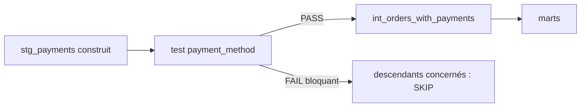
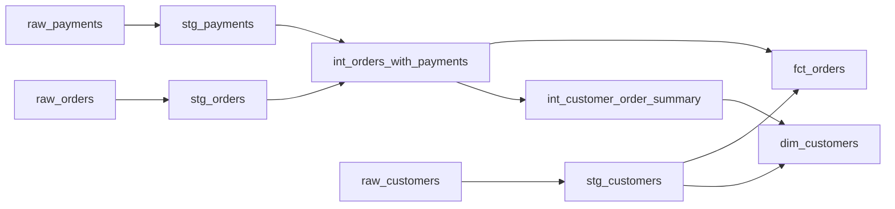
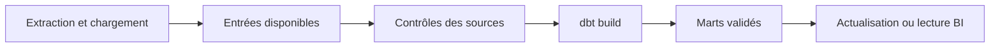

# 📝 14 — dbt · Tests, documentation, environnements, macros & packages

> [!info] Repères Brocode
> **Modèle IA — rédaction :** [[modeles-ia/ChatGPT Sol|ChatGPT Sol]]
> **Version :** référence · [[navigation/Cours|Index des cours]]
> **Variante conservée :** [[wagon2321/cours/13_dbt_advanced_warehousing|Claude Sonnet]]


> [!info] Navigation Brocode
> **← Précédent :** [[wagon2321/cours_sol/13_intro_dbt_sol|13 — Introduction dbt & pipeline Jaffle Shop]]
> **Liens SQL :** [[wagon2321/cours_sol/07_joins_and_testing_sol|JOINs & Testing]] · [[wagon2321/cours_sol/09_udf_window_functions_sol|UDFs & Window Functions]]
> **Workflow :** [[wagon2321/cours_sol/12_git_versioning_github_collaboration_sol|Git, versioning & collaboration]]

> [!abstract] Objectif du chapitre
> Passer d’un pipeline qui s’exécute à un pipeline dont on peut expliquer et vérifier les résultats : écrire les bons tests, retrouver les anomalies, documenter les contrats, isoler dev et prod, factoriser du SQL et réutiliser des packages sans masquer leur fonctionnement.

> [!tip] Fiches pour approfondir
> [[codex/sheet/Clé de jointure et cardinalité|Clé de jointure et cardinalité]] · [[codex/sql/NULL et agrégation (AVG, COUNT)|NULL et agrégation (AVG, COUNT)]] · [[wagon2321/cours/12a_dbt-config-sources-fiche|🧠 Fiche de synthèse — Config initiale dbt & gestion des sources]]


## 🧭 0. Position dans le Brocode et périmètre réel du cours

**Cours source.** Ce chapitre reprend le cours du **23 juillet 2026**, son export Markdown — deux séquences de transcription avec résumés — et les **23 captures**, de `09.08.19` à `10.18.01`.

Le chapitre #13 explique comment construire les sept modèles Jaffle Shop. Ici, on approfondit surtout les moyens de **fiabiliser, comprendre et maintenir** ce projet. On ne recopie pas tout son SQL.

| Dans le chapitre #13 | Ce que le chapitre #14 ajoute |
| --- | --- |
| Modèles, couches, `source()` et `ref()` | Tests adaptés aux contrats et aux couches |
| Premiers tests de clés et de conservation | Sévérité, diagnostic et tests personnalisés |
| Présentation de Jinja | Macros écrites et utilisées de bout en bout |
| Mention dev/prod | Configuration des targets et effets réels sur les relations |
| YAML documentaire | Utilisation du catalogue et du lineage pour comprendre un projet |
| DuckDB local | Démonstration BigQuery et précautions de portabilité |

### Convention éditoriale

- **Cours source** : idées ou exemples présents dans les supports, reformulés.
- **Complément Brocode** : explication, méthode ou exemple ajouté pour permettre une réutilisation autonome.
- **Correction Brocode** : rectification d’un exemple erroné ou d’une généralisation trompeuse.

Les blocs complets portent leur chemin. Les extraits YAML signalés comme tels sont à **fusionner avec l’entrée existante du modèle**, pas à ajouter comme une seconde déclaration de celui-ci.

> [!note] Ce que “Advanced” recouvre ici
> Les supports traitent les tests, la documentation, les targets, Jinja, les macros, les packages et une connexion BigQuery. Ils ne développent pas les modèles incrémentaux, snapshots, tests unitaires dbt ni une chaîne CI/CD complète.
>
> Ces sujets ne sont donc pas artificiellement ajoutés comme s’ils avaient été enseignés. Le mot “avancé” désigne ici la deuxième étape du bootcamp, pas l’ensemble des fonctionnalités avancées du produit.

### Versions et exemples

Les exemples pratiques prolongent **dbt Core v1.x + dbt-duckdb** du chapitre #13. Le YAML avec `arguments:` vise **Core 1.10.5 ou ultérieur**. La version du moteur se lit avec `dbt --version` ; `version: 2` dans les fichiers de propriétés n’est pas la version du logiciel ni celle du vault.

Le package de la slide est `dbt_utils` **1.1.1**. L’exemple reproductible de ce chapitre fixe **1.4.1**, version affichée par le [Package Hub consulté le 8 septembre 2026](https://hub.getdbt.com/dbt-labs/dbt_utils/latest/). Dans un projet existant, une mise à jour de dépendance reste un changement à tester.

### Parcours de lecture

- **Fiabiliser les données :** sections 1 à 10.
- **Comprendre et maintenir le projet :** sections 11 à 14.
- **Transposer à BigQuery et Greenweez :** sections 15 et 16.
- **Reproduire l’atelier complet :** section 17.
- **Diagnostiquer, réviser, retrouver une source :** sections 18 à 20.

### Deux terrains d’application

1. **Jaffle Shop** : on reprend le contrat et le jeu synthétique du #13 pour rendre les exemples exécutables.
2. **Greenweez** : on explique le changement d’échelle et les problèmes montrés dans le cours. Le ZIP ne contient pas les CSV ni le projet des challenges ; les exemples supplémentaires ont donc un contrat explicite, sans prétendre reproduire leur corrigé officiel.

La reconnaissance vocale déforme parfois Greenweez en “Guinness” ou “Italy”. Les slides identifient bien **Greenweez** ; c’est le nom retenu ici.

---

## 🔍 1. Avant de transformer : reconnaître une donnée problématique

### 1.1 Un run vert peut produire de mauvais chiffres

**Cours source.** `dbt run` peut réussir même si les résultats métier sont faux. C’est le risque des **silent failures**, les erreurs qui ne font pas échouer le SQL.

Exemples :

- une commande dupliquée après JOIN ;
- un montant converti deux fois ;
- un client perdu par un INNER JOIN ;
- un coût resté en texte puis mal interprété ;
- une catégorie nouvelle non prise en charge dans un calcul ;
- une clé étrangère qui pointe vers une entité absente.

Le moteur vérifie qu’il peut exécuter la requête. Il ne connaît pas à lui seul le bon nombre de commandes ou le sens du revenu.

### 1.2 Les quatre questions du cours

Pour chaque table raw :

1. **Grain** : que représente une ligne ?
2. **Clé** : quelle colonne, ou combinaison de colonnes, identifie cette ligne ?
3. **Volume** : combien de lignes attend-on approximativement ?
4. **Qualité** : quels types, NULL, doublons et incohérences observe-t-on ?

**Complément Brocode.** Ajouter l’unité et le périmètre des mesures : prix unitaire ou coût total, centimes ou euros, historique complet ou extrait, date de commande ou date de paiement.

### 1.3 Les exemples Greenweez des slides

La slide montre :

- `purchSE_PRICE`, un nom à standardiser ;
- ce prix stocké en `VARCHAR`, à convertir avant calcul ;
- `ship_cost`, également stocké en texte.

**Extrait SQL DuckDB à adapter aux noms réellement présents :**

```sql
select
    cast("purchSE_PRICE" as double) as purchase_price,
    cast(ship_cost as double) as ship_cost
from raw.my_source;
```

**Complément Brocode.** `DOUBLE` reprend le choix pédagogique du cours. Pour des montants nécessitant un calcul décimal contrôlé, examiner `DECIMAL(p,s)` et les règles d’arrondi. Un coût unitaire et un coût par commande ne s’additionnent pas au même grain.

> [!warning] Correction Brocode — casse et type sont deux problèmes différents
> Le nom hétérogène gêne la lisibilité. C’est surtout le type texte qui gêne les opérations numériques. Renommer la colonne ne convertit pas ses valeurs ; un `CAST` ne renomme pas la colonne sans alias.

### 1.4 `CAST` ou `TRY_CAST` ?

**Complément Brocode.** Dans DuckDB, `CAST` échoue si une valeur n’est pas convertible ; `TRY_CAST` renvoie NULL dans ce cas. Voir [les conversions DuckDB](https://duckdb.org/docs/current/sql/expressions/cast).

```sql
select
    raw_price,
    try_cast(raw_price as decimal(18, 2)) as parsed_price
from (
    values ('12.50'), ('unknown'), (cast(null as varchar))
) as input(raw_price);
```

Résultat attendu : `12.50`, NULL, NULL.

Avec `TRY_CAST`, il faut donc distinguer **NULL déjà présent** et **conversion échouée** :

```sql
select raw_price
from raw.my_prices
where raw_price is not null
  and try_cast(raw_price as decimal(18, 2)) is null;
```

Ne pas remplacer immédiatement ces échecs par zéro : un coût inconnu transformé en zéro augmente artificiellement la marge. Un outil de conversion tolérant a besoin d’un contrôle explicite de la qualité.

---

## 🧪 2. Comprendre ce qu’est réellement un data test dbt

### 2.1 Le raisonnement à l’envers

**Cours source.** Un test SQL cherche les situations qui **ne devraient pas exister**.

```text
Assertion : aucune commande ne doit avoir de montant négatif
                         ↓
Requête : sélectionner les commandes au montant négatif
                         ↓
Aucune ligne → assertion satisfaite sur les données testées
Des lignes   → anomalies à examiner
```

Cette logique vaut pour les tests singuliers et pour la plupart des tests génériques du cours, avec leurs seuils par défaut.

### 2.2 Une assertion n’est pas une réparation

Un test de non-nullité ne remplit pas les NULL. Un test d’unicité ne déduplique pas la table. Un test de relation ne crée pas le client manquant.

Le test rend une anomalie visible. Il faut ensuite déterminer sa cause et la correction métier appropriée.

### 2.3 Data tests et unit tests

> [!warning] Correction Brocode — `unique` et `not_null` ne sont pas les “unit tests” dbt
> Les vérifications du cours interrogent des relations et des données réellement présentes : ce sont des **data tests**. Les **unit tests dbt**, au sens du produit, vérifient la logique d’un modèle avec des entrées contrôlées et une sortie attendue. Ils ne sont pas développés dans ce cours. Référence : [unit tests dbt](https://docs.getdbt.com/docs/build/unit-tests).

On peut utiliser un petit jeu de données pour apprendre ou vérifier des data tests sans avoir configuré une ressource `unit_tests:`.

### 2.4 Test réussi, table vide

**Complément Brocode.** Une table vide peut réussir `unique`, `not_null` et `accepted_values`, puisqu’elle ne contient aucune ligne en contradiction avec ces assertions.

Si le métier attend obligatoirement des données, il faut un contrôle de population distinct. “42 tests ont passé” n’est pas une preuve d’exhaustivité de la donnée.

---

## 🧾 3. Les quatre tests génériques intégrés

### 3.1 Tableau de référence

| Test | Ce qu’il vérifie | Exemple | Ce qu’il ne suffit pas à prouver |
| --- | --- | --- | --- |
| `unique` | Pas de valeur non NULL dupliquée | `payment_id` | Présence de chaque clé, population complète |
| `not_null` | Pas de NULL | `order_id` | Valeurs justes ou uniques |
| `accepted_values` | Valeurs non NULL dans une liste | `payment_method` | Absence de NULL, validité de la liste métier |
| `relationships` | Chaque clé non NULL existe dans le parent | Commande → client | Unicité du parent, absence de clés NULL |

**Cours source.** `unique` + `not_null` forment le contrôle de base d’une clé primaire simple.

**Correction Brocode.** Ces assertions n’installent pas automatiquement des contraintes SQL empêchant toutes les écritures invalides. Et `relationships` doit être complété par le contrôle de clé du parent. Référence : [propriété data_tests](https://docs.getdbt.com/reference/resource-properties/data-tests).

### 3.2 Syntaxe courte et syntaxe développée

```yaml
columns:
  - name: payment_id
    data_tests: [unique, not_null]
```

Équivalent :

```yaml
columns:
  - name: payment_id
    data_tests:
      - unique
      - not_null
```

Les éléments de la liste sont les **noms de tests**, pas des noms de colonnes.

**Mise à jour Brocode.** Les slides écrivent `tests:`. On emploie ici `data_tests:` ; `tests:` reste un alias. Pour les tests paramétrés, les arguments sont placés sous `arguments:` dans les versions visées.

### 3.3 Valeurs autorisées sur les moyens de paiement

**Extrait à fusionner dans `models/staging/schema.yml`, sous l’entrée existante `stg_payments`.**

```yaml
columns:
  - name: payment_method
    description: "Moyen de paiement enregistré ; liste contrôlée pour cet exercice."
    data_tests:
      - not_null
      - accepted_values:
          name: payment_method_allowed
          arguments:
            values: ['credit_card', 'coupon', 'bank_transfer', 'gift_card']
```

**Cours source.** Cette liste reprend la slide. **Complément Brocode.** Le nom explicite `payment_method_allowed` simplifie la sélection du test dans les exercices de diagnostic.

Le test doit échouer si une nouvelle valeur `paypal` apparaît, mais cet échec ne signifie pas nécessairement que la donnée est fausse. Le catalogue des valeurs autorisées peut être devenu obsolète après une évolution du service de paiement.

> [!tip] Face à une nouvelle catégorie
> Vérifier l’origine et la définition de la valeur, identifier les modèles qui en dépendent, puis décider s’il faut corriger la source ou mettre à jour le contrat. Ne pas supprimer la donnée uniquement pour obtenir un résultat vert.

### 3.4 Relations : connaître le sens de la vérification

**Extrait du contrôle déjà présent dans le chapitre #13, à ne pas dupliquer :**

```yaml
columns:
  - name: customer_id
    data_tests:
      - not_null
      - relationships:
          arguments:
            to: ref('dim_customers')
            field: customer_id
```

Si ce bloc est sous `fct_orders`, il vérifie :

```text
Chaque customer_id renseigné dans fct_orders
                         ↓
existe dans dim_customers.customer_id
```

Il ne demande pas que tous les clients aient une commande. Un client sans commande est valide dans la dimension du #13.

**Complément Brocode — SQL de diagnostic équivalent dans l’intention :**

```sql
select orders.order_id, orders.customer_id
from main_marts.fct_orders as orders
left join main_marts.dim_customers as customers
    on orders.customer_id = customers.customer_id
where orders.customer_id is not null
  and customers.customer_id is null;
```

### 3.5 Un bon test doit viser le bon grain

- `stg_payments.payment_id` doit être unique.
- `stg_payments.order_id` peut se répéter.
- `int_orders_with_payments.order_id` doit redevenir unique.
- `dim_customers.customer_id` doit être unique.

Tester la mauvaise colonne peut faire échouer des données parfaitement valides. Les tests découlent du contrat du modèle, pas d’une liste générique appliquée à toutes ses colonnes.

---

## 🗂 4. Organiser les propriétés YAML sans déclarations en double

### 4.1 La structure recommandée par le cours

```text
models/
├── sources.yml                 # sources brutes
├── staging/
│   └── schema.yml               # modèles et tests du staging
├── intermediate/
│   └── schema.yml               # modèles et tests intermediate
└── marts/
    └── schema.yml               # modèles et tests des marts
```

On garde cette structure dans la continuité du chapitre #13. Elle permet de retrouver le contrat d’un modèle près de son SQL.

### 4.2 Convention de rangement et contrainte réelle

> [!warning] Correction Brocode — mélanger `sources:` et `models:` n’est pas interdit
> Un fichier de propriétés peut contenir les deux sections. L’erreur réelle est notamment de déclarer deux fois la même ressource ou de définir plusieurs fois les propriétés d’un même modèle.
>
> La séparation par dossier est une convention de maintenance, pas une obligation du parseur. Le fichier `schema.yml` à la racine n’est pas intrinsèquement réservé aux sources.

Le dossier d’un fichier de propriétés ne limite pas magiquement les modèles que l’on peut y nommer. C’est la cohérence du projet et l’absence de doublons qui comptent.

### 4.3 Comment ajouter proprement un test

1. Rechercher le `name` du modèle dans les fichiers YAML.
2. Identifier sa déclaration existante.
3. Ajouter la colonne ou le test au bon niveau.
4. Garder les descriptions déjà présentes.
5. Vérifier que la même colonne n’a pas été recréée comme deuxième entrée.
6. Parser ou construire le projet.

```bash
dbt parse
dbt ls --resource-type test --select stg_payments
```

### 4.4 Les versions à ne pas confondre

| Écriture | Sens |
| --- | --- |
| `version: 2` dans les propriétés | Format de ce fichier dbt |
| `config-version: 2` dans le projet | Format de configuration du projet |
| `version: "1.0.0"` dans le projet | Version déclarée du projet utilisateur |
| `version: "1.4.1"` dans `packages.yml` | Version d’une dépendance |
| `dbt --version` | Versions réellement installées du moteur et des adaptateurs |

**Correction Brocode.** `version: 2` ne signifie pas “dernière version récente de YAML”. YAML est un langage distinct ; la version du format dbt est autre chose.

---

## 🚦 5. Choisir entre ERROR, WARN et seuils

### 5.1 Pourquoi ne pas rendre chaque anomalie bloquante ?

**Cours source.** Une clé primaire invalide peut casser tout le calcul aval. Un champ descriptif incomplet peut être moins critique. La sévérité doit refléter cet impact.

```yaml
columns:
  - name: first_name
    data_tests:
      - not_null:
          config:
            severity: warn
```

**Extrait pédagogique.** Ce bloc exprime “je souhaite surveiller les prénoms manquants, sans bloquer par défaut”. Il ne fait pas partie du contrat minimal du #13 : si l’absence de prénom est parfaitement normale, il est parfois préférable de ne pas créer un avertissement permanent.

### 5.2 Les trois paramètres

| Paramètre | Rôle | Par défaut |
| --- | --- | --- |
| `severity` | Nature de la réaction | `error` |
| `error_if` | Condition sur le nombre d’échecs pour une erreur | `!=0` |
| `warn_if` | Condition sur ce nombre pour un avertissement | `!=0` |

**Complément Brocode.** Avec `severity: error`, dbt évalue la condition d’erreur, puis celle d’avertissement si nécessaire. Avec `severity: warn`, il n’utilise pas `error_if`. Des options d’exécution peuvent promouvoir des avertissements en erreurs. Référence : [sévérité et seuils](https://docs.getdbt.com/reference/resource-configs/severity).

```yaml
columns:
  - name: first_name
    data_tests:
      - not_null:
          config:
            severity: error
            error_if: ">10"
            warn_if: ">0"
```

Dans cet exemple : zéro échec passe, 1 à 10 déclenchent un WARN, plus de 10 déclenchent une erreur. Ce sont des **nombres d’échecs**, pas des pourcentages.

### 5.3 Seuil absolu ou proportion ?

**Complément Brocode.** Dix NULL sur vingt lignes et dix NULL sur dix millions de lignes ne représentent pas le même taux. Pour une règle “au moins 95 % de valeurs renseignées”, un test de proportion est plus adapté ; voir la section packages.

Ne pas tolérer dix doublons de clé sous prétexte que le dataset est grand : certaines règles sont absolues, car un seul doublon peut modifier les jointures et les agrégats.

### 5.4 Que faire d’un WARN ?

Un avertissement utile a une règle lisible, une personne ou une équipe qui le surveille et une action possible. Sinon, les messages finissent par être ignorés. Le choix de la sévérité est une décision de qualité, pas une manière de contourner un échec gênant.

---

## 🔄 6. `run`, `test` et `build` : ce qui se passe vraiment

### 6.1 Trois commandes, trois intentions

| Commande | Intention |
| --- | --- |
| `dbt run` | Construire les modèles sélectionnés |
| `dbt test` | Vérifier les ressources existantes selon les tests sélectionnés |
| `dbt build` | Construire et tester les ressources sélectionnées selon leurs dépendances |

**Cours source.** `build` est le réflexe recommandé pour le travail courant du cours.

**Correction Brocode.** `run` ne “force” pas un SQL invalide à s’exécuter. Il ne lance simplement pas les data tests. Un problème de syntaxe, de permission ou de relation manquante peut toujours le faire échouer.

### 6.2 `run && test` n’est pas équivalent à `build`

```bash
dbt run && dbt test
```

Le shell n’exécute `test` que si `run` réussit. Tous les modèles sélectionnés par le premier run ont alors déjà été construits avant ces tests.

Avec `build`, les tests peuvent empêcher la construction de certains descendants à mesure que dbt progresse dans le graphe.



### 6.3 Ce qui peut déjà avoir changé quand le test échoue

> [!warning] Correction Brocode — les data tests d’un modèle passent après sa construction
> Dans le cas illustré, `stg_payments` a été construit avant son test de données. Une erreur peut empêcher la suite concernée, mais elle ne restaure pas automatiquement le modèle déjà construit.
>
> `build` n’est pas une transaction globale avec rollback de toutes les tables. Les branches indépendantes peuvent aussi continuer. La portée des tests à plusieurs parents dépend du graphe. Voir [commande build](https://docs.getdbt.com/reference/commands/build).

**Complément Brocode.** Si le staging est une vue, une modification de sa source peut devenir visible dès la lecture, même avant un nouveau run. La protection des consommateurs dépend donc aussi des matérialisations, des cibles et du processus de publication.

### 6.4 Sélection : les parents doivent être disponibles

```bash
# Construire le mart commandes avec ses ancêtres.
dbt build --select +fct_orders

# Reconstruire les paiements et leurs descendants.
dbt build --select stg_payments+

# Lister avant d’exécuter.
dbt ls --select stg_payments+
```

**Rappel du #13.** `ref()` déclare une dépendance ; il ne force pas l’ajout de tous les ancêtres à une sélection trop étroite. Les tests multi-parents peuvent être inclus ou exclus selon la sélection indirecte. Pour ce petit projet pédagogique, un build complet reste souvent plus simple à interpréter.

---

## 🐛 7. Lire un échec et retrouver les données en cause

### 7.1 Différencier les sorties

| Sortie | Interprétation |
| --- | --- |
| PASS | L’assertion a passé avec sa configuration |
| FAIL | Des résultats du test dépassent le seuil autorisé |
| ERROR | Le test ou modèle n’a pas pu s’exécuter correctement |
| SKIP | La ressource n’a pas été exécutée |
| WARN | Avertissement à examiner, non bloquant par défaut |

**Cours source.** La démonstration rencontre d’abord une relation non construite. C’est un problème d’exécution, pas la découverte d’une mauvaise valeur métier. Construire le modèle manquant et tester ses données répondent à deux problèmes différents.

### 7.2 Logs, SQL compilé et résultats sont trois choses distinctes

| Emplacement | Ce que l’on y cherche |
| --- | --- |
| Terminal | Résumé, nom du test, nombre d’échecs, statut |
| `logs/dbt.log` | Détails d’exécution et messages d’erreur |
| `target/compiled/` | SQL après résolution de Jinja |
| `target/run_results.json` | Résultats structurés de la dernière commande concernée |
| Relation d’audit avec `store_failures` | Résultats persistés du test si activé |

> [!warning] Correction Brocode — les lignes en échec ne sont pas forcément imprimées
> La slide annonce que les lignes défaillantes apparaissent dans les logs. Il ne faut pas compter sur un affichage intégral automatique. Le terminal donne généralement un résumé ; inspecter le SQL compilé et exécuter sa requête, ou activer le stockage des échecs.

Ne pas modifier le fichier compilé pour corriger le projet : la prochaine compilation l’écrasera. Corriger le SQL ou YAML source.

### 7.3 Persister les échecs d’un test

**Complément Brocode.** Avec le test nommé dans la section 3 :

```bash
dbt test --select payment_method_allowed --store-failures
```

dbt peut créer une relation d’audit contenant le résultat du test. Elle nécessite les droits de création correspondants ; suivre le nom exact affiché. Son emplacement dépend de la configuration et de la cible, souvent dans un schéma d’audit dédié. Référence : [store_failures](https://docs.getdbt.com/reference/resource-configs/store_failures).

Le résultat stocké est celui de la requête du test : il peut s’agir de valeurs agrégées avec leur fréquence, pas forcément des lignes originales complètes. Pour un identifiant sensible ou un environnement réel, choisir aussi qui peut consulter ces résultats.

### 7.4 Démonstration corrigée : introduire `paypal`

**Cours source.** La slide veut introduire un moyen de paiement non autorisé puis observer l’échec.

> [!warning] Correction Brocode — ne pas faire l’INSERT dans `stg_payments`
> Dans l’architecture du cours et du chapitre #13, `stg_payments` est une **vue**. L’INSERT montré dans la slide n’est pas adapté à cette matérialisation DuckDB. On introduit donc l’anomalie dans la table raw d’un **fichier d’exercice isolé**.
>
> On utilise un `order_id` existant et on respecte l’unité raw en centimes. Ainsi, on teste le moyen de paiement sans ajouter involontairement une erreur de clé étrangère.

Avec le jeu synthétique du #13, vérifier d’abord que l’ID 9001 est libre, puis exécuter dans DBeaver :

```sql
-- Uniquement dans la copie d’exercice du #13.
select * from raw.raw_payments where id = 9001;

insert into raw.raw_payments (id, order_id, payment_method, amount)
values (9001, 101, 'paypal', 5000);
```

Fermer la connexion DBeaver, puis :

```bash
dbt test --select payment_method_allowed --store-failures
```

**Attendu :** échec de ce test. Le staging étant une vue, il voit la nouvelle ligne raw sans reconstruction préalable de son résultat.

Pour observer l’impact sur les descendants :

```bash
dbt build --select stg_payments+
```

**Attendu dans cette reconstruction :** erreur sur le test de méthode, puis descendants concernés ignorés. Cette commande peut modifier des ressources en dev avant l’échec ; elle se lance donc dans la copie d’exercice.

### 7.5 Retirer précisément l’anomalie

Reconnecter DBeaver après la commande :

```sql
-- Annule uniquement l’insertion pédagogique décrite ci-dessus.
delete from raw.raw_payments
where id = 9001
  and order_id = 101
  and payment_method = 'paypal'
  and amount = 5000;
```

Puis déconnecter et relancer :

```bash
dbt build
```

Le succès après correction et les montants attendus du #13 permettent de vérifier le retour à un état sain. Ne pas supprimer indistinctement toutes les lignes utilisant un moyen de paiement : on annule l’exemple précis, pas une population métier.

### 7.6 Méthode générale de diagnostic

1. Identifier FAIL ou ERROR.
2. Repérer le test et le modèle exacts.
3. Lire l’assertion métier, y compris ses filtres et seuils.
4. Lire le SQL compilé.
5. Examiner quelques anomalies et remonter à la source.
6. Corriger la donnée, la transformation ou le contrat selon la cause.
7. Reconstruire et tester le périmètre concerné.

---

## 🧩 8. Écrire un test singulier

### 8.1 Cas du cours : montant négatif

**Fichier à ajouter : `tests/assert_non_negative_order_amount.sql`**

```sql
select order_id, total_amount
from {{ ref('fct_orders') }}
where total_amount < 0
```

```bash
dbt test --select assert_non_negative_order_amount

# Tous les tests singuliers sélectionnés par ce filtre.
dbt test --select test_type:singular
```

**Cours source.** Le fichier contient du SQL normal avec `ref()`. Il n’a pas de bloc `` et n’a pas besoin d’être redéclaré dans un YAML pour être découvert.

> [!warning] Correction Brocode — “positif” ne veut pas dire “non négatif”
> La slide nomme son fichier `assert_positive_order_amount` mais utilise `< 0` comme anomalie : zéro est donc autorisé. Ici, le nom est corrigé en `non_negative`.
>
> `NULL < 0` ne vaut pas TRUE : ce test ne détecte pas les montants NULL. Le test `not_null` du #13 est complémentaire. Et des remboursements négatifs peuvent être légitimes dans un autre contrat métier.

### 8.2 Cas ajouté : dates clientes cohérentes

**Complément Brocode.** La première commande ne peut pas être postérieure à la dernière.

**Fichier à ajouter : `tests/assert_customer_order_dates.sql`**

```sql
select
    customer_id,
    first_order_date,
    most_recent_order_date
from {{ ref('dim_customers') }}
where first_order_date > most_recent_order_date
```

Un client sans commande a deux dates NULL et ne doit pas échouer à ce test. Pour exiger des dates lorsque `number_of_orders > 0`, on pourrait ajouter un contrôle distinct.

### 8.3 Cas ajouté : présence de données attendues

**Fichier à ajouter : `tests/assert_customers_not_empty.sql`**

```sql
select count(*) as row_count
from {{ ref('stg_customers') }}
having count(*) = 0
```

Ici, le `HAVING` est essentiel : une ligne de résultat n’est retournée que si la table est vide. Ce test traduit une règle **de notre exercice**, qui attend des clients ; il n’est pas universellement applicable à une table qui peut être vide normalement.

### 8.4 Quel résultat doit retourner le test ?

Idéalement, les colonnes nécessaires pour diagnostiquer : clé, valeur observée, valeur attendue, écart. Un test de conservation du montant devrait permettre de retrouver la commande concernée, pas seulement afficher “KO”.

Les deux tests de conservation du #13 restent utiles : mêmes commandes avant/après et mêmes montants par commande. Le deuxième cours les complète ; il ne les remplace pas par les seuls tests génériques.

---

## ♻️ 9. Écrire un test générique personnalisé

### 9.1 Quand passer du singulier au générique ?

**Cours source.** Une même assertion peut être réutilisée sur plusieurs modèles ou colonnes. On paramètre alors la logique au lieu de copier plusieurs requêtes presque identiques.

| Test singulier | Test générique |
| --- | --- |
| Vise un cas et une requête donnés | Définit une assertion paramétrable |
| Placé dans `tests/` | Définition dans `tests/generic/` ou `macros/` |
| Découvert comme test à exécuter | Appelé depuis une propriété YAML |
| Utilise souvent un `ref()` explicite | Reçoit notamment `model`, éventuellement `column_name` |

### 9.2 Exemple complet : une valeur non négative

**Fichier à ajouter : `tests/generic/non_negative.sql`**

```sql


select
    {{ column_name }} as invalid_value
from {{ model }}
where {{ column_name }} < 0


```

**Extrait à ajouter aux tests existants de `fct_orders.total_amount` :**

```yaml
columns:
  - name: total_amount
    data_tests:
      - not_null
      - non_negative
```

dbt fournit `model` et `column_name` à partir du modèle et de la colonne où le test est déclaré. L’appel ne s’écrit pas `{{ non_negative(...) }}` dans le SELECT d’un modèle.

**Complément Brocode.** Pour des noms de colonnes simples et contrôlés, cet exemple est suffisant. Une macro destinée à des identifiants complexes doit prévoir une stratégie de quoting ; ce n’est pas nécessaire ici.

### 9.3 Emplacement et arguments : les nuances

> [!warning] Correction Brocode — `model` et `column_name` ne sont pas toujours tous deux obligatoires
> Un test générique au niveau table peut n’avoir besoin que de `model`, et un test peut accepter d’autres arguments. `column_name` est pertinent lorsque l’assertion vise une colonne.
>
> Le cours range les tests dans `macros/tests/`, ce qui est possible. `tests/generic/` est aussi un emplacement reconnu. Éviter de mettre la même définition aux deux endroits. Référence : [tests génériques personnalisés](https://docs.getdbt.com/best-practices/writing-custom-generic-tests).

### 9.4 L’erreur importante de la slide : `SELECT COUNT(*)`

La slide propose conceptuellement :

```sql
-- Exemple incorrect avec le calcul d’échecs dbt par défaut.
select count(*) as num_records
from my_table
where my_column = 'forbidden';
```

Même s’il n’existe aucune valeur interdite, cette requête retourne **une ligne contenant 0**. Par défaut, dbt compte les lignes du résultat du test : une ligne signifie un échec, indépendamment du zéro contenu dans la cellule.

> [!warning] Correction Brocode — retourner les anomalies, pas toujours un compteur
> Le correctif le plus lisible est `SELECT ... WHERE anomalie`, comme dans le test `non_negative`. Autre possibilité : une agrégation avec un `HAVING` qui ne retourne une ligne qu’en cas d’anomalie.
>
> On peut personnaliser `fail_calc`, mais c’est inutilement complexe pour cette introduction aux tests personnalisés. Référence : [calcul du nombre d’échecs](https://docs.getdbt.com/reference/resource-configs/fail_calc).

```sql
-- Variante agrégée correcte : zéro ligne si aucune anomalie.
select count(*) as num_records
from my_table
where my_column = 'forbidden'
having count(*) > 0;
```

### 9.5 Éviter les doublons de couverture involontaires

Pour `fct_orders.total_amount`, le test singulier de la section 8 et le générique `non_negative` expriment la même règle. Les conserver tous les deux est utile pour comparer les deux mécanismes pendant l’apprentissage, mais pas nécessaire dans un projet entretenu.

Le test singulier est souvent préférable pour une règle unique et complexe ; le générique pour une assertion stable et répétée. Dans l’atelier de validation, on conserve les deux pour montrer qu’ils détectent le même défaut.

---
## 🔑 10. Tester une clé composée et protéger le grain

### 10.1 Une clé ne correspond pas toujours à une colonne

**Cours source.** Dans une table de ventes, `orders_id` peut se répéter parce qu’une commande contient plusieurs produits. Le tester avec `unique` ferait échouer des données parfaitement valides.

**Complément Brocode.** Avant de choisir `(orders_id, products_id)` comme clé, vérifier le contrat : un produit apparaît-il au maximum une fois dans une commande ? Si deux lignes du même produit sont autorisées, il faut peut-être `order_line_id`, ou une autre composante. La paire n’est pas une clé universelle du e-commerce.

Avec le contrat **une ligne par couple commande–produit**, le diagnostic est :

```sql
select
    orders_id,
    products_id,
    count(*) as row_count
from my_sales
group by orders_id, products_id
having count(*) > 1;
```

La présence d’une ligne dans ce résultat signifie que le grain annoncé n’est pas respecté. Un test singulier peut utiliser exactement cette logique, en remplaçant `my_sales` par un `ref()` ou `source()` approprié.

### 10.2 Pourquoi une simple concaténation est fragile

```sql
-- Collision : deux couples différents produisent le même texte.
select '1' || '23' as key_a, '12' || '3' as key_b;
```

Ajouter un séparateur réduit ce problème, mais ne le supprime pas si ce séparateur peut exister dans les valeurs : `('a_b', 'c')` et `('a', 'b_c')` produisent tous les deux `a_b_c`.

La gestion des NULL dépend aussi de l’expression et du moteur. Une clé concaténée ne doit pas être acceptée simplement parce que son SQL est court.

Pour **tester** une combinaison, préférer un `GROUP BY` sur les colonnes, ou `dbt_utils.unique_combination_of_columns` présenté en section 14. Pour **créer** une clé technique, il faut un contrat explicite de sérialisation, de NULL et de stabilité ; ce sujet dépasse l’exemple de libellé du cours.

### 10.3 Les tests de JOIN restent indispensables

Reprendre la méthode de [[wagon2321/cours_sol/07_joins_and_testing_sol|JOINs & Testing]] et du #13 :

| Contrat attendu | Vérification pertinente |
| --- | --- |
| Une ligne par commande avant et après enrichissement | Unicité de `order_id` sur le modèle final |
| Toutes les commandes conservées | Comparaison des identifiants ou test de conservation |
| Le client d’une commande existe | `relationships` sur `customer_id` |
| La table clients contient une ligne par client | `unique` + `not_null` sur la clé parent |
| Un total de paiement n’est pas multiplié | Réconciliation des montants avant/après JOIN |
| Une table de lignes de vente a un grain composé | Test de la combinaison des clés |

`relationships` peut passer même si la clé parent est dupliquée : il vérifie l’existence de la correspondance, pas que la jointure est plusieurs-vers-un. C’est l’association des contrats qui protège le résultat.

> [!tip] Un test de nombre de lignes ne prouve pas toute la conservation
> Un résultat peut perdre une commande et en dupliquer une autre tout en conservant le même nombre de lignes. Combiner volume, unicité et comparaison des clés lorsque la conservation complète compte.

---

## 📚 11. Documentation et lineage : transmettre le sens du pipeline

### 11.1 Ce que les descriptions doivent apprendre au lecteur

**Cours source.** Ajouter `description:` aux modèles et aux colonnes, puis générer la documentation.

Une description utile répond aux questions laissées ouvertes par le nom de la colonne. Écrire « montant total » sous `total_amount` apporte peu. Pour Jaffle Shop, on préfère :

```yaml
# Extrait à fusionner dans l'entrée existante de fct_orders.
- name: total_amount
  description: >
    Somme des paiements enregistrés pour la commande, en USD,
    après conversion depuis les centimes. Zéro lorsqu'aucun paiement
    n'est présent. Aucun filtre supplémentaire sur le statut de commande
    et aucune logique de remboursement ne sont appliqués dans cet atelier.
  data_tests:
    - not_null
    - non_negative
```

Le modèle devrait aussi préciser : son grain, la population conservée, ses exclusions et sa clé. Une source devrait préciser d’où elle vient et ce qu’elle contient réellement.

**Complément Brocode.** Séparer les faits vérifiés des hypothèses. Si la devise ou la définition du revenu n’est pas connue, écrire « à confirmer » et lever l’ambiguïté avec le propriétaire de la donnée. Un texte très précis peut aussi documenter une erreur avec beaucoup d’assurance.

### 11.2 Générer puis ouvrir la documentation

Depuis la racine du projet Core :

```bash
dbt docs generate
dbt docs serve --port 8080
```

Ouvrir ensuite `http://localhost:8080` dans le navigateur. Arrêter le serveur local avec `Ctrl+C` quand la consultation est terminée.

`docs generate` produit notamment le catalogue des relations et exploite les métadonnées du projet ; il peut interroger la plateforme pour collecter les informations nécessaires. Il ne remplace pas un `dbt build` : générer la documentation ne construit pas à lui seul le pipeline métier.

Les artefacts se trouvent par défaut dans `target/`, notamment `manifest.json`, `catalog.json` et la page de documentation. Ils sont générés ; la source maintenue à la main reste le SQL et les fichiers de propriétés. Référence : [commandes de documentation](https://docs.getdbt.com/reference/commands/cmd-docs).

### 11.3 Lire le lineage dans les deux directions

À partir de `fct_orders` :

- **vers l’amont** : quelles sources et transformations expliquent ce résultat ?
- **vers l’aval** : quels modèles risquent d’être affectés si je change ce contrat ?



Ce schéma représente les **dépendances SQL des modèles du #13**. Un test `relationships` entre `fct_orders` et `dim_customers` est une dépendance du **test** ; il ne signifie pas que le SQL de `fct_orders` sélectionne la dimension.

Un `ref()` ou `source()` permet à dbt de connaître les liens déclarés. Une table écrite en dur dans du SQL peut être interrogée sans apparaître comme la dépendance attendue dans le graphe dbt.

### 11.4 Documentation n’est pas observation en temps réel

Un catalogue décrit un état généré à un instant donné. Une description ne prouve pas qu’un test a réussi aujourd’hui ; un graphe ne prouve pas que l’ingestion s’est terminée ; une colonne documentée peut encore contenir des valeurs incorrectes.

Pour comprendre un incident, réunir : le SQL, les descriptions, le lineage, le résultat du dernier build et les anomalies du test. Chaque outil répond à une partie de la question.

---

## 🌍 12. Environnements dev/prod : où le même code écrit-il ?

### 12.1 Les quatre éléments à ne pas confondre

| Élément | Question |
| --- | --- |
| Branche Git | Quelle version du code suis-je en train de modifier ? |
| Profil dbt | Quel ensemble de connexions le projet utilise-t-il ? |
| Target du profil | Quelle connexion et quel espace de sortie ai-je sélectionnés ? |
| Sources | Quelles données d’entrée mes modèles lisent-ils ? |

Changer de branche ne change pas automatiquement la target. Exécuter `--target prod` depuis une branche de travail reste possible si l’identité utilisée possède les droits : Git n’est pas une barrière d’accès à la base.

**Cours source.** La slide montre deux targets DuckDB pointant vers le même fichier, avec des schémas différents. C’est une séparation logique des sorties, suffisante pour apprendre le mécanisme ; elle n’isole pas deux infrastructures.

### 12.2 Exemple complet pour prolonger le #13

Dans `dbt_project.yml`, conserver :

```yaml
profile: jaffle_shop_dbt
```

**Profil local à adapter : `~/.dbt/profiles.yml`** — remplacer le chemin par le chemin absolu du fichier **synthétique de l’atelier**. Si le fichier contient déjà d’autres profils, conserver leurs entrées et fusionner celle-ci.

```yaml
jaffle_shop_dbt:
  target: dev
  outputs:
    dev:
      type: duckdb
      path: /CHEMIN/ABSOLU/jaffle_shop.duckdb
      schema: main
      threads: 4
    prod:
      type: duckdb
      path: /CHEMIN/ABSOLU/jaffle_shop.duckdb
      schema: analytics_prod
      threads: 4
```

Les deux chemins sont volontairement identiques. `target: dev` définit la cible par défaut **de ce profil** ; dbt n’impose pas que le nom par défaut soit toujours `dev`.

```bash
dbt debug --target dev
dbt build --target dev
```

Pour simuler une production **dans cette base locale d’exercice uniquement** :

```bash
dbt debug --target prod
dbt build --target prod
```

Le choix de la target est accessible à Jinja, par exemple avec `target.name` et `target.schema`. Les attributs de connexion supplémentaires varient selon l’adapter. Références : [profils locaux](https://docs.getdbt.com/docs/local/profiles.yml), [objet `target`](https://docs.getdbt.com/reference/dbt-jinja-functions/target).

### 12.3 Le piège du schéma final

Le #13 configure les dossiers avec `+schema: staging`, `+schema: intermediate` et `+schema: marts`. Avec la génération standard des schémas dbt :

| Target | `target.schema` | Dossier staging | Dossier marts |
| --- | --- | --- | --- |
| `dev` | `main` | `main_staging` | `main_marts` |
| `prod` | `analytics_prod` | `analytics_prod_staging` | `analytics_prod_marts` |

Le schéma custom est ajouté au schéma de la target. Il ne le remplace pas. Sans `+schema`, un modèle va dans le schéma de la target. Référence : [génération des schémas](https://docs.getdbt.com/docs/build/custom-schemas).

> [!warning] Correction Brocode — isoler les sorties ne copie pas les entrées
> Les sources du #13 gardent `schema: raw`. Dans cet exemple, dev et prod lisent donc les **mêmes tables raw** du même fichier. Modifier ces entrées peut affecter les deux environnements, en particulier leurs vues. Pour isoler les données, il faut aussi organiser explicitement les sources, les fichiers ou les accès.

### 12.4 Que devient `ref()` quand on change de target ?

Le code reste :

```sql
select *
from {{ ref('stg_orders') }}
```

En dev, la relation compilée vise le schéma `main_staging`. En prod, elle vise `analytics_prod_staging`, avec la configuration ci-dessus. C’est l’un des bénéfices du nom logique : les modèles n’ont pas à contenir les coordonnées physiques de chaque environnement.

En revanche, `source()` suit sa déclaration de source. Il ne devine pas qu’une autre table raw serait préférable pour la production.

### 12.5 Du développement au déploiement

**Complément Brocode — le workflow, sans inventer une CI/CD complète au programme :**

1. Créer une branche et modifier le SQL, les tests et les descriptions ensemble.
2. Construire et tester dans un espace de développement.
3. Ouvrir une pull request ; une CI peut reconstruire et tester dans un espace temporaire.
4. Faire relire le changement et fusionner après validation.
5. Exécuter la version approuvée avec la connexion de production.
6. Surveiller les échecs et documenter la marche à suivre.

Une exécution de CI avant fusion valide un candidat. Un déploiement après fusion applique le code retenu. Un job planifié réactualise les données. Ces trois actions peuvent toutes appeler dbt, mais n’ont ni le même déclencheur ni le même objectif.

Voir [[wagon2321/cours_sol/12_git_versioning_github_collaboration_sol|Git, versioning & collaboration]] pour la mécanique Git.

---

## 🧩 13. Jinja et macros : factoriser du SQL lisible

### 13.1 Deux moments, deux langages

**Cours source.** Une macro évite de recopier la même logique dans plusieurs modèles. Pour la comprendre, distinguer la génération du SQL et l’exécution du SQL.

```text
Fichier SQL + Jinja
        ↓ dbt évalue le template
SQL compilé, avec noms de relations et expressions concrètes
        ↓ l'adapter organise l'exécution sur la plateforme
Vue, table ou résultat de test
```

Une macro appelée dans une expression de modèle peut **produire du texte SQL**. Ce SQL sera ensuite évalué par DuckDB ou BigQuery pour les lignes traitées. Le template n’est pas une boucle Python appliquée à chaque ligne de la table.

| Syntaxe | Rôle | Exemple |
| --- | --- | --- |
| `{{ ... }}` | Insérer le résultat d’une expression Jinja | `{{ ref('stg_orders') }}` |
| `` | Définir ou contrôler le template | `` |
| `{# ... #}` | Commentaire Jinja | `{# Explication du template #}` |

> [!note] Correction Brocode — les fonctions du contexte ne sont pas toutes des macros utilisateur
> `ref()`, `source()` et `config()` sont des fonctions fournies par le contexte dbt. Elles s’utilisent dans Jinja, mais on ne les écrit pas comme les macros de notre dossier `macros/`. Les regrouper comme « fonctions disponibles avec Jinja dans dbt » est plus exact que dire que tout appel entre accolades est une macro.

Référence générale : [Jinja et macros dans dbt](https://docs.getdbt.com/docs/build/jinja-macros).

### 13.2 Macro dbt et UDF SQL

| Macro dbt de cet atelier | UDF SQL étudiée au #09 |
| --- | --- |
| Réutilise un morceau de template dans le projet | Réutilise une fonction dans le moteur SQL |
| Son appel est développé pendant la compilation | Son appel appartient à la requête exécutée par le moteur |
| Le fichier vit dans `macros/` | La fonction peut être temporaire ou enregistrée dans la base selon sa définition |
| Ne crée pas automatiquement une fonction persistante | Une définition persistante crée un objet interrogeable dans la base |

La macro est un mécanisme de génération ; l’UDF est un mécanisme du langage ou du moteur SQL. Voir [[wagon2321/cours_sol/09_udf_window_functions_sol|UDFs & Window Functions]].

### 13.3 Corriger la macro de libellé produit de la slide

La slide concatène modèle, couleur et taille dans `create_product_id(model, color)`. Trois points méritent une correction :

1. `size` est utilisée sans être un paramètre : la macro dépend silencieusement d’une colonne portant ce nom.
2. Les doubles guillemets autour de `"_"` et `"no-size"` ne sont pas des chaînes SQL dans DuckDB : ils désignent des identifiants. Employer les apostrophes SQL.
3. Un libellé concaténé n’est pas une garantie d’unicité ; le nom `product_label` décrit mieux l’exemple.

**Fichier à ajouter : `macros/product_label.sql`**

```sql

    case
        when {{ model_col }} is null or {{ color_col }} is null then null
        else concat(
            cast({{ model_col }} as varchar),
            '_',
            cast({{ color_col }} as varchar),
            '_',
            coalesce(cast({{ size_col }} as varchar), 'no-size')
        )
    end

```

**Complément Brocode.** Le contrat de cet exemple DuckDB est explicite : modèle ou couleur absent → libellé NULL ; taille absente → suffixe `no-size`. C’est un choix d’affichage pédagogique, pas une règle universelle sur les produits.

L’emploi de `varchar` rend cette version directement adaptée à DuckDB. Pour BigQuery, revoir les types, par exemple `string`. dbt ne traduit pas automatiquement tout SQL d’un dialecte vers un autre.

### 13.4 Un modèle minuscule pour voir la macro fonctionner

**Fichier à ajouter : `models/examples/demo_product_labels.sql`**

```sql
{{ config(materialized='view') }}

with products as (
    select *
    from (
        values
            (1, 'tee', 'blue', 'M'),
            (2, 'tee', 'red', cast(null as varchar)),
            (3, cast(null as varchar), 'black', 'L')
    ) as t(product_id, model_name, color, size)
)

select
    product_id,
    model_name,
    color,
    size,
    {{ product_label('model_name', 'color', 'size') }} as product_label
from products
```

Ces trois lignes sont **synthétiques**. Le modèle est autonome et sert uniquement à vérifier le comportement du template ; ce n’est pas une nouvelle source métier Jaffle Shop.

Résultat attendu :

| product_id | product_label |
| --- | --- |
| 1 | `tee_blue_M` |
| 2 | `tee_red_no-size` |
| 3 | NULL |

```bash
dbt compile --select demo_product_labels
```

Ouvrir `target/compiled/jaffle_shop_dbt/models/examples/demo_product_labels.sql` dans le projet du #13. On doit y trouver un `case`, `concat` et les noms de colonnes ; l’appel Jinja d’origine doit avoir disparu.

Pour créer la vue :

```bash
dbt run --select demo_product_labels
```

Sans configuration de schéma du dossier `examples`, elle sera dans `main` en dev avec le profil ci-dessus.

### 13.5 Pourquoi les arguments sont entre quotes

Dans cet appel :

```sql
{{ product_label('model_name', 'color', 'size') }}
```

`'model_name'` est une **chaîne Jinja** contenant le texte du nom de colonne. Quand la macro écrit `{{ model_col }}`, elle insère `model_name` dans le SQL, sans apostrophes SQL.

Sans quotes, `product_label(model_name, color, size)` demande à Jinja de chercher des variables du template portant ces noms. Ce n’est pas la façon de lire les colonnes d’une table.

Pour produire un littéral SQL depuis une chaîne Jinja, il faut transmettre aussi les quotes SQL, par exemple `"'blue'"`. Ce double niveau n’est pas nécessaire dans la macro ci-dessus, qui reçoit trois noms de colonnes.

### 13.6 `~`, `||` et `concat()` ne travaillent pas au même moment

- `~` concatène dans **Jinja**, pendant la construction du template.
- `||` et `concat()` concatènent dans le **SQL généré**, selon le dialecte et sa politique de NULL.

Exemple de construction d’un nom de colonne dans Jinja :

```sql



select
    sum(case when payment_method = '{{ method }}' then amount else 0 end)
        as {{ output_column }}
from {{ ref('stg_payments') }}
```

Ici, `method` est une valeur définie dans le code du projet. Le SQL compilé compare la colonne à la chaîne SQL `'credit_card'` et nomme la sortie `credit_card_amount`.

Pour les opérateurs du template et leurs délimiteurs, voir la [référence Jinja](https://jinja.palletsprojects.com/en/stable/templates/).

### 13.7 `compile` : vérifier la génération, pas certifier tout le pipeline

> [!warning] Correction Brocode — « sans rien exécuter » est trop absolu
> `dbt compile` ne matérialise pas les modèles comme `dbt run`. Mais la compilation peut nécessiter une connexion et des requêtes d’introspection, ou l’exécution de logique de macros qui interroge la base. Elle n’est donc pas une promesse d’absence totale d’accès à la plateforme.
>
> Un SQL compilé peut encore échouer lors de l’exécution, ou produire des résultats métier faux. Référence : [commande `compile`](https://docs.getdbt.com/reference/commands/compile).

Pour déboguer, progresser dans cet ordre : validité du template → SQL compilé → exécution du modèle → résultat des tests. Une macro qui compile sans erreur n’a pas pour autant le bon comportement sur les NULL ou les valeurs limites.

### 13.8 Quand créer une macro ?

Créer une macro quand la même règle stable apparaît à plusieurs endroits, que ses paramètres sont compréhensibles et que son contrat peut être expliqué en quelques lignes.

Ne pas généraliser une expression utilisée une seule fois simplement parce que c’est possible. La lecture du modèle doit encore permettre de comprendre le calcul. Une bonne factorisation réduit les divergences ; une abstraction opaque déplace seulement la difficulté.

---
## 📦 14. Packages : réutiliser et versionner des dépendances

### 14.1 Un package dbt n’est pas une bibliothèque Python à importer

**Cours source.** Un package partage du code dbt réutilisable, par exemple des macros et des tests génériques. `dbt_utils` est le package montré dans les slides.

L’adapter `dbt-duckdb` est installé dans l’environnement Python. Le package `dbt_utils`, lui, est déclaré dans le projet dbt et récupéré avec `dbt deps`. Ce sont deux niveaux de dépendances différents.

**Fichier à ajouter : `packages.yml`** — ou entrée à fusionner avec les dépendances existantes :

```yaml
packages:
  - package: dbt-labs/dbt_utils
    version: 1.4.1
```

Depuis le dossier contenant `dbt_project.yml` :

```bash
dbt deps
```

Depuis un autre dossier, préciser le projet :

```bash
dbt deps --project-dir /CHEMIN/ABSOLU/jaffle_shop_dbt
```

> [!note] Correction Brocode — version historique et version de l’atelier
> La slide utilise `1.1.1`. Ce n’est pas une faute dans un support historique. Le chapitre fixe `1.4.1` pour sa validation du 8 septembre 2026 et emploie la syntaxe actuelle `arguments:`. Ne pas remplacer aveuglément la version d’un projet existant par « la dernière ».

### 14.2 Ce qui doit aller dans Git

| Fichier ou dossier | Rôle | Politique habituelle |
| --- | --- | --- |
| `packages.yml` | Dépendances demandées | Versionner |
| `package-lock.yml` | Résolution verrouillée des versions | Versionner |
| `dbt_packages/` | Code téléchargé des packages | Ignorer ; régénérer avec `dbt deps` |
| `target/`, `logs/` | Résultats générés et journaux | Ignorer dans le dépôt du projet |
| `macros/` | Notre code réutilisable | Versionner |

Le verrouillage permet à l’équipe et aux exécutions automatisées de retrouver la même résolution. Une mise à jour explicite appelle une revue des changements et une nouvelle validation. Référence : [gestion des packages](https://docs.getdbt.com/docs/build/packages).

### 14.3 Appeler une macro avec son espace de noms

```sql
{{ dbt_utils.safe_divide('revenue', 'number_of_orders') }}
```

`dbt_utils` indique de quel package provient la macro. Les deux arguments sont du texte SQL que la macro insère dans son expression.

Dans l’implémentation par défaut de la version installée, la division protège le dénominateur avec `nullif(..., 0)` : un dénominateur nul ou égal à zéro donne NULL. Elle ne décide pas qu’un ratio impossible doit valoir zéro. Le résultat SQL et son type restent liés au moteur. Voir [implémentation `safe_divide`](https://github.com/dbt-labs/dbt-utils/blob/1.4.1/macros/sql/safe_divide.sql).

**Fichier à ajouter : `models/examples/demo_safe_divide.sql`**

```sql
{{ config(materialized='view') }}

with metrics as (
    select *
    from (
        values
            (1, cast(20 as decimal(18, 2)), 2),
            (2, cast(0 as decimal(18, 2)), 0),
            (3, cast(null as decimal(18, 2)), 2)
    ) as t(metric_id, revenue, number_of_orders)
)

select
    metric_id,
    revenue,
    number_of_orders,
    {{ dbt_utils.safe_divide('revenue', 'number_of_orders') }}
        as average_order_value
from metrics
```

Résultat attendu : `10`, NULL, NULL pour les identifiants 1, 2, 3. Ces données synthétiques illustrent une division définie, une division par zéro et un numérateur inconnu.

> [!tip] La protection technique ne remplace pas le grain
> Même sans division par zéro, `sum(revenue) / count(*)` ne donne un panier moyen que si le dénominateur compte bien des commandes. Sur une table de lignes produit, `count(*)` compte des lignes produit. Une macro fiable ne corrige pas un mauvais dénominateur métier.

### 14.4 Tester une combinaison de colonnes avec `dbt_utils`

**Extrait pour un modèle `stg_sales` qui existerait dans votre projet Greenweez :**

```yaml
version: 2

models:
  - name: stg_sales
    description: "Une ligne par couple commande-produit, selon le contrat vérifié."
    data_tests:
      - dbt_utils.unique_combination_of_columns:
          arguments:
            combination_of_columns:
              - orders_id
              - products_id
    columns:
      - name: orders_id
        data_tests: [not_null]
      - name: products_id
        data_tests: [not_null]
```

Le test de combinaison est au **niveau du modèle** : sa règle porte sur plusieurs colonnes. Il regroupe les combinaisons et recherche celles qui apparaissent plusieurs fois. Les tests `not_null` restent séparés pour exprimer que chaque composante est obligatoire. Voir [implémentation du test de combinaison](https://github.com/dbt-labs/dbt-utils/blob/1.4.1/macros/generic_tests/unique_combination_of_columns.sql).

Ne pas déposer cet extrait tel quel dans Jaffle Shop : il ne contient pas de modèle `stg_sales`. L’atelier applique le même mécanisme au modèle synthétique de libellés.

### 14.5 Un seuil de complétude avec `not_null_proportion`

**Cours source.** Le package permet de tolérer une fraction de données manquantes lorsque la règle métier le justifie.

```yaml
# Extrait de propriété de colonne, à adapter.
- name: email
  data_tests:
    - dbt_utils.not_null_proportion:
        arguments:
          at_least: 0.95
```

Cela exige **au moins 95 % de valeurs non NULL**, donc au plus 5 % de NULL. Le seuil est une proportion entre 0 et 1, pas un nombre de lignes ni `95`.

**Correction Brocode.** Ce test ne garantit pas que la table contient des données. Dans la version 1.4.1 inspectée, une table vide conduit à une proportion indéfinie et peut ne retourner aucune anomalie ; conserver un contrôle de présence si l’absence totale est interdite. Une chaîne vide `''` est également non NULL : si elle signifie « manquant », la normaliser ou écrire une autre règle. Voir [implémentation de `not_null_proportion`](https://github.com/dbt-labs/dbt-utils/blob/1.4.1/macros/generic_tests/not_null_proportion.sql).

### 14.6 Propriétés complètes des deux modèles de démonstration

**Fichier à ajouter : `models/examples/schema.yml`**

```yaml
version: 2

models:
  - name: demo_product_labels
    description: >
      Trois produits synthétiques pour observer product_label.
      Une ligne par product_id ; ce modèle n'est pas un mart métier.
    data_tests:
      - dbt_utils.unique_combination_of_columns:
          arguments:
            combination_of_columns: [model_name, color, size]
    columns:
      - name: product_id
        data_tests: [unique, not_null]
      - name: product_label
        description: "NULL si modèle ou couleur manque ; taille NULL remplacée par no-size."
        data_tests:
          - dbt_utils.not_null_proportion:
              arguments:
                at_least: 0.66

  - name: demo_safe_divide
    description: "Trois cas synthétiques de division : définie, zéro au dénominateur, NULL au numérateur."
    columns:
      - name: metric_id
        data_tests: [unique, not_null]
      - name: average_order_value
        description: "Résultat de revenue / number_of_orders ; NULL si non calculable."
```

Ici, la proportion attendue de libellés non NULL vaut `2/3`, soit environ `0,667`. Le seuil `0.66` est choisi pour cet exercice. Le modèle accepte volontairement certains NULL ; le test de combinaison ne remplace donc pas un éventuel contrat de présence des composantes dans un vrai produit.

Les tests de propriétés ne vérifient pas encore **les valeurs exactes** des sorties. On ajoute cette assertion comportementale :

**Fichier à ajouter : `tests/assert_demo_macro_outputs.sql`**

```sql
with bad_labels as (
    select product_id
    from {{ ref('demo_product_labels') }}
    where
        (product_id = 1 and product_label is distinct from 'tee_blue_M')
        or (product_id = 2 and product_label is distinct from 'tee_red_no-size')
        or (product_id = 3 and product_label is not null)
),

bad_ratios as (
    select metric_id
    from {{ ref('demo_safe_divide') }}
    where
        (metric_id = 1 and average_order_value is distinct from 10)
        or (metric_id in (2, 3) and average_order_value is not null)
)

select 'product_label' as rule_name, product_id as record_id
from bad_labels
union all
select 'safe_divide' as rule_name, metric_id as record_id
from bad_ratios
```

**Complément Brocode.** Ce test vérifie les sorties des lignes synthétiques présentes ; il ne garantit pas à lui seul que les trois identifiants existent encore. Les définitions inline fixent ici le jeu d’entrée. Pour un dataset variable, ajouter les assertions de population appropriées.

---

## ☁️ 15. Démonstration BigQuery : ce qui change et ce qui reste

### 15.1 Les rôles des outils

**Cours source — démonstration orale.** Le formateur connecte dbt Core à BigQuery, configure une identité de service, adapte le profil et montre les relations créées dans le cloud.

| Outil | Rôle |
| --- | --- |
| VS Code | Modifier les fichiers du projet et lire le SQL compilé |
| Terminal + dbt Core | Déclencher compilation, construction, tests et documentation |
| Adapter `dbt-bigquery` | Relier les opérations dbt au moteur BigQuery |
| BigQuery | Stocker les relations et exécuter les requêtes |
| Console Google Cloud | Inspecter les datasets, jobs et autorisations |
| DBeaver avec DuckDB | Inspecter la base locale du parcours initial |

La démarche reste : source déclarée → staging → intermediate → marts → tests/documentation. Ce qui change est la connexion, les coordonnées des relations et les particularités SQL du moteur.

### 15.2 Exemple de profil Core avec compte de service

**Complément Brocode — exemple à adapter, non exécuté pendant la validation locale de ce document.** Il suppose l’adapter BigQuery installé dans l’environnement Python du projet et un compte de service disposant des accès nécessaires.

```yaml
# Extrait de ~/.dbt/profiles.yml : profil distinct de l'atelier DuckDB.
jaffle_shop_bigquery:
  target: dev
  outputs:
    dev:
      type: bigquery
      method: service-account
      project: mon-projet-gcp
      dataset: dbt_brice
      keyfile: "{{ env_var('DBT_BIGQUERY_KEYFILE') }}"
      location: EU
      threads: 4
```

`mon-projet-gcp`, `dbt_brice` et `EU` sont des exemples. La région doit être cohérente avec celle des datasets réellement interrogés. Définir `DBT_BIGQUERY_KEYFILE` dans l’environnement avec le chemin du fichier de clé, conservé hors du dépôt.

Dans le **projet BigQuery adapté**, le champ `profile` du `dbt_project.yml` doit alors être `jaffle_shop_bigquery`. Garder un projet ou un environnement Python séparé facilite l’exercice sans modifier par accident la connexion du parcours DuckDB.

Les alias `project` et `dataset` correspondent respectivement à `database` et `schema` dans le modèle de connexion de l’adapter Core. Références : [configuration BigQuery](https://docs.getdbt.com/docs/local/connect-data-platform/bigquery-setup), [définition officielle des credentials de l’adapter Core](https://github.com/dbt-labs/dbt-adapters/blob/main/dbt-bigquery/src/dbt/adapters/bigquery/credentials.py).

> [!note] La documentation actuelle présente plusieurs moteurs dbt
> Vérifier le sélecteur de version de la documentation : les pages peuvent présenter Fusion v2 ou Core v1. Ce chapitre décrit l’atelier **Core** ; une interface différente de la capture n’invalide pas automatiquement le principe enseigné.

### 15.3 Sources BigQuery : trois noms différents

```yaml
version: 2

sources:
  - name: jaffle_shop
    database: mon-projet-gcp
    schema: raw
    tables:
      - name: customers
        identifier: raw_customers
```

Avec cette déclaration :

```sql
select *
from {{ source('jaffle_shop', 'customers') }}
```

désigne la table physique BigQuery `mon-projet-gcp.raw.raw_customers`.

- `jaffle_shop` est le **nom logique de la source dbt**.
- `raw` est le **dataset** qui contient la table.
- `raw_customers` est le **nom physique de la table**.
- `customers` est le nom logique utilisé dans l’appel `source()`.

Déclarer ce YAML ne charge aucune donnée. La table doit exister et être accessible avant que le modèle puisse la lire. Importer un CSV manuellement pour un exercice reste une étape d’ingestion, extérieure au modèle SQL dbt.

### 15.4 Ce qu’il faut corriger dans les raccourcis de la démonstration

> [!warning] Correction Brocode — identité, clé et droits
> Les permissions appartiennent au **compte de service**, via les rôles qui lui sont attribués ; la clé sert à s’authentifier comme cette identité. Donner des droits d’administrateur très larges pour réussir une démonstration n’est pas un modèle d’accès à reprendre systématiquement.
>
> Le fichier privé d’une clé générée ne se retélécharge pas à volonté. Cela ne signifie pas qu’on ne peut créer qu’une seule clé : si nécessaire, une nouvelle clé peut être créée et l’ancienne révoquée selon les règles du projet. Référence : [création et téléchargement des clés de comptes de service](https://docs.cloud.google.com/iam/docs/keys-create-delete).

Le besoin concret est de pouvoir exécuter des jobs, lire les sources et créer/modifier les objets dans les datasets de sortie autorisés. Les rôles précis dépendent de l’organisation du projet. Des méthodes sans clé persistante existent ; le fichier JSON illustre ici la démonstration du cours, pas une obligation de dbt.

### 15.5 Le SQL ne devient pas automatiquement portable

| Intention | DuckDB | BigQuery |
| --- | --- | --- |
| Type texte courant dans nos casts | `varchar` | `string` |
| Conversion tolérante d’une valeur invalide | `try_cast(x as ...)` | `safe_cast(x as ...)` |
| Toutes les colonnes sauf une | `select * exclude (col)` | `select * except (col)` |

Références : [SELECT DuckDB](https://duckdb.org/docs/current/sql/query_syntax/select), [syntaxe GoogleSQL BigQuery](https://docs.cloud.google.com/bigquery/docs/reference/standard-sql/query-syntax).

Ce sont des repères de dialecte, pas une recette de migration complète. Dates, tableaux, types numériques et fonctions peuvent aussi différer. Les adapters et certaines macros abstraient des opérations ; ils ne réécrivent pas automatiquement toutes les expressions propres à un moteur.

### 15.6 Renommer un modèle et retrouver les objets

Si un modèle change de nom ou de schéma, sa nouvelle exécution peut créer une nouvelle relation sans supprimer automatiquement l’ancienne relation devenue orpheline. Actualiser l’explorateur de la base et vérifier les coordonnées complètes avant de conclure que dbt a créé un doublon.

Une erreur « table introuvable » peut venir du projet GCP, du dataset, du nom physique, de la région, des droits ou d’une absence d’ingestion. Comparer le YAML, le SQL compilé et la relation réellement visible dans la plateforme.

---

## 🛒 16. Appliquer la méthode à Greenweez

### 16.1 Un pipeline plus riche, les mêmes questions

**Cours source.** Le passage à Greenweez ajoute des types à nettoyer, des clés composées, des ventes et des frais logistiques. L’objectif est de déplacer les transformations reproductibles dans des modèles et de contrôler leurs résultats à chaque changement de grain.

**Complément Brocode — architecture indicative, pas corrigé officiel des challenges :**

| Entrée ou modèle | Grain à confirmer | Transformations et contrôles |
| --- | --- | --- |
| Produits | Une ligne par produit | Type du prix d’achat, unicité et présence de l’identifiant |
| Lignes de vente | Une ligne par ligne, ou couple commande-produit si garanti | Dates, quantité, revenu, clé composée |
| Expéditions | Une ligne par commande ou expédition, selon la source | Types des frais, clé réellement unique |
| Ventes enrichies | Grain des lignes de vente | JOIN produit plusieurs-vers-un, conservation des lignes |
| Commandes agrégées | Une ligne par commande | Sommes des lignes, unicité de la commande |
| Commandes avec logistique | Une ligne par commande si les frais sont agrégés à ce grain | JOIN compatible, absence de multiplication des frais |
| Mart journalier | Une ligne par date pour le périmètre choisi | Réconciliation des totaux et définition des ratios |

### 16.2 Le piège classique des frais de livraison

Supposons une commande contenant trois lignes produit, avec **6 € de frais au niveau de la commande**. Joindre les 6 € à chaque ligne puis faire `sum(shipping_fee)` donne 18 €.

Deux options répondent à des besoins différents :

1. Agréger les ventes par commande, puis joindre les frais également au grain commande.
2. Répartir les frais entre lignes selon une règle métier explicite, puis vérifier que les parts totalisent 6 €.

La première option suffit souvent pour un mart de commandes. La deuxième exige une règle d’allocation : au prorata du revenu, de la quantité, du poids, etc. Elle ne se devine pas dans un JOIN.

Même vigilance sur les prix d’achat : `purchase_price` peut être **unitaire**, donc un coût de ligne peut nécessiter `quantity * purchase_price`. Ce calcul n’est correct que si l’unité, la période de validité et le sens des champs ont été confirmés.

### 16.3 Répartir les tests selon la responsabilité des couches

| Couche | Questions à vérifier |
| --- | --- |
| Raw / sources | Les entrées attendues existent-elles ? Les clés promises sont-elles présentes et uniques ? |
| Staging | Les casts, noms et unités respectent-ils le contrat ? Les catégories sont-elles reconnues ? |
| Intermediate | Les JOINs et agrégations respectent-ils le grain ? Les montants sont-ils conservés ? |
| Marts | Le résultat publié correspond-il à la population et aux règles métier documentées ? |

Il n’est pas nécessaire de répéter mécaniquement chaque test sur chaque colonne à toutes les couches. Une jointure ou une agrégation crée cependant un nouveau risque : le contrat de sortie mérite alors un contrôle propre.

### 16.4 Médaillon et couches dbt

Les termes Bronze/Silver/Gold et Raw/Staging/Intermediate/Marts expriment tous une progression vers des données utilisables, mais ne sont pas des synonymes exacts imposés par dbt. Une organisation peut les rapprocher avec ses conventions ; la correspondance dépend de son architecture.

Pour travailler dans le Brocode, privilégier une définition concrète du rôle de chaque dossier. Un nom prestigieux ne dit pas si un modèle nettoie une colonne ou calcule une marge.

### 16.5 Où intervient l’orchestration ?



**Complément Brocode.** L’orchestrateur coordonne l’enchaînement et les échecs. L’exécution de dbt s’occupe du graphe dbt sélectionné ; elle ne prouve pas qu’un connecteur d’ingestion a fini son travail.

La fraîcheur des sources répond à une autre question que l’unicité ou la validité des valeurs. Si des critères de fraîcheur sont configurés, leur contrôle est déclenché avec la commande dédiée `dbt source freshness` ; il n’est pas à supposer implicitement couvert par un `dbt build` ordinaire. Sa configuration détaillée n’est pas développée dans ce cours. Référence : [commande de contrôle des sources](https://docs.getdbt.com/reference/commands/source).

Le choix entre Airbyte, Fivetran et d’autres outils dépend notamment des connecteurs, de l’exploitation et du coût. Le raccourci « un outil pour les petites entreprises, l’autre pour les grandes » ne suffit pas pour choisir une architecture.

### 16.6 DuckDB et travail partagé

> [!note] Correction Brocode — connexion n’est pas processus
> DuckDB n’est pas limité à une seule connexion au sens absolu : la concurrence dans un même processus est possible. Pour l’usage classique d’un fichier natif, l’accès par plusieurs processus suit des contraintes différentes, notamment pour l’écriture. Une connexion DBeaver et un processus dbt peuvent donc rencontrer un conflit de verrouillage ; fermer la connexion concurrente est un dépannage pratique, pas la preuve que DuckDB « n’accepte qu’une connexion ».
>
> Référence : [concurrence DuckDB](https://duckdb.org/docs/current/connect/concurrency).

Dans une équipe, choisir l’infrastructure selon les besoins de partage, de calcul, d’exploitation et de gouvernance. L’exercice local montre les concepts dbt ; il n’établit pas une limite universelle de taille des données.

---
## 🧪 17. Atelier complet : prolonger le Jaffle Shop du #13

### 17.1 Préconditions

Cet atelier suppose que le projet du [[wagon2321/cours_sol/13_intro_dbt_sol|chapitre #13]] fonctionne déjà avec sa fixture synthétique : trois clients, trois commandes et trois paiements. Les sept modèles et les 42 tests initiaux sont conservés.

La base est un fichier d’exercice isolé. Fermer une éventuelle connexion DBeaver qui empêcherait dbt d’y accéder, puis ouvrir le terminal dans le dossier de `dbt_project.yml`.

```bash
dbt --version
dbt debug
dbt build
```

Le succès du build initial fournit un point de comparaison. Sur des données différentes, les listes de catégories et les règles de signe doivent être validées avant de les appliquer.

### 17.2 Les ajouts, dans l’ordre

| Action | Emplacement | Section |
| --- | --- | --- |
| Fixer la dépendance `dbt_utils` | `packages.yml` | 14.1 |
| Installer la dépendance | `dbt deps` | 14.1 |
| Ajouter présence et liste des méthodes de paiement | Entrée `stg_payments.payment_method` du YAML staging existant | 3.3 |
| Ajouter trois tests singuliers | `tests/assert_non_negative_order_amount.sql`, `assert_customer_order_dates.sql`, `assert_customers_not_empty.sql` | 8 |
| Définir le générique `non_negative` | `tests/generic/non_negative.sql` | 9 |
| Appliquer `non_negative` à `fct_orders.total_amount` | YAML marts existant | 9 |
| Définir la macro de libellé | `macros/product_label.sql` | 13.3 |
| Ajouter les deux modèles synthétiques | `models/examples/demo_product_labels.sql`, `demo_safe_divide.sql` | 13.4 et 14.3 |
| Ajouter leurs propriétés | `models/examples/schema.yml` | 14.6 |
| Vérifier les sorties exactes des macros | `tests/assert_demo_macro_outputs.sql` | 14.6 |
| Décrire les mesures et configurer la target locale `prod` | Propriétés existantes et profil local | 11 et 12 |

**Attention au YAML :** les fragments d’illustration sur `email`, `stg_sales` ou la sévérité ne font pas partie de ces ajouts. Ils ne doivent pas créer de fausses déclarations de modèles ou de colonnes dans Jaffle Shop.

### 17.3 Construire, lire, puis documenter

```bash
dbt deps
dbt compile --select demo_product_labels demo_safe_divide
dbt build --target dev
dbt docs generate --target dev
dbt docs serve --port 8080
```

Pour un profil conservé ailleurs que dans le dossier dbt habituel, ajouter `--profiles-dir /CHEMIN/DU/DOSSIER` aux commandes concernées. Depuis un autre répertoire, ajouter aussi `--project-dir /CHEMIN/DU/PROJET`.

Dans DBeaver, après l’exécution et avec la connexion au bon fichier :

```sql
select *
from main.demo_product_labels
order by product_id;

select *
from main.demo_safe_divide
order by metric_id;

select count(*) as orders_count, sum(total_amount) as total_amount
from main_marts.fct_orders;
```

Pour la fixture du #13, on attend toujours **3 commandes et 13,00 USD**. L’ajout de tests et de démonstrations de macros ne change pas les calculs du pipeline métier.

### 17.4 Provoquer un échec utile

Suivre la section 7 : vérifier que l’identifiant `9001` est libre, insérer le paiement `paypal` **dans la table raw de la copie d’exercice**, puis lancer le test nommé.

```bash
dbt test --select payment_method_allowed --store-failures
dbt build --select stg_payments+
```

Le premier appel doit identifier une catégorie non autorisée. Le second doit montrer un échec de test et des descendants non construits. Observer le résultat stocké et le SQL compilé avant de supprimer précisément la ligne d’exercice comme indiqué en section 7.

```bash
dbt build --target dev
```

Un atelier de qualité des données n’est pas validé uniquement par un écran vert : on veut aussi avoir vu un test devenir rouge pour la bonne raison, puis redevenir vert après le correctif.

### 17.5 Vérifier les deux implémentations du test de signe

**Complément Brocode — uniquement sur la copie synthétique locale.** Pour isoler le comportement des assertions, modifier temporairement une ligne de la table mart déjà construite :

```sql
update main_marts.fct_orders
set total_amount = -1
where order_id = 101;
```

Puis tester les relations existantes, sans les reconstruire avant :

```bash
dbt test --select assert_non_negative_order_amount test_name:non_negative
```

Les deux tests doivent échouer. Un `dbt build` effectué avant ce test aurait déjà recalculé le montant correct depuis les sources et effacé l’anomalie introduite.

Restaurer ensuite par reconstruction :

```bash
dbt build --target dev
```

Cette modification directe n’est pas une méthode de correction de production. Elle sert à éprouver une assertion dans une base jetable. Dans le travail courant, on corrige la donnée ou la transformation responsable, puis on reconstruit les résultats.

### 17.6 Simuler dev/prod

Après avoir adapté le profil de la section 12 au fichier local :

```bash
dbt build --target prod
```

Comparer les deux espaces :

```sql
select 'dev' as environment, count(*) as orders_count, sum(total_amount) as total_amount
from main_marts.fct_orders
union all
select 'prod', count(*), sum(total_amount)
from analytics_prod_marts.fct_orders;
```

Les deux donnent trois commandes et 13,00 USD avec cette fixture. Les noms de schémas montrent que les sorties sont distinctes ; les sources raw sont communes. Les modèles `examples`, sans schéma custom, apparaissent directement dans `main` ou `analytics_prod`.

Revenir ensuite à `--target dev` pour poursuivre les exercices. La valeur par défaut du profil n’a pas été réécrite par le simple usage de `--target prod`.

### 17.7 Préparer un changement Git relisible

Versionner les modèles, macros, tests, descriptions, `packages.yml` et `package-lock.yml`. La description du changement devrait préciser la règle ajoutée et sa validation, par exemple :

> Ajoute le contrôle des moyens de paiement autorisés et des montants de commande non négatifs. Les tests détectent respectivement une catégorie inconnue et un montant négatif dans la fixture locale ; le build repasse après restauration.

Un changement de logique métier doit aussi modifier sa documentation. Une revue ne devrait pas avoir à deviner si une nouvelle valeur est interdite pour une raison métier ou simplement parce qu’elle était absente de l’extrait initial.

---

## 🧰 18. Aide-mémoire de diagnostic

### 18.1 Retrouver rapidement la bonne action

| Symptôme | Vérifier d’abord | Action pertinente |
| --- | --- | --- |
| Le test ne trouve pas sa relation | Modèle construit ? Bonne target ? | Construire les parents nécessaires, puis tester |
| Le build échoue sur une catégorie | Valeur nouvelle ou erreur de donnée ? | Inspecter les anomalies et confirmer la règle métier |
| Le test semble toujours échouer avec zéro anomalie | `SELECT COUNT(*)` retourne-t-il une ligne ? | Retourner les anomalies ou ajouter un `HAVING` approprié |
| Le test passe malgré une table vide | Assertion seulement ligne par ligne ? | Ajouter un contrôle de population |
| `relationships` passe mais les montants doublent | Unicité du parent et grain des JOINs | Tester le parent et les totaux après JOIN |
| Une macro ne trouve pas un nom | Argument Jinja entre quotes ? Paramètre oublié ? | Lire l’appel, la signature et le SQL compilé |
| DuckDB cherche une colonne `_` | Double quote SQL utilisée pour une chaîne ? | Employer `'_'` pour le littéral SQL |
| `dbt_utils` n’est pas trouvé | Dépendance déclarée et installée ? | Vérifier `packages.yml`, puis `dbt deps` |
| Les données apparaissent dans un schéma inattendu | Target + schéma custom | Lire le nom complet de la relation créée |
| DBeaver ne montre pas le changement | Bon fichier ? Bon schéma ? Explorateur à jour ? | Actualiser après l’exécution et vérifier la connexion |
| DuckDB signale un verrou | Autre processus connecté au fichier ? | Libérer l’accès concurrent puis relancer |
| La documentation paraît ancienne | Dernière génération et target utilisée | Régénérer après le build approprié |

### 18.2 Commandes à retrouver en quelques secondes

| Commande | Usage |
| --- | --- |
| `dbt --version` | Identifier moteur et adapters installés |
| `dbt debug` | Vérifier configuration et connexion |
| `dbt deps` | Installer les packages du projet |
| `dbt ls --select stg_payments+` | Voir la sélection avant d’agir |
| `dbt compile --select mon_modele` | Inspecter le SQL généré |
| `dbt run --select mon_modele` | Construire le modèle sélectionné |
| `dbt test --select mon_test` | Exécuter un test nommé |
| `dbt test --select mon_test --store-failures` | Conserver le résultat d’anomalies pour diagnostic |
| `dbt build` | Construire et tester le graphe sélectionné |
| `dbt build --select +mon_modele` | Inclure ses ancêtres |
| `dbt build --select mon_modele+` | Inclure ses descendants |
| `dbt build --target dev` | Choisir explicitement l’environnement |
| `dbt docs generate` | Générer la documentation et le catalogue |
| `dbt docs serve --port 8080` | Consulter la documentation Core localement |

Les noms `mon_modele` et `mon_test` sont des paramètres à remplacer. Les opérateurs de sélection ne changent pas les données à eux seuls ; ils déterminent les ressources auxquelles la commande s’applique.

---

## 🎓 19. Questions de révision

### « Un test dbt réussit : que puis-je affirmer ? »

Que la requête d’assertion a satisfait ses seuils dans le périmètre et l’environnement testés, à cet instant. Pas que toutes les données sont exactes, complètes ou fraîches.

### « Pourquoi garder `not_null` à côté de `unique` ? »

L’unicité et la présence sont deux règles distinctes. Une clé doit généralement satisfaire les deux ; tester seulement l’une laisse une partie du contrat ouverte.

### « Pourquoi mon test de relation ne protège-t-il pas mon JOIN ? »

Il vérifie que les clés référencées existent. Il ne prouve pas l’unicité du parent, la conservation de la population ou des montants. Tester ces propriétés séparément.

### « Que choisir entre singulier et générique ? »

Un singulier pour une requête d’anomalies spécifique ; un générique pour une règle réutilisable avec des paramètres. Dans les deux cas, penser d’abord à ce qui doit constituer une anomalie.

### « Quelle différence entre `severity: warn` et `error` ? »

Un avertissement est non bloquant par défaut ; un échec bloquant peut interrompre les descendants concernés pendant un build. Les seuils et les options de traitement des warnings modifient ce comportement. Voir la section 5 avant d’assouplir un test.

### « Une macro est-elle exécutée une fois par ligne ? »

Dans nos exemples, elle génère une expression SQL pendant la compilation. Le moteur évalue ensuite cette expression sur les données. Ce sont deux étapes différentes.

### « Dev/prod, c’est juste deux branches ? »

Non. Les branches distinguent des versions de code ; les targets déterminent des connexions et des espaces de sortie. La séparation des sources et des permissions doit aussi être organisée.

### « Pourquoi un bon modèle doit-il être documenté s’il a déjà des tests ? »

Les tests formalisent certaines assertions. La documentation explique leur sens : population, grain, unité, exclusions et limites. Un test de montant non négatif ne dit pas si le montant représente du revenu, un paiement ou une marge.

### « Qu’est-ce que je dois savoir refaire sans les slides ? »

- Déclarer et diagnostiquer les quatre tests génériques de base.
- Écrire une requête qui retourne les anomalies d’une règle métier.
- Transformer une règle répétée en test générique.
- Expliquer le résultat d’un `build` avec PASS, FAIL et SKIP.
- Retrouver le SQL compilé et lire les relations dans le lineage.
- Choisir la target et prévoir le nom du schéma de sortie.
- Écrire une macro à paramètres explicites et vérifier ses sorties.
- Installer un package avec une version définie et appeler ses macros/tests.
- Tester le grain après un JOIN et documenter les mesures publiées.

---

## 🧾 20. Corrections, traçabilité et validation

### 20.1 Registre des corrections Brocode

| Formulation ou exemple du support | Précision retenue dans le Brocode |
| --- | --- |
| Insérer une erreur directement dans `stg_payments` | Le staging est une vue dans cet atelier DuckDB ; l’insertion de démonstration vise la table raw de la copie locale |
| Le terminal affiche les lignes fautives | Il affiche surtout le statut, le nombre d’échecs et des chemins ; inspecter le SQL ou stocker les résultats pour voir les anomalies |
| `run` force les modèles | Il construit sans lancer les data tests ; les erreurs SQL ou d’accès restent bloquantes |
| `build` empêche toute donnée incorrecte d’être créée | Un modèle peut être construit avant l’échec de son test ; pas de rollback global |
| `SELECT COUNT(*)` suffit à un test personnalisé | Une agrégation sans `HAVING` retourne une ligne même quand le compteur vaut zéro |
| Test « positif » défini par `amount < 0` | Il vérifie la non-négativité, donc autorise zéro ; les NULL nécessitent une règle séparée |
| `schema.yml` d’un côté, `sources.yml` de l’autre obligatoirement | Ce sont des conventions d’organisation ; les propriétés reconnues et l’unicité des déclarations comptent |
| `ref`, `source`, `config` sont toutes des macros utilisateur | Ce sont des fonctions du contexte dbt accessibles via Jinja |
| La macro reçoit modèle/couleur mais utilise aussi `size` | Rendre les trois paramètres explicites |
| `"_"` ou `"no-size"` pour concaténer dans DuckDB | Utiliser des littéraux SQL entre apostrophes |
| La concaténation crée automatiquement un identifiant unique | Risques de collisions et de NULL ; l’exemple produit un libellé |
| `compile` n’exécute absolument rien | Pas de matérialisation des modèles, mais accès à la base possible pendant la compilation |
| `dev` est nécessairement la target par défaut | Le défaut vient du profil ; `--target` le remplace pour l’invocation |
| Changer la target isole toutes les données | Il faut examiner séparément les sorties, les sources et les droits |
| Une clé JSON « possède » les droits | Elle authentifie le compte de service auquel les rôles sont accordés |
| Une clé n’est téléchargeable qu’une fois, donc aucune autre clé n’est possible | Le téléchargement du secret existant et la création d’une nouvelle clé sont deux actions distinctes |
| DuckDB accepte seulement une connexion | Distinguer connexions, processus et contraintes d’écriture sur le fichier |
| Part de marché ou choix d’outil déduits d’une estimation orale | Les chiffres non sourcés et catégories petite/grande entreprise ne sont pas présentés comme des faits de référence |

### 20.2 Repères dans les supports fournis

| Partie du chapitre | Support principal |
| --- | --- |
| Qualité et grain | Captures `09.08.19`, `09.09.34`, `09.10.49` |
| Tests génériques et résultats | `09.12.45` à `09.18.59` |
| Sévérité, YAML par couche et démonstration d’échec | `09.21.31` à `09.34.07` |
| Documentation, build et stratégie de tests | `09.41.27` à `09.43.14`, `09.50.35` |
| Tests singuliers | `09.45.32` |
| Environnements | `09.56.58` |
| Jinja, macro et test générique personnalisé | `10.03.07`, `10.04.06`, `10.07.05` |
| Packages et compilation | `10.13.50`, `10.18.01` |
| Démonstration BigQuery, compte de service et discussion d’architecture | Deux séquences de la transcription Markdown |

Les exemples exécutables ajoutés, leurs petits jeux de données et les procédures d’injection d’erreurs sont des **compléments Brocode**. Ils ne sont pas présentés comme les fichiers originaux des challenges.

### 20.3 Documentation officielle pour approfondir un point précis

Références consultées le **8 septembre 2026**. Choisir le moteur et la version correspondant au projet lorsqu’un sélecteur est proposé.

| Sujet | Référence |
| --- | --- |
| Syntaxe des data tests et arguments | [Propriétés des data tests](https://docs.getdbt.com/reference/resource-properties/data-tests) |
| Définir ses tests génériques | [Écriture de tests génériques](https://docs.getdbt.com/best-practices/writing-custom-generic-tests) |
| Seuils et sévérité | [Severity](https://docs.getdbt.com/reference/resource-configs/severity) |
| Résultats stockés | [Store failures](https://docs.getdbt.com/reference/resource-configs/store_failures) |
| Calcul des échecs | [Fail calc](https://docs.getdbt.com/reference/resource-configs/fail_calc) |
| Tests unitaires, distincts des data tests | [Unit tests](https://docs.getdbt.com/docs/build/unit-tests) |
| Exécution et dépendances | [Build](https://docs.getdbt.com/reference/commands/build), [Compile](https://docs.getdbt.com/reference/commands/compile) |
| Documentation | [Docs commands](https://docs.getdbt.com/reference/commands/cmd-docs) |
| Fraîcheur des sources | [Source command](https://docs.getdbt.com/reference/commands/source) |
| Templates | [Documentation Jinja](https://jinja.palletsprojects.com/en/stable/templates/) |
| Macros dbt | [Jinja and macros](https://docs.getdbt.com/docs/build/jinja-macros) |
| Packages | [Gestion des packages](https://docs.getdbt.com/docs/build/packages), [dbt_utils sur le Hub](https://hub.getdbt.com/dbt-labs/dbt_utils/latest/) |
| Environnements | [Target](https://docs.getdbt.com/reference/dbt-jinja-functions/target), [Custom schemas](https://docs.getdbt.com/docs/build/custom-schemas) |
| Dialectes `SELECT` | [DuckDB](https://duckdb.org/docs/current/sql/query_syntax/select), [BigQuery](https://docs.cloud.google.com/bigquery/docs/reference/standard-sql/query-syntax) |
| Concurrence locale | [DuckDB concurrency](https://duckdb.org/docs/current/connect/concurrency) |

### 20.4 Validation technique de cette version SOL

La validation utilise une **reconstruction isolée du projet et de la fixture du #13**, complétée par les fichiers et modifications de l’atelier ci-dessus. Elle ne se connecte pas à une production réelle.

Environnement : **dbt Core 1.12.0**, **dbt-duckdb 1.10.1**, **DuckDB 1.5.4**, **dbt_utils 1.4.1**.

| Vérification exécutée | Résultat observé |
| --- | --- |
| Construction complète en dev | 9 modèles construits et 55 data tests réussis ; aucun avertissement ni échec |
| Insertion du paiement `paypal`, test nommé avec stockage | Échec attendu ; résultat d’audit contenant `paypal` et son nombre d’occurrences |
| Build `stg_payments+` avec cette anomalie | 1 modèle construit, 6 tests réussis, 1 test échoué et 28 ressources ignorées ; descendants effectivement bloqués |
| Suppression ciblée du paiement d’exercice | Build complet de nouveau réussi |
| Montant de commande temporairement fixé à `-1` | Les deux tests de non-négativité échouent chacun sur une anomalie |
| Reconstruction après ce défaut | 9 modèles et 55 tests de nouveau réussis |
| Construction dans la target locale `prod` | 9 modèles et 55 tests réussis dans les schémas attendus |
| Comparaison des marts dev/prod | 3 commandes et 13,00 USD dans chacun des deux espaces |
| Macro de libellé et division sûre | Sorties attendues vérifiées, y compris les NULL |
| `SELECT COUNT(*)` sur un ensemble vide | Une ligne contenant `0`, confirmant le piège du test personnalisé |
| Génération de la documentation | Réussite et catalogue généré |

Les **64 succès** d’un build complet correspondent ici à **9 modèles + 55 tests**, pas à 64 tests. Les sept modèles métier initiaux sont accompagnés de deux modèles de démonstration. Le nombre montré dans les slides dépend de leur projet et n’est pas une cible universelle.

**Limite de validation.** Les exemples BigQuery ont été vérifiés contre les références officielles, mais n’ont pas été exécutés sur un compte cloud. Les données originales des challenges Greenweez ne figurent pas dans le ZIP ; aucune réussite sur ces données n’est revendiquée. Les tests synthétiques montrent des comportements précis, pas une certification de toutes les données futures.

---

> [!success] Contrat de sortie de ce deuxième cours
> Je sais définir ce qu’un modèle promet, traduire une partie de cette promesse en tests, expliquer un échec, retrouver ses dépendances, choisir où il se construit et réutiliser du SQL sans cacher ses hypothèses. Le SQL, les tests et la documentation évoluent ensemble.

**← Revenir au pipeline complet :** [[wagon2321/cours_sol/13_intro_dbt_sol|13 — Introduction dbt & Jaffle Shop]]
